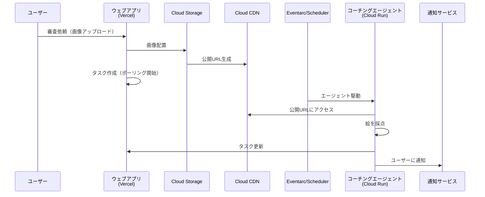

# スコープ変更: PRベース → ウェブアプリベース

## 背景

当初はPRでお絵描きの審査を行う設計だったが、非エンジニアにもわかりやすいエージェント体験を提供するため、ウェブアプリベースに変更する。

---

## 新しいアーキテクチャ概要

---

## 変更点サマリー

### トリガー方式
| 項目 | 変更前（PRベース） | 変更後（ウェブアプリベース） |
|------|-------------------|----------------------------|
| トリガー | GitHub Actions（PR作成） | ウェブアプリからの審査依頼 |
| 画像配置 | GitHubリポジトリ | Cloud Storage |
| 画像公開 | GitHub Raw URL | Cloud CDN |
| エージェント駆動 | GitHub Actions HTTP POST | Eventarc / Cloud Scheduler |
| 結果表示 | PRコメント | ウェブアプリUI |
| 通知方法 | PRコメント通知 | WebPush/Email等 |

### 新規コンポーネント
- **ウェブアプリ**: Vite + React + Tailwind CSS + Zustand
- **ホスティング**: Vercel（自動CI/CD）
- **タスク管理**: 非同期判定のタスク化、ポーリング監視

### 削除/縮小コンポーネント
- GitHub Actions連携（PRトリガー）
- PRコメント投稿機能

---

## MVPラベル付きIssue（参照）

| Issue | タイトル | 概要 |
|-------|---------|------|
| #11 | エージェントの追加 | 最小規模のお絵描きエージェントをADKを用いて構築 |
| #7 | タスク管理の追加 | 非同期判定、フロントでポーリング監視 |
| #6 | ウェブアプリの追加 | Tailwind Vite React Zustand、Vercel連携 |
| #5 | マルチモーダルエンベディング機能 | ベクトル検索による類似スケッチ検索 |
| #1 | initial implementation | とりあえず動くまで |

---

## 修正対象ドキュメント

1. **product-requirements.md** - プロダクト要求定義書
   - 機能一覧の変更（PRトリガー → ウェブアプリ）
   - ユーザーストーリーの更新
   - 機能要件の更新

2. **functional-design.md** - 機能設計書
   - システム構成図の刷新
   - 処理フローの変更
   - コンポーネント設計の追加（ウェブアプリ）
   - データモデル拡張（タスク管理）

3. **architecture.md** - 技術仕様書
   - テクノロジースタックの追加（React, Vite, Vercel等）
   - インフラ構成の変更（Cloud Storage, CDN, Eventarc）

4. **repository-structure.md** - リポジトリ構造定義書
   - フロントエンド（webapp/）の追加
   - ディレクトリ構成の更新

---

## 受け入れ条件

- [ ] product-requirements.md がウェブアプリベースに更新されている
- [ ] functional-design.md のシステム構成図・フローが新アーキテクチャを反映している
- [ ] architecture.md にフロントエンド技術スタックが追加されている
- [ ] repository-structure.md にwebapp/ディレクトリが定義されている
- [ ] 各ドキュメント間で整合性が取れている
