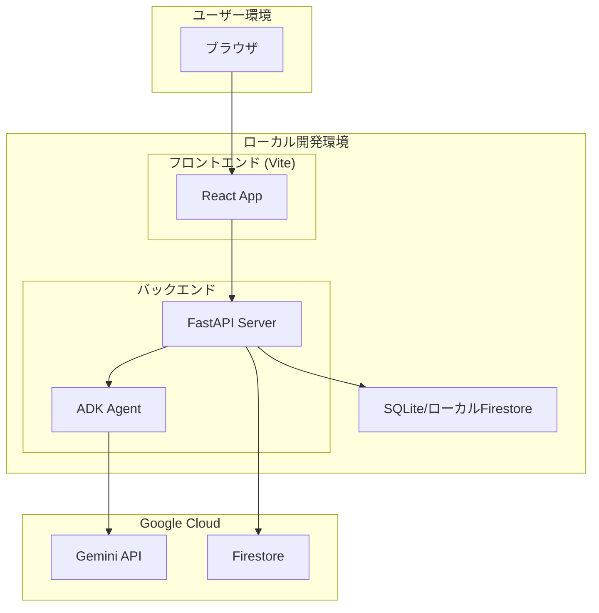

# MVP実装 設計書

## アーキテクチャ概要



## MVP実装ステップ

### ステップ1: エージェント基盤構築

**変更対象**: `packages/agent/`

**内容**:
- プロジェクト初期化（pyproject.toml, Dockerfile）
- FastAPIエントリーポイント作成
- ADKエージェント基本構造
- ローカル実行確認

**ファイル構成**:
```
packages/agent/
├── pyproject.toml
├── Dockerfile
├── src/
│   ├── __init__.py
│   ├── main.py          # FastAPIエントリーポイント
│   ├── config.py         # 設定
│   ├── agent.py          # ADKエージェント定義
│   ├── api/
│   │   ├── __init__.py
│   │   └── reviews.py    # 審査API
│   ├── services/
│   │   ├── __init__.py
│   │   └── gemini_service.py
│   └── models/
│       ├── __init__.py
│       └── task.py
└── tests/
    └── __init__.py
```

---

### ステップ2: Geminiによるデッサン分析機能

**変更対象**: `packages/agent/src/services/`

**内容**:
- Gemini API連携
- デッサン分析プロンプト
- フィードバック生成

---

### ステップ3: タスク管理機能

**変更対象**: `packages/agent/src/services/`

**内容**:
- Firestore連携
- タスク作成・更新・取得
- ステータス管理（pending → processing → completed/failed）

---

### ステップ4: ウェブアプリ基盤構築

**変更対象**: `packages/web/`

**内容**:
- Vite + React + TypeScript初期化
- Tailwind CSS設定
- 基本レイアウト

**ファイル構成**:
```
packages/web/
├── package.json
├── vite.config.ts
├── tailwind.config.js
├── postcss.config.js
├── tsconfig.json
├── index.html
├── public/
└── src/
    ├── main.tsx
    ├── App.tsx
    ├── index.css
    ├── components/
    │   ├── ImageUpload.tsx
    │   ├── FeedbackDisplay.tsx
    │   └── TaskList.tsx
    ├── pages/
    │   └── Home.tsx
    ├── stores/
    │   └── taskStore.ts
    ├── hooks/
    │   └── useReview.ts
    └── api/
        └── reviewApi.ts
```

---

### ステップ5: 画像アップロード機能

**変更対象**: `packages/web/`, `packages/agent/`

**内容**:
- フロントエンド: 画像選択・プレビュー・送信UI
- バックエンド: マルチパートフォームデータ受信・保存

---

### ステップ6: ポーリングによるタスク監視

**変更対象**: `packages/web/`

**内容**:
- SWRでAPI定期ポーリング
- タスクステータスに応じたUI更新
- フィードバック表示

---

### ステップ7: 統合テスト・動作確認

**内容**:
- ローカル環境でEnd-to-Endテスト
- 画像アップロード → 分析 → フィードバック表示の一連フロー確認

---

## API設計

### POST /reviews

審査リクエストを作成する。

**リクエスト**:
- Content-Type: multipart/form-data
- image: ファイル（JPEG, PNG, WebP）

**レスポンス**:
```json
{
  "task_id": "string",
  "status": "pending"
}
```

### GET /reviews/{task_id}

タスク情報を取得する。

**レスポンス**:
```json
{
  "task_id": "string",
  "status": "pending | processing | completed | failed",
  "feedback": { ... },
  "error_message": "string | null"
}
```

### GET /reviews

タスク一覧を取得する。

**レスポンス**:
```json
{
  "tasks": [
    {
      "task_id": "string",
      "status": "string",
      "created_at": "string"
    }
  ]
}
```

---

## ローカル開発環境

### フロントエンド起動
```bash
cd packages/web
pnpm install
pnpm dev
```

### バックエンド起動
```bash
cd packages/agent
uv sync
uv run uvicorn src.main:app --reload --port 8000
```

### 環境変数（.env）
```
GCP_PROJECT_ID=your-project-id
FIRESTORE_DATABASE=(default)
```

---

## 検証計画

### 自動テスト

1. **バックエンドユニットテスト**
   ```bash
   cd packages/agent
   uv run pytest tests/ -v
   ```

2. **フロントエンドビルドテスト**
   ```bash
   cd packages/web
   pnpm build
   ```

### 手動検証

1. **画像アップロードフロー**
   - ブラウザで `http://localhost:5173` を開く
   - 画像をアップロード
   - タスク一覧に「pending」状態で表示されることを確認
   - 数秒後、ステータスが「processing」→「completed」に変わることを確認
   - フィードバック内容が表示されることを確認

2. **エラーハンドリング**
   - 無効なファイル形式（.txt等）をアップロード
   - エラーメッセージが適切に表示されることを確認
