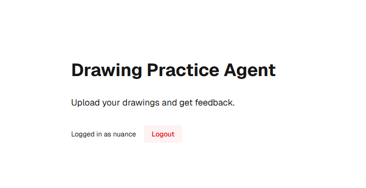

# Firebase Auth 実装 & Firebase Hosting デプロイ完了

## 概要
ユーザー認証機能（Firebase Authentication）の実装と、本番環境（Firebase Hosting）へのデプロイが完了しました。
当初Vercelへのデプロイを予定していましたが、承認済みドメイン設定の手間を省くため、Googleエコシステムで完結するFirebase Hostingへ移行しました。

## 実装内容

### 1. 認証基盤 (Firebase Authentication)
- **Identity Platform**: GitHub認証プロバイダーを有効化。
- **Client SDK**: `packages/web` で `getAuth`, `signInWithPopup` を実装。
- **State Management**: Zustand でユーザーセッションを管理。

### 2. バックエンド変更 (`packages/agent`)
- **Token Verification**: `firebase-admin` SDKを採用し、IDトークンの署名検証を実装（Cognito/JWTからの移行）。
- **Dependency**: `pyproject.toml` に依存関係を追加。

### 3. デプロイ構成 (Firebase Hosting)
- **Framework Awareness**: `frameworksBackend` (Next.js) を有効化し、SSRに対応。
- **Deployment**: `firebase deploy --only hosting` でデプロイ。

### 4. クリーンアップ & 最適化
- **Vercel Removal**: Vercelプロジェクトと設定ファイルを削除し、Google Cloudエコシステムに統一。
- **Legacy Code Removal**: `next-auth`, `jose` および旧JWT認証コードを削除し、依存関係を軽量化。

## 検証結果
ユーザーによるスクリーンショットにて、GitHubアカウント (`nuance`) でのログイン成功を確認しました。

## 次のステップ
- フロントエンドからバックエンドAPIへのリクエスト時に、`Authorization: Bearer <ID_TOKEN>` を付与する実装。
- タスク管理機能などの保護されたAPIエンドポイントの動作確認。
