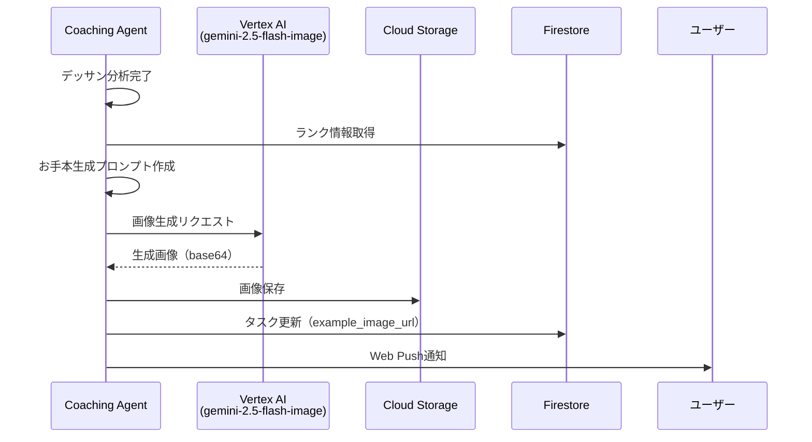

# お手本画像生成機能 設計書

## アーキテクチャ概要

既存のCoaching Agentに画像生成機能を追加し、デッサン分析完了後に自動的にお手本画像を生成する。

## システム構成



## コンポーネント設計

### 1. ImageGenerationService

新しいサービスクラスを作成し、画像生成のロジックを管理する。

```python
# src/services/image_generation_service.py
class ImageGenerationService:
    """お手本画像生成サービス"""
    
    def generate_example_image(
        self, 
        original_image_url: str,
        analysis: DessinAnalysis,
        user_rank: UserRank,
        motif_tags: List[str]
    ) -> str:
        """お手本画像を生成し、URLを返す"""
        
    def create_generation_prompt(
        self,
        analysis: DessinAnalysis,
        target_rank: Rank,
        motif_tags: List[str]
    ) -> str:
        """ランクと改善点に基づいてプロンプトを生成"""
        
    def get_target_rank(self, current_rank: Rank) -> Rank:
        """現在のランクからワンランク上のターゲットランクを取得"""
```

### 2. GeminiService拡張

既存のGeminiServiceに画像生成機能を追加する。

```python
# src/services/gemini_service.py (拡張)
class GeminiService:
    
    async def generate_image(
        self, 
        prompt: str,
        original_image_data: bytes = None
    ) -> bytes:
        """Gemini 2.5 Flash Imageで画像を生成"""
        
    def _prepare_image_generation_request(
        self,
        prompt: str,
        original_image_data: bytes = None
    ) -> dict:
        """画像生成リクエストを準備"""
```

### 3. StorageService拡張

生成画像の保存機能を追加する。

```python
# src/services/storage_service.py (新規または拡張)
class StorageService:
    
    def save_generated_image(
        self,
        image_data: bytes,
        task_id: str,
        user_id: str
    ) -> str:
        """生成画像をCloud Storageに保存し、CDN URLを返す"""
        
    def get_image_path(self, task_id: str, image_type: str) -> str:
        """画像のストレージパスを生成"""
```

## プロンプト設計

### ベースプロンプト構造

```python
BASE_PROMPT_TEMPLATE = """
Create an improved pencil drawing based on the following analysis and target skill level.

**Original Drawing Analysis:**
- Overall Score: {overall_score}/100
- Current Rank: {current_rank}
- Target Rank: {target_rank}
- Motif: {motif_tags}

**Key Improvements Needed:**
{improvements_list}

**Specific Areas to Enhance:**
- Proportion: {proportion_feedback}
- Tone/Shading: {tone_feedback}
- Line Quality: {line_feedback}
- Texture: {texture_feedback}

**Style Requirements:**
- Medium: Pencil drawing (graphite)
- Style: Realistic academic drawing
- Skill Level: {target_rank_description}
- Resolution: 1024px
- Format: Monochrome (black and white)

**Instructions:**
Generate a pencil drawing that demonstrates the improvements mentioned above, 
showing what the drawing would look like at {target_rank} skill level. 
Focus on {primary_improvement_areas}.

The drawing should maintain the same subject matter but show clear improvements in:
{specific_improvements}
"""
```

### ランク別プロンプト調整

```python
RANK_DESCRIPTIONS = {
    Rank.KYU_9: "Beginner level with focus on basic shapes and proportions",
    Rank.KYU_8: "Basic understanding of form and simple shading",
    Rank.KYU_7: "Improved proportions with consistent light source",
    Rank.KYU_6: "Good form accuracy with developing tonal range",
    Rank.KYU_5: "Solid fundamentals with 5-7 tonal values",
    Rank.KYU_4: "Advanced shading with 7-9 tonal values",
    Rank.KYU_3: "Refined technique with subtle gradations",
    Rank.KYU_2: "Near-professional quality with full tonal range",
    Rank.KYU_1: "Professional-level accuracy and technique",
    Rank.DAN_1: "Master-level precision and artistic expression",
    Rank.DAN_2: "Expert-level with advanced texture rendering",
    Rank.DAN_3: "Virtuoso technique with atmospheric effects",
    Rank.SHIHAN_DAI: "Teaching-level mastery with perfect execution",
    Rank.SHIHAN: "Grand master level with artistic innovation"
}
```

## 処理フロー

### メインフロー

```python
async def generate_example_image_flow(
    self,
    task_id: str,
    original_image_url: str,
    analysis: DessinAnalysis,
    user_rank: UserRank
) -> Optional[str]:
    """お手本画像生成のメインフロー"""
    
    try:
        # 1. ターゲットランクを決定
        target_rank = self._get_target_rank(user_rank.current_rank)
        
        # 2. 元画像を取得
        original_image_data = await self._fetch_original_image(original_image_url)
        
        # 3. 生成プロンプトを作成
        prompt = self._create_generation_prompt(analysis, target_rank)
        
        # 4. 画像生成を実行
        generated_image_data = await self.gemini_service.generate_image(
            prompt=prompt,
            original_image_data=original_image_data
        )
        
        # 5. 生成画像を保存
        example_image_url = self.storage_service.save_generated_image(
            image_data=generated_image_data,
            task_id=task_id,
            user_id=user_rank.user_id
        )
        
        # 6. タスクを更新
        await self.task_service.update_task(
            task_id=task_id,
            updates={"example_image_url": example_image_url}
        )
        
        return example_image_url
        
    except Exception as e:
        logger.error("image_generation_failed", task_id=task_id, error=str(e))
        # 画像生成失敗時はテキストフィードバックのみで完了
        return None
```

### エラーハンドリング

```python
class ImageGenerationError(Exception):
    """画像生成エラー"""
    pass

async def generate_with_retry(
    self,
    prompt: str,
    original_image_data: bytes,
    max_retries: int = 3
) -> bytes:
    """リトライ機能付き画像生成"""
    
    for attempt in range(max_retries):
        try:
            return await self.gemini_service.generate_image(prompt, original_image_data)
        except Exception as e:
            if attempt == max_retries - 1:
                raise ImageGenerationError(f"Failed after {max_retries} attempts: {e}")
            
            # 指数バックオフでリトライ
            await asyncio.sleep(2 ** attempt)
```

## データモデル拡張

### ReviewTask拡張

```python
class ReviewTask(BaseModel):
    # 既存フィールド...
    example_image_url: Optional[str] = None  # 生成画像のCDN URL
    image_generation_status: Optional[str] = None  # "pending", "generating", "completed", "failed"
    image_generation_error: Optional[str] = None  # 生成エラーメッセージ
```

### ImageGenerationRequest

```python
class ImageGenerationRequest(BaseModel):
    """画像生成リクエスト"""
    task_id: str
    original_image_url: str
    analysis: DessinAnalysis
    user_rank: UserRank
    motif_tags: List[str]
    target_rank: Rank
```

## Cloud Storage構成

### ディレクトリ構造

```
gs://{bucket-name}/
├── uploads/           # ユーザーアップロード画像
│   └── {user_id}/
│       └── {task_id}/
│           └── original.jpg
└── generated/         # AI生成画像
    └── {user_id}/
        └── {task_id}/
            └── example.png
```

### CDN URL形式

```
https://cdn.example.com/generated/{user_id}/{task_id}/example.png
```

## ADK Agent統合

### Tool追加

```python
@Tool
def generate_example_image(
    self,
    task_id: str,
    original_image_url: str,
    analysis_json: str,
    user_rank_json: str
) -> str:
    """お手本画像を生成するツール"""
    
    analysis = DessinAnalysis.model_validate_json(analysis_json)
    user_rank = UserRank.model_validate_json(user_rank_json)
    
    # 画像生成サービスを呼び出し
    example_image_url = self.image_generation_service.generate_example_image(
        original_image_url=original_image_url,
        analysis=analysis,
        user_rank=user_rank,
        motif_tags=analysis.tags
    )
    
    return example_image_url or "Image generation failed"
```

### Agent Flow更新

```python
class DessinCoachingAgent(Agent):
    
    async def process_review_task(self, task_data: dict) -> dict:
        """レビュータスクの処理（画像生成を含む）"""
        
        # 既存の分析処理...
        analysis = await self.analyze_dessin(image_data)
        feedback = await self.generate_feedback(analysis, user_rank)
        
        # タスク更新（フィードバック保存）
        await self.update_task(task_id, "processing", {
            "feedback": feedback.model_dump(),
            "score": analysis.overall_score
        })
        
        # 画像生成（非同期）
        try:
            example_image_url = await self.generate_example_image(
                task_id=task_id,
                original_image_url=original_image_url,
                analysis_json=analysis.model_dump_json(),
                user_rank_json=user_rank.model_dump_json()
            )
            
            # 最終更新
            await self.update_task(task_id, "completed", {
                "example_image_url": example_image_url
            })
            
        except Exception as e:
            logger.warning("image_generation_failed", task_id=task_id, error=str(e))
            # 画像生成失敗でもタスクは完了とする
            await self.update_task(task_id, "completed", {})
        
        # 通知送信
        await self.send_push_notification(user_id, "デッサン分析が完了しました")
        
        return {"status": "completed"}
```

## フロントエンド表示

### 画像表示コンポーネント

```typescript
// components/features/review/ExampleImageDisplay.tsx
interface ExampleImageDisplayProps {
  originalImageUrl: string;
  exampleImageUrl?: string;
  isGenerating: boolean;
}

export const ExampleImageDisplay: React.FC<ExampleImageDisplayProps> = ({
  originalImageUrl,
  exampleImageUrl,
  isGenerating
}) => {
  return (
    <div className="grid grid-cols-1 md:grid-cols-2 gap-4">
      <div>
        <h3 className="text-lg font-semibold mb-2">あなたのデッサン</h3>
        
      </div>
      
      <div>
        <h3 className="text-lg font-semibold mb-2">お手本画像</h3>
        {isGenerating ? (
          <div className="flex items-center justify-center h-64 bg-gray-100 rounded-lg">
            <div className="text-center">
              <div className="animate-spin rounded-full h-8 w-8 border-b-2 border-blue-500 mx-auto mb-2"></div>
              <p className="text-gray-600">お手本画像を生成中...</p>
            </div>
          </div>
        ) : exampleImageUrl ? (
          <div>
            
            <p className="text-xs text-gray-500 mt-1">
              ※この画像はAI（Gemini 2.5 Flash Image）によって生成されました
            </p>
          </div>
        ) : (
          <div className="flex items-center justify-center h-64 bg-gray-100 rounded-lg">
            <p className="text-gray-600">お手本画像の生成に失敗しました</p>
          </div>
        )}
      </div>
    </div>
  );
};
```

## 設定・環境変数

### 新規環境変数

```bash
# Gemini API設定
GEMINI_IMAGE_MODEL=gemini-2.5-flash-image
GEMINI_IMAGE_GENERATION_TIMEOUT=180  # 3分

# 画像生成設定
IMAGE_GENERATION_ENABLED=true
IMAGE_GENERATION_MAX_RETRIES=3
IMAGE_GENERATION_RESOLUTION=1024

# Cloud Storage設定
GENERATED_IMAGES_BUCKET=drawing-coach-generated
GENERATED_IMAGES_CDN_BASE_URL=https://cdn.example.com
```

## 監視・ログ

### メトリクス

```python
# 画像生成関連のメトリクス
GENERATION_REQUESTS_TOTAL = Counter("image_generation_requests_total")
GENERATION_SUCCESS_TOTAL = Counter("image_generation_success_total")
GENERATION_FAILURE_TOTAL = Counter("image_generation_failure_total")
GENERATION_DURATION_SECONDS = Histogram("image_generation_duration_seconds")
```

### ログ出力

```python
logger.info(
    "image_generation_started",
    task_id=task_id,
    user_rank=user_rank.current_rank.value,
    target_rank=target_rank.value,
    motif_tags=motif_tags
)

logger.info(
    "image_generation_completed",
    task_id=task_id,
    duration_seconds=duration,
    image_size_bytes=len(generated_image_data),
    example_image_url=example_image_url
)
```

## テスト戦略

### 単体テスト

```python
# tests/test_image_generation_service.py
class TestImageGenerationService:
    
    def test_get_target_rank(self):
        """ターゲットランク計算のテスト"""
        
    def test_create_generation_prompt(self):
        """プロンプト生成のテスト"""
        
    async def test_generate_example_image_success(self):
        """画像生成成功ケースのテスト"""
        
    async def test_generate_example_image_failure(self):
        """画像生成失敗ケースのテスト"""
```

### 統合テスト

```python
# tests/test_integration_image_generation.py
class TestImageGenerationIntegration:
    
    async def test_end_to_end_image_generation(self):
        """エンドツーエンドの画像生成テスト"""
```

## デプロイメント

### Cloud Run設定更新

```yaml
# packages/agent/cloudbuild.yaml (更新)
env:
  - name: GEMINI_IMAGE_MODEL
    value: "gemini-2.5-flash-image"
  - name: IMAGE_GENERATION_ENABLED
    value: "true"
  - name: GENERATED_IMAGES_BUCKET
    value: "${_GENERATED_IMAGES_BUCKET}"
```

### IAM権限追加

```bash
# Cloud Storageへの書き込み権限
gcloud projects add-iam-policy-binding $PROJECT_ID \
    --member="serviceAccount:$SERVICE_ACCOUNT" \
    --role="roles/storage.objectCreator"

# Vertex AI画像生成権限
gcloud projects add-iam-policy-binding $PROJECT_ID \
    --member="serviceAccount:$SERVICE_ACCOUNT" \
    --role="roles/aiplatform.user"
```

## 実装順序

1. **Phase 1**: ImageGenerationService基本実装
2. **Phase 2**: GeminiService画像生成機能追加
3. **Phase 3**: StorageService拡張
4. **Phase 4**: ADK Agent統合
5. **Phase 5**: フロントエンド表示機能
6. **Phase 6**: テスト・デバッグ
7. **Phase 7**: 本番デプロイ