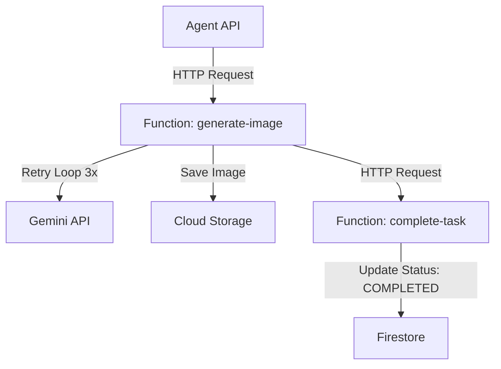

# 設計書：お手本画像生成機能のCloud Run Functions移行

## アーキテクチャ概要

従来の「Agentが生成から保存、DB更新まで一貫して行う」構成から、「機能ごとにCloud Functionに切り出し、GCSイベントで連携する」イベント駆動アーキテクチャへ移行します。

### フローチャート


## コンポーネント詳細

### 1. Function: `generate-image`
お手本画像の生成のみを担当します。

- **Trigger**: HTTP Trigger (認証必須)
- **Runtime**: Python 3.22+
- **Input (JSON)**:
  - `original_image_url`: 元画像URL
  - `prompt_data`: プロンプト生成に必要な情報（分析結果、ランク等）
  - `task_id`: タスクID（ファイル名に使用）
- **Process**:
  1. プロンプト生成（ロジック移植）
  2. Gemini 2.5 Flash Image で画像生成
  3. GCSの所定パス（例: `generated/{user_id}/{task_id}/example.png`）に保存
  4. レスポンスとして成功ステータスを返す（この時点ではタスクは未完了）

### 2. Function: `complete_task`
画像の生成完了を検知し、タスクを完了状態にします。

- **Trigger**: Cloud Storage Trigger (Eventarc)
  - Event Type: `google.cloud.storage.object.v1.finalized`
  - Filter: `generated/` プレフィックス
- **Runtime**: Python 3.12+
- **Process**:
  1. イベントからファイルパスを取得
  2. パスを解析して `task_id` を抽出
  3. Firestoreの `tasks/{task_id}` ドキュメントを更新
     - `status`: `COMPLETED`
     - `example_image_url`: 生成された画像のURL
     - `updated_at`: 現在時刻

### 3. Agent: `ImageGenerationService`
- ローカルの生成ロジックを全削除
- `generate-image` Functionを呼び出すクライアントコードのみ保持
- エラーハンドリング：Function呼び出し失敗時はログ出力（リトライはFunction側に任せるか、Agent側で行うか要検討。今回はAgent側でエラーならログのみとする）

## ディレクトリ構造案
```
packages/
  functions/
    generate_image/
      main.py
      requirements.txt
    complete_task/
      main.py
      requirements.txt
```

## インフラ・権限設定
- **Service Accounts**:
  - `generate-image-sa`: Vertex AI User, Storage Object Creator
  - `complete-task-sa`: Storage Object Viewer, Datastore User
- **Triggers**:
  - `generate-image`: `roles/run.invoker` を Agent SA に付与
  - `complete-task`: GCSバケットへのEventarcトリガー設定が必要
