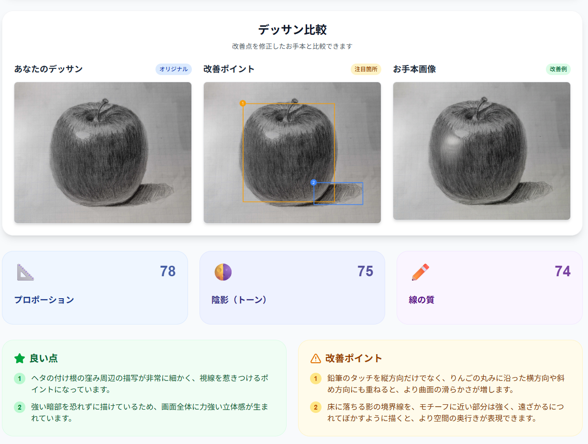
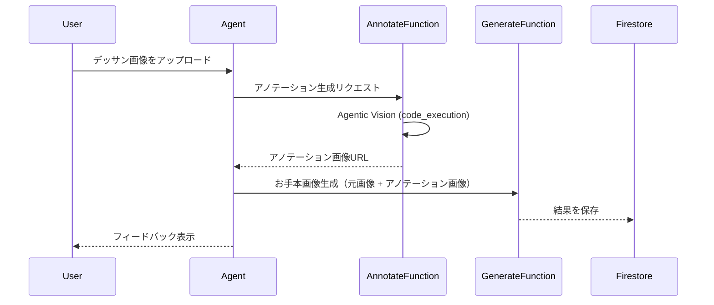

# Agentic Visionを利用した画像アノテーション機能

## 概要

[GitHub Issue #47](https://github.com/nuance-sudo/drawing-practice-agent-gch4/issues/47) の実装として、Gemini 3 Flashの新機能「**Agentic Vision**」を活用した画像アノテーション機能を追加しました。

この機能により、ユーザーがレビュー依頼したデッサン画像の改善点にバウンディングボックスでアノテーションを付け、視覚的にわかりやすいフィードバックを提供します。

---

## 成果物



**画面構成（3カラム）：**
1. **あなたのデッサン** - ユーザーがアップロードしたオリジナル画像
2. **改善ポイント** - Agentic Visionによるアノテーション付き画像（バウンディングボックスでハイライト）
3. **お手本画像** - AIが生成した改善例

---

## 実装内容

### バックエンド（Agent/Functions）

#### 新規ファイル

| ファイル | 説明 |
|---------|------|
| [annotation_service.py](file:///home/ec2-user/src/drawing-practice-agent-gch4/packages/agent/src/services/annotation_service.py) | アノテーション画像生成サービス |
| [annotate_image/main.py](file:///home/ec2-user/src/drawing-practice-agent-gch4/packages/functions/annotate_image/main.py) | Agentic Vision Cloud Function |

#### 変更ファイル

| ファイル | 変更内容 |
|---------|---------|
| [reviews.py](file:///home/ec2-user/src/drawing-practice-agent-gch4/packages/agent/src/api/reviews.py) | アノテーションサービスの統合 |
| [image_generation_service.py](file:///home/ec2-user/src/drawing-practice-agent-gch4/packages/agent/src/services/image_generation_service.py) | アノテーション画像URLパラメータ追加 |
| [generate_image/main.py](file:///home/ec2-user/src/drawing-practice-agent-gch4/packages/functions/generate_image/main.py) | マルチ画像入力対応 |

---

### フロントエンド（Web）

| ファイル | 変更内容 |
|---------|---------|
| [task.ts](file:///home/ec2-user/src/drawing-practice-agent-gch4/packages/web/src/types/task.ts) | `annotatedImageUrl`フィールド追加 |
| [useTasks.ts](file:///home/ec2-user/src/drawing-practice-agent-gch4/packages/web/src/hooks/useTasks.ts) | Firestoreマッピング更新 |
| [ExampleImageDisplay.tsx](file:///home/ec2-user/src/drawing-practice-agent-gch4/packages/web/src/components/ExampleImageDisplay.tsx) | 3カラム表示対応 |

---

## 技術的なポイント

### お手本画像生成へのバウンディング画像統合

お手本画像生成時に、元画像に加えて**バウンディング画像（アノテーション画像）**をGemini APIに渡すことで、改善ポイントにフォーカスした修正を可能にしました。

**効果：**
- バウンディングボックスで示された改善箇所を重点的に修正
- それ以外の良い部分はそのまま維持
- より具体的で的確なお手本画像を生成

### Agentic Visionの活用



### 処理フローの変更

**変更前：** アノテーション生成は非同期で結果を待たない

**変更後：** アノテーション完了を待ってから、そのURLをお手本画像生成に渡す

```diff
- await annotation_service.generate_annotated_image(...)
- await image_generation_service.generate_example_image(original_image_url)
+ annotated_url = await annotation_service.generate_annotated_image(...)
+ await image_generation_service.generate_example_image(original_image_url, annotated_url)
```

---

## 設定変更

Gemini 3 Flash利用のため、リージョン設定を `global` に更新：

| ファイル | 変更内容 |
|---------|---------|
| [env.yaml](file:///home/ec2-user/src/drawing-practice-agent-gch4/packages/agent/env.yaml) | `GEMINI_REGION: global` |
| [DEPLOY_GUIDE.md](file:///home/ec2-user/src/drawing-practice-agent-gch4/docs/DEPLOY_GUIDE.md) | リージョン設定ドキュメント更新 |

---

## 関連リンク

- [Gemini 3 Agentic Vision公式ブログ](https://blog.google/innovation-and-ai/technology/developers-tools/agentic-vision-gemini-3-flash/)
- [PR #51](https://github.com/nuance-sudo/drawing-practice-agent-gch4/pull/51) - マージ済み
