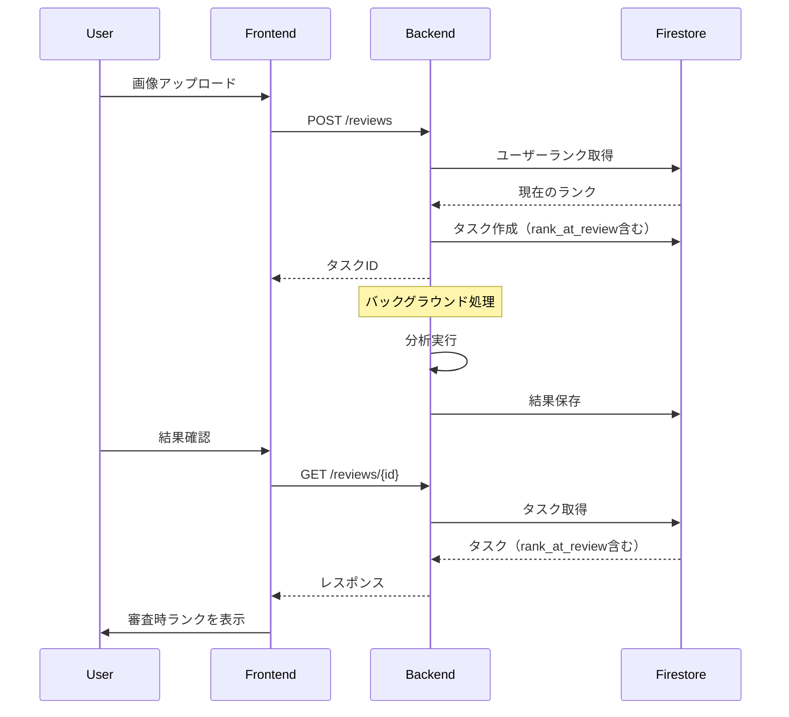

# Issue #52: 設計書

## アーキテクチャ概要



## データモデル変更

### ReviewTask（バックエンド）

```python
class ReviewTask(BaseModel):
    # 既存フィールド...
    rank_at_review: str | None  # 追加: "10級", "1段" など
```

### ReviewTask（フロントエンド）

```typescript
type ReviewTask = {
    // 既存フィールド...
    rankAtReview?: string;  // 追加
};
```

## コンポーネント設計

### UserProfileMenu（新規）

```
┌──────────────────┐
│ [👤 アバター]    │ ← クリックでドロップダウン
└──────────────────┘
        │
        ▼
┌──────────────────┐
│ ユーザー名       │
│ ───────────────  │
│ 現在のランク     │
│ [10級] ↗        │
│ ───────────────  │
│ [ログアウト]     │
└──────────────────┘
```

### FeedbackDisplay変更

**Before:**
- `rank` props: 現在のランク（useRankから取得）

**After:**
- タスクに保存された `rankAtReview` を使用
- 存在しない場合は現在のランクをフォールバック

## 影響範囲

### バックエンド

| ファイル | 変更内容 |
|---------|---------|
| `src/models/task.py` | rank_at_reviewフィールド追加 |
| `src/services/task_service.py` | 変換処理の追加 |
| `src/api/reviews.py` | タスク作成時にランク保存 |

### フロントエンド

| ファイル | 変更内容 |
|---------|---------|
| `src/types/task.ts` | rankAtReviewフィールド追加 |
| `src/components/features/review/FeedbackDisplay.tsx` | 表示ロジック変更 |
| `src/components/common/UserProfileMenu.tsx` | 新規作成 |
| `src/app/page.tsx` | ヘッダーにプロフィール追加 |
