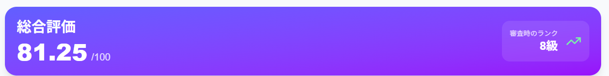
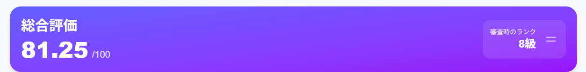
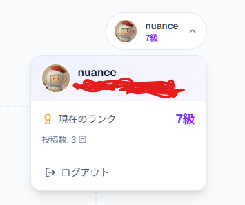

# Issue #52: ランク表示修正とプロフィール機能追加 - 完了ウォークスルー

## 概要

GitHub Issue: https://github.com/nuance-sudo/drawing-practice-agent-gch4/issues/52

---

## 実装した機能

### 1. 審査時のランク表示

審査結果画面に表示されるランクが、**審査実行時点のランク**を表示するようになりました。
これにより、過去の審査履歴を見たときに、その時点でどのランクだったかが正確にわかります。

### 2. ランク変動アイコン

審査後のランク変動に応じて、アイコンが切り替わります：

| 状態 | アイコン | 意味 |
|------|---------|------|
| ランクアップ | ↗ (緑色) | 80点以上を獲得して昇格 |
| 現状維持 | = (グレー) | スコアが80点未満で維持 |

````carousel

<!-- slide -->

````

### 3. ユーザープロフィールメニュー

ヘッダーにプロフィールメニューを追加しました：

- GitHubアバター画像の表示
- クリックで現在のランクと投稿数を確認
- ログアウト機能



### 4. ランクアップ条件

ランク昇格の条件は以下の通りです：

- **80点以上**のスコアを獲得すると、1つ上のランクに昇格
- 最高ランク（師範）の場合は昇格なし
- スコアが80点未満の場合はランク維持

---

## 検証結果

| 項目 | 結果 |
|------|------|
| バックエンド型チェック (mypy) | ✅ Success |
| フロントエンドビルド (Next.js 16.1.3) | ✅ Compiled successfully |
| Firebase Hosting デプロイ | ✅ Deploy complete |
| Cloud Run デプロイ | ✅ SUCCESS |

---

## デプロイURL

- **フロントエンド**: https://drawing-practice-agent.web.app
- **バックエンドAPI**: Cloud Run (us-central1)
