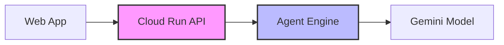

# Agent Engine APIマイグレーション Walkthrough

Cloud RunのAPIサーバーからVertex AI Agent Engineを呼び出すための実装変更を完了しました。

## 概要



**変更前**: Cloud Run内でエージェントを直接実行
**変更後**: Cloud RunがAgent Engineにデプロイされたエージェントを呼び出し

---

## 新規ファイル

### Agent Engine用エージェントパッケージ

新規ディレクトリ: [dessin_coaching_agent/](file:///home/ec2-user/src/drawing-practice-agent-gch4/packages/agent/dessin_coaching_agent/)

ADKを使用したエージェント定義をパッケージとしてまとめ、Vertex AI Agent Engineにデプロイ。

| ファイル | 説明 |
|---------|------|
| [agent.py](file:///home/ec2-user/src/drawing-practice-agent-gch4/packages/agent/dessin_coaching_agent/agent.py) | ルートエージェント定義 |
| [tools.py](file:///home/ec2-user/src/drawing-practice-agent-gch4/packages/agent/dessin_coaching_agent/tools.py) | `analyze_dessin_image`ツール |
| [prompts.py](file:///home/ec2-user/src/drawing-practice-agent-gch4/packages/agent/dessin_coaching_agent/prompts.py) | システムプロンプト |
| [custom_gemini.py](file:///home/ec2-user/src/drawing-practice-agent-gch4/packages/agent/dessin_coaching_agent/custom_gemini.py) | globalリージョン用Geminiモデル |
| [models.py](file:///home/ec2-user/src/drawing-practice-agent-gch4/packages/agent/dessin_coaching_agent/models.py) | Pydanticモデル定義 |
| [config.py](file:///home/ec2-user/src/drawing-practice-agent-gch4/packages/agent/dessin_coaching_agent/config.py) | Agent Engine用設定 |

---

### Agent Engineサービス

#### [agent_engine_service.py](file:///home/ec2-user/src/drawing-practice-agent-gch4/packages/agent/src/services/agent_engine_service.py)

Agent Engineを呼び出すサービスクラス。新しいVertex AI SDK（`vertexai.Client`）パターンを使用。

```python
# 新しいSDKパターン
client = vertexai.Client(project=..., location=...)
adk_app = client.agent_engines.get(name=resource_name)
async for event in adk_app.async_stream_query(...):
    # レスポンス処理
```

**主な機能**:
- Agent Engineへの非同期ストリーミングクエリ送信
- JSONレスポンスのパース（markdown code block対応）
- `DessinAnalysis`オブジェクトへの変換

---

## 変更ファイル

### reviews.py

render_diffs(file:///home/ec2-user/src/drawing-practice-agent-gch4/packages/agent/src/api/reviews.py)

**主な変更**:
- ローカルの`analyze_dessin_image`呼び出しを削除
- `AgentEngineService`経由でAgent Engineを呼び出すよう変更
- `asyncio.create_task()`を`await`に変更（同期的に待機）

---

### config.py

render_diffs(file:///home/ec2-user/src/drawing-practice-agent-gch4/packages/agent/src/config.py)

Agent Engine用の設定を追加:
- `agent_engine_id`: Agent EngineリソースID
- `agent_engine_location`: リージョン（us-central1）

---

### env.yaml

Cloud Run環境変数にAgent Engine設定を追加:
```yaml
AGENT_ENGINE_ID: "<AGENT_ENGINE_ID>"
AGENT_ENGINE_LOCATION: us-central1
```

---

## 削除したファイル

不要になった古いアプローチの残骸を削除:
- `src/adk_app.py` - 古いデプロイパターン用
- `src/requirements.txt` - 古いデプロイパターン用

---

## Agent Engineデプロイ

Agent Engineへのデプロイは `adk deploy agent_engine` CLIコマンドで実行:

```bash
cd packages/agent
adk deploy agent_engine \
  --project=dessin-coaching-agent \
  --region=us-central1 \
  --module_name=dessin_coaching_agent.agent \
  --agent_name=root_agent \
  --gcs_staging_dir=gs://dessin-coaching-agent-agent-assets \
  --requirements=dessin_coaching_agent/requirements.txt
```

**デプロイ結果**:
- Agent Engine ID: `<AGENT_ENGINE_ID>`
- リージョン: `us-central1`
- モデル: `gemini-3-flash-preview`（globalリージョン）

---

## デプロイ結果

| サービス | ステータス | URL/ID |
|---------|----------|--------|
| Agent Engine | ✅ デプロイ完了 | `<AGENT_ENGINE_ID>` |
| Cloud Run | ✅ デプロイ完了 | `https://dessin-coaching-agent-<PROJECT_ID>.us-central1.run.app` |

---

## Agent Engineトレース

Agent Engineでの実行トレース。`invoke_agent`から`analyze_dessin_image`ツールが呼び出されている様子が確認できます。


---

## 技術的なポイント

### 1. globalリージョンモデル対応

`gemini-3-flash-preview`モデルは`global`リージョンでのみ利用可能。`custom_gemini.py`でglobalリージョン対応のGeminiモデルラッパーを実装。

### 2. レスポンスパース処理

Agent Engineからのレスポンスはmarkdown code blockで囲まれている場合があるため、`_extract_json_from_text`メソッドで複数パターンに対応:
- ` ```json ... ``` `
- ` ``` ... ``` `

### 3. ADK CLIデプロイ

Python SDKでのデプロイは`ModuleNotFoundError`が発生したため、ADK CLIコマンドを採用。CLIはパッケージを適切にバンドルしてアップロード。

---

## 次のステップ

- [ ] E2Eテスト（Webアプリから審査リクエストを送信）
- [ ] エラーハンドリングの強化
- [ ] パフォーマンスモニタリング
