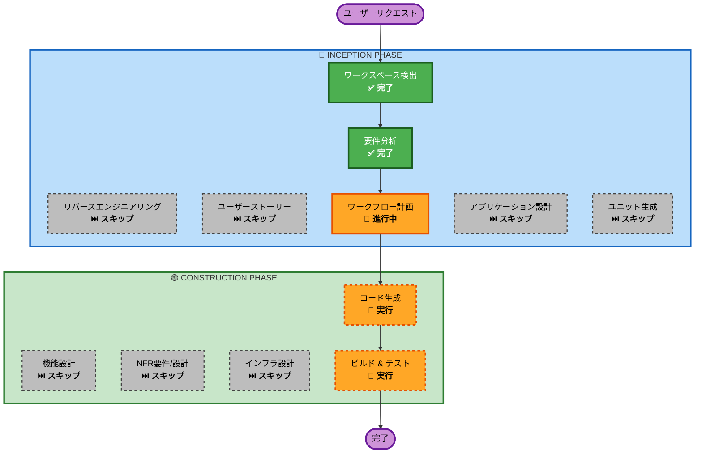

# 実行計画書: Cloud Tasks移行による審査処理の非同期化

## 詳細分析サマリー

### 変換スコープ（Brownfield）

| 項目 | 内容 |
|------|------|
| **変換タイプ** | アーキテクチャ変更（同期→非同期処理） |
| **主な変更** | Cloud Tasks + Cloud Function導入 |
| **影響コンポーネント** | API Server、Cloud Functions、インフラスクリプト |

### 変更影響評価

| 項目 | 影響 | 説明 |
|------|------|------|
| **ユーザー影響** | ✅ あり | レスポンス時間が大幅改善（数分→500ms以下） |
| **構造変更** | ✅ あり | 同期処理から非同期処理に変更 |
| **データモデル変更** | ❌ なし | 既存のFirestoreスキーマを継続使用 |
| **API変更** | ❌ なし | エンドポイントとレスポンス形式は変更なし |
| **NFR影響** | ✅ あり | 信頼性向上（リトライ機能追加） |

### コンポーネント関係

```
┌─────────────────────────────────────────────────────────────────┐
│                     変更対象コンポーネント                        │
├─────────────────────────────────────────────────────────────────┤
│  [Cloud Run API]                                                │
│  └── reviews.py (変更)                                          │
│  └── cloud_tasks_service.py (新規)                              │
│                                                                 │
│  [Cloud Functions]                                              │
│  └── process-review/ (新規)                                     │
│                                                                 │
│  [Infrastructure]                                               │
│  └── scripts/create_cloud_tasks_queue.sh (新規)                 │
└─────────────────────────────────────────────────────────────────┘
                              ↓
┌─────────────────────────────────────────────────────────────────┐
│                     変更なしコンポーネント                        │
├─────────────────────────────────────────────────────────────────┤
│  [Firestore] - 既存スキーマ継続                                  │
│  [Web App] - Firestoreリアルタイム監視継続                       │
│  [Agent Engine] - ロジック移植のみ                               │
└─────────────────────────────────────────────────────────────────┘
```

### リスク評価

| 項目 | 評価 |
|------|------|
| **リスクレベル** | Medium（複数コンポーネント変更） |
| **ロールバック複雑度** | Easy（Cloud Runを元に戻すだけ） |
| **テスト複雑度** | Moderate（Cloud Tasks連携テストが必要） |

---

## ワークフロー可視化



### テキスト代替（フォールバック）

```
Phase 1: INCEPTION
- ワークスペース検出 (✅ 完了)
- リバースエンジニアリング (⏭️ スキップ - 既存ドキュメント利用)
- 要件分析 (✅ 完了)
- ユーザーストーリー (⏭️ スキップ - インフラ変更のため)
- ワークフロー計画 (🔄 進行中)
- アプリケーション設計 (⏭️ スキップ - 既存コンポーネント変更)
- ユニット生成 (⏭️ スキップ - 単一ユニット)

Phase 2: CONSTRUCTION
- 機能設計 (⏭️ スキップ - シンプルなロジック移植)
- NFR要件/設計 (⏭️ スキップ - 既存設定で十分)
- インフラ設計 (⏭️ スキップ - gcloud CLIスクリプトで対応)
- コード生成 (🔶 実行)
- ビルド & テスト (🔶 実行)
```

---

## 実行フェーズ

### 🔵 INCEPTION PHASE

| ステージ | 状態 | 理由 |
|----------|------|------|
| ワークスペース検出 | ✅ 完了 | Brownfield判定済み |
| リバースエンジニアリング | ⏭️ スキップ | `docs/architecture.md`等の既存ドキュメント利用 |
| 要件分析 | ✅ 完了 | `requirements.md`作成済み |
| ユーザーストーリー | ⏭️ スキップ | インフラ/バックエンド変更のためユーザーストーリー不要 |
| ワークフロー計画 | 🔄 進行中 | 本ドキュメント |
| アプリケーション設計 | ⏭️ スキップ | 既存コンポーネント境界内の変更 |
| ユニット生成 | ⏭️ スキップ | 単一ユニットで分割不要 |

### 🟢 CONSTRUCTION PHASE

| ステージ | 状態 | 理由 |
|----------|------|------|
| 機能設計 | ⏭️ スキップ | 既存の`process_review_task`ロジックを移植 |
| NFR要件 | ⏭️ スキップ | PoCのため既存NFR設定で十分 |
| NFR設計 | ⏭️ スキップ | Cloud Tasks標準設定を使用 |
| インフラ設計 | ⏭️ スキップ | gcloud CLIスクリプトで対応（要件で決定済み） |
| コード生成 | 🔶 実行 | Cloud Function + API変更の実装 |
| ビルド & テスト | 🔶 実行 | Lint、型チェック、デプロイテスト |

---

## 実装順序

### Step 1: インフラ準備
1. Cloud Tasksキュー作成スクリプト (`create_cloud_tasks_queue.sh`)
2. サービスアカウント権限設定

### Step 2: Cloud Function実装
1. `process-review` Cloud Function作成
2. 既存の`process_review_task`ロジックを移植
3. デプロイスクリプト作成

### Step 3: API Server変更
1. Cloud Tasksクライアントサービス追加 (`cloud_tasks_service.py`)
2. `reviews.py`の`create_review`をCloud Tasks投入に変更

### Step 4: 統合テスト
1. ローカルテスト（エミュレータ使用）
2. Cloud Run再デプロイ
3. E2Eテスト

---

## 予想タイムライン

| フェーズ | 推定時間 |
|----------|----------|
| コード生成（計画） | 〜10分 |
| コード生成（実装） | 〜30分 |
| ビルド & テスト | 〜20分 |
| **合計** | **〜60分** |

---

## 成功基準

1. `/reviews` POST APIが500ms以内にレスポンスを返す
2. Cloud Tasksにタスクが正常に投入される
3. Cloud Functionが呼び出され、審査処理が完了する
4. Firestoreのタスクステータスが正しく更新される
5. フロントエンドで審査結果が表示される
6. 失敗時にリトライが実行される
7. 3回失敗後にタスクが`failed`ステータスになる
