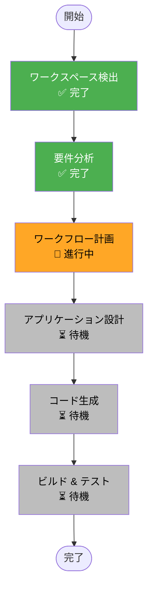

# ワークフロー計画: Vertex AI Agent Engine マイグレーション

## 実行計画概要

このマイグレーションはPoCプロジェクトのため、軽量なAI-DLCワークフローを適用します。

## 推奨ワークフロー

## スキップするステージと理由

| ステージ | 判定 | 理由 |
|----------|------|------|
| リバースエンジニアリング | ⏭️ SKIP | `docs/architecture.md`等の既存ドキュメントが利用可能 |
| ユーザーストーリー | ⏭️ SKIP | インフラ移行作業でエンドユーザー影響なし |
| ユニット生成 | ⏭️ SKIP | 単一ユニットの変更（エージェント移行のみ） |
| 機能設計 | ⏭️ SKIP | 既存機能の移行、新規ビジネスロジックなし |
| NFR要件/設計 | ⏭️ SKIP | PoCのため非機能要件は軽量化 |
| インフラ設計 | 🔄 統合 | アプリケーション設計に統合 |

## 実行するステージ

### 1. アプリケーション設計（Application Design）
- Agent Engine用のエージェント構成設計
- Cloud Run ↔ Agent Engine 統合設計
- コンポーネント変更一覧

### 2. コード生成（Code Generation）
**Part 1 - 計画**:
- 変更ファイル一覧
- 実装順序

**Part 2 - 生成**:
- Agent Engineラッパー実装
- Agent Engine呼び出しサービス実装
- 設定ファイル更新
- デプロイスクリプト作成

### 3. ビルド & テスト（Build & Test）
- ローカルテスト実行
- Agent Engineへのデプロイ
- 動作確認

## 作業単位

このマイグレーションは**単一ユニット**として扱います：

- **ユニット名**: `agent-engine-migration`
- **スコープ**: エージェントのAgent Engine移行 + API統合

## 見積もり

| 項目 | 見積もり |
|------|----------|
| アプリケーション設計 | 30分 |
| コード生成（計画） | 15分 |
| コード生成（実装） | 1-2時間 |
| ビルド & テスト | 30分-1時間 |
| **合計** | **約2-4時間** |

## 次のステップ

1. ✅ 要件分析の承認を得る
2. ⏳ アプリケーション設計を作成
3. ⏳ コード生成計画を作成
4. ⏳ 実装開始

---

**注意**: この計画はPoCプロジェクトのため、軽量なプロセスを採用しています。本番移行時にはより詳細な設計とテストが必要です。
