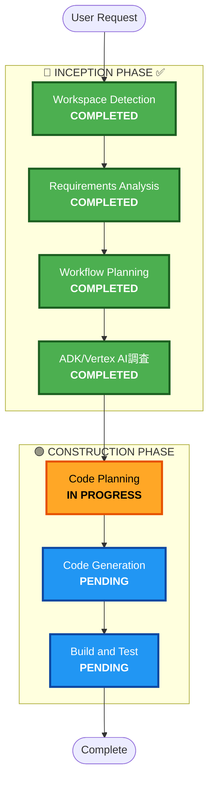

# 実行計画: メモリ機能による成長トラッキング v3

## 詳細分析サマリー

### 変更スコープ
- **変更タイプ**: 機能拡張（Enhancement）
- **主要変更**: Vertex AI Agent Engine Memory Bank統合
- **影響コンポーネント**: 
  - `packages/agent/dessin_coaching_agent/` - エージェントパッケージ

### 技術調査結果（2026-02-01）

| 機能 | ADKツール | Vertex AI Client API |
|-----|----------|---------------------|
| セマンティック検索 | ✅ `LoadMemoryTool` | ✅ `similarity_search_params` |
| メタデータフィルタ | ❌ 未サポート | ✅ `filter_groups` |
| 時系列フィルタ | ❌ 未サポート | ✅ `filter` |

**結論**: メタデータフィルタ使用のため、Vertex AI Client APIをカスタムツールでラップ

---

## ワークフロー可視化

---

## 実装計画

### 新規ファイル

| ファイル | 内容 |
|---------|------|
| `tools/memory_tools.py` | カスタムメモリ検索ツール（モチーフフィルタ） |
| `callbacks.py` | メモリ保存コールバック（メタデータ付き） |

### 既存ファイル更新

| ファイル | 変更内容 |
|---------|---------|
| `agent.py` | ツール・コールバック登録 |
| `prompts.py` | カスタムツール使用指示追加 |

---

## 実行フェーズ

### 🔵 INCEPTION PHASE ✅
- [x] Workspace Detection
- [x] Requirements Analysis
- [x] Workflow Planning
- [x] ADK/Vertex AI調査

### 🟢 CONSTRUCTION PHASE
- [/] Code Planning - **IN PROGRESS**
- [ ] Code Generation - **PENDING**
- [ ] Build & Test - **PENDING**

---

## 成功基準

1. **メモリ保存**: メタデータ付きでMemory Bankに保存
2. **モチーフ検索**: 同じモチーフの過去メモリを取得
3. **成長フィードバック**: 比較フィードバック生成
4. **既存機能維持**: 新規ユーザーでも正常動作
