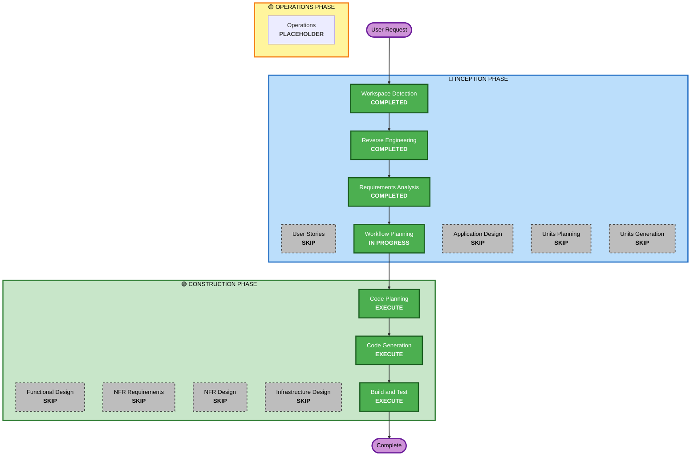

# Execution Plan

## Detailed Analysis Summary

### Transformation Scope (Brownfield Only)
- **Transformation Type**: Single component + configuration
- **Primary Changes**: PWA対応（manifest + service worker + headers）と Firebase Hosting 最小調整
- **Related Components**: `packages/web`, `firebase.json`

### Change Impact Assessment
- **User-facing changes**: Yes - インストール可能化とPWAメタデータ追加
- **Structural changes**: No - 既存構成の範囲内
- **Data model changes**: No
- **API changes**: No
- **NFR impact**: Yes (Security headers) - ただし限定的

### Component Relationships (Brownfield Only)
## Component Relationships
- **Primary Component**: `packages/web`
- **Infrastructure Components**: `firebase.json`
- **Shared Components**: なし
- **Dependent Components**: なし（Web単独のPWA対応）
- **Supporting Components**: なし

### Risk Assessment
- **Risk Level**: Low
- **Rollback Complexity**: Easy
- **Testing Complexity**: Simple

## Workflow Visualization

### Mermaid Diagram


### Text Alternative
```
INCEPTION: Workspace Detection (COMPLETED) -> Reverse Engineering (COMPLETED) -> Requirements Analysis (COMPLETED) -> Workflow Planning (IN PROGRESS)
SKIP: User Stories, Application Design, Units Planning, Units Generation
CONSTRUCTION: Code Planning -> Code Generation -> Build and Test (all EXECUTE)
SKIP: Functional Design, NFR Requirements, NFR Design, Infrastructure Design
OPERATIONS: Placeholder
```

## Phases to Execute

### 🔵 INCEPTION PHASE
- [x] Workspace Detection (COMPLETED)
- [x] Reverse Engineering (COMPLETED)
- [x] Requirements Analysis (COMPLETED)
- [ ] User Stories - SKIP  
  - **Rationale**: 単一ユーザー向けで要件が明確、追加ストーリーの価値が低い
- [x] Workflow Planning (IN PROGRESS)
- [ ] Application Design - SKIP  
  - **Rationale**: 既存コンポーネント内の設定変更のみ
- [ ] Units Planning - SKIP  
  - **Rationale**: 分解不要の単一ユニット
- [ ] Units Generation - SKIP  
  - **Rationale**: 分解不要の単一ユニット

### 🟢 CONSTRUCTION PHASE
- [ ] Functional Design - SKIP  
  - **Rationale**: 新規ビジネスロジックなし
- [ ] NFR Requirements - SKIP  
  - **Rationale**: セキュリティヘッダー追加は実装で対応可能
- [ ] NFR Design - SKIP  
  - **Rationale**: NFR要件の分解が不要
- [ ] Infrastructure Design - SKIP  
  - **Rationale**: Firebase Hosting設定の軽微調整のみ
- [ ] Code Planning - EXECUTE (ALWAYS)
- [ ] Code Generation - EXECUTE (ALWAYS)
- [ ] Build and Test - EXECUTE (ALWAYS)

### 🟡 OPERATIONS PHASE
- [ ] Operations - PLACEHOLDER

## Module Update Strategy
- **Update Approach**: Sequential
- **Critical Path**: `packages/web` → `firebase.json`
- **Coordination Points**: Hosting設定とPWAアセットの配置
- **Testing Checkpoints**: ローカル起動とスマホでのインストール確認

## Estimated Timeline
- **Total Phases**: 1 unit / construction focus
- **Estimated Duration**: 0.5 - 1 day

## Success Criteria
- **Primary Goal**: PWAとしてインストール可能にする
- **Key Deliverables**: manifest, service worker, security headers, Firebase Hosting調整
- **Quality Gates**: スマホでのインストール確認
