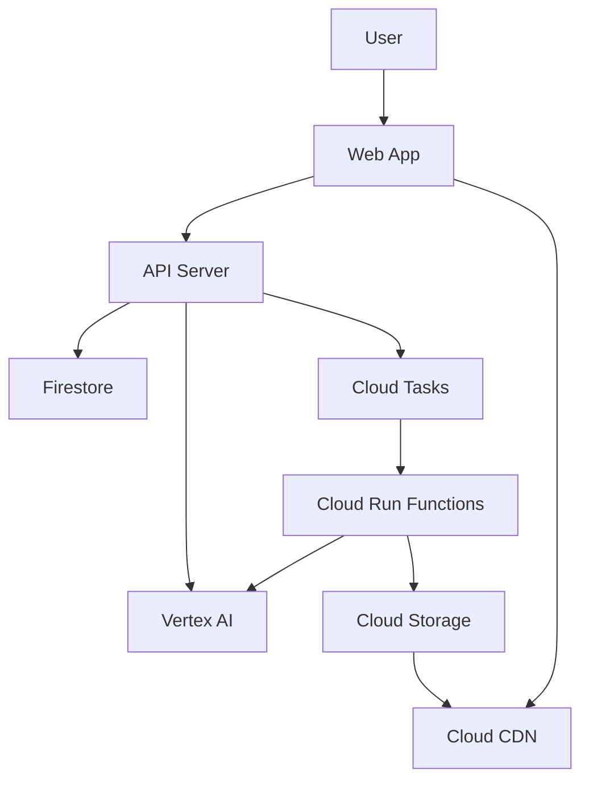
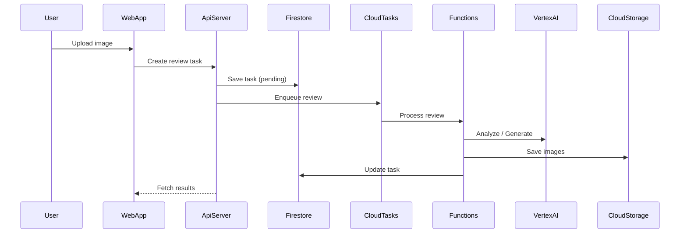

# System Architecture

## System Overview
ウェブアプリからの審査依頼を起点に、APIサーバーがAI分析・画像生成をオーケストレーションし、結果をFirestoreで管理するサーバーレス構成。

## Architecture Diagram
### Mermaid Diagram


### Text Alternative
```
ユーザーはWebアプリから審査依頼を行う。
APIサーバーがFirestoreにタスクを作成し、Cloud TasksとFunctionsを経由してAI分析や画像生成を実行する。
画像はCloud Storageに保存され、Cloud CDN経由で配信される。
```

## Component Descriptions
### packages/web
- **Purpose**: UI提供、認証、結果表示
- **Responsibilities**: 画像アップロード、タスク一覧表示、リアルタイム更新
- **Dependencies**: Firebase SDK, Next.js, API Server
- **Type**: Application

### packages/agent
- **Purpose**: 審査APIとAIオーケストレーション
- **Responsibilities**: タスク管理、分析実行、フィードバック生成、ランク更新
- **Dependencies**: Firestore, Cloud Tasks, Vertex AI
- **Type**: Application

### packages/functions
- **Purpose**: 非同期処理の実行
- **Responsibilities**: アノテーション生成、お手本画像生成、タスク完了処理
- **Dependencies**: Cloud Storage, Vertex AI, Firestore
- **Type**: Application

### packages/infra
- **Purpose**: インフラ構成と補助スクリプト
- **Responsibilities**: GCPセットアップ、デプロイ支援
- **Dependencies**: gcloud, Terraform
- **Type**: Infrastructure

## Data Flow
### Mermaid Diagram


### Text Alternative
```
ユーザーが画像をアップロードし、APIがタスクを作成する。
Cloud TasksがFunctionsを起動し、AI分析・画像生成を実行する。
結果はFirestoreに保存され、Webアプリで閲覧される。
```

## Integration Points
- **External APIs**: Vertex AI Gemini API
- **Databases**: Firestore
- **Third-party Services**: Firebase Authentication, Firebase Hosting (任意)

## Infrastructure Components
- **Cloud Run**: APIサーバーとエージェント実行
- **Cloud Run Functions**: 画像生成・完了処理
- **Cloud Tasks**: 非同期ジョブ管理
- **Cloud Storage / CDN**: 画像保存と配信
