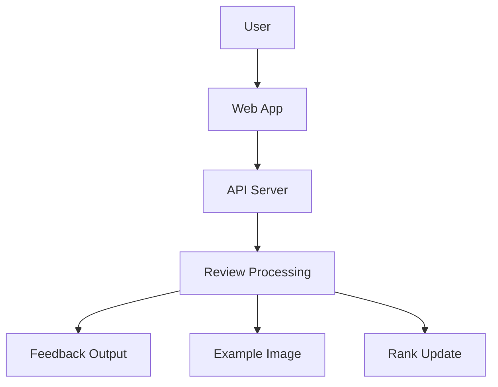

# Business Overview

## Business Context Diagram
### Mermaid Diagram


### Text Alternative
```
ユーザーがWebアプリに画像をアップロードし、APIサーバーが審査処理を実行する。
審査処理の結果として、フィードバック・お手本画像・ランク更新が提供される。
```

## Business Description
- **Business Description**: 鉛筆デッサンの学習者が画像をアップロードすると、AIが分析・フィードバック・お手本画像を返し、成長を可視化する学習支援サービス。
- **Business Transactions**:
  - デッサン画像のアップロード
  - 審査リクエストの作成
  - AIによる分析とフィードバック生成
  - アノテーション画像生成
  - お手本画像生成
  - ランク更新と履歴表示
- **Business Dictionary**:
  - Review Task: 審査の単位となるタスク
  - Feedback: 分析結果と改善点の説明
  - Annotation: 改善ポイントを示す画像
  - Example Image: 改善後イメージの生成画像
  - Rank: 成長度合いを表す評価指標

## Component Level Business Descriptions
### packages/web
- **Purpose**: 学習者が画像を投稿し、結果を閲覧するUIを提供する。
- **Responsibilities**: 認証、画像アップロード、結果表示、リアルタイム更新。

### packages/agent
- **Purpose**: 審査APIとAI分析のオーケストレーションを提供する。
- **Responsibilities**: タスク作成、AI分析呼び出し、フィードバック生成、ランク更新。

### packages/functions
- **Purpose**: 画像生成などの非同期処理を実行する。
- **Responsibilities**: アノテーション生成、お手本画像生成、タスク完了処理。

### packages/infra
- **Purpose**: GCPリソース構成・運用スクリプトを提供する。
- **Responsibilities**: デプロイ設定、ストレージや認証の準備。
