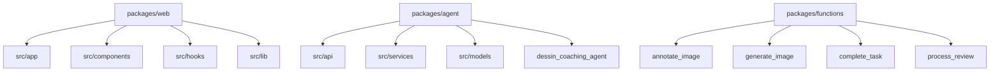

# Code Structure

## Build System
- **Type**: npm (web), uv (agent/functions), Docker (deployment)
- **Configuration**:
  - `packages/web/package.json`
  - `packages/agent/pyproject.toml`
  - `packages/functions/*/requirements.txt`

## Key Classes/Modules
### Mermaid Diagram


### Text Alternative
```
web は app/components/hooks/lib に分かれたUI構成。
agent は api/services/models と、dessin_coaching_agent のエージェント実装で構成。
functions は各機能別に独立したHTTP関数が配置されている。
```

### Existing Files Inventory
- `packages/web/src/app/layout.tsx` - ルートレイアウト
- `packages/web/src/app/page.tsx` - ログイン/トップ
- `packages/web/src/app/(authenticated)/review/page.tsx` - レビュー表示
- `packages/web/src/lib/api.ts` - API呼び出し
- `packages/web/src/lib/firebase.ts` - Firebase初期化
- `packages/web/src/hooks/useTasks.ts` - Firestore監視
- `packages/agent/src/main.py` - FastAPIエントリーポイント
- `packages/agent/src/api/reviews.py` - 審査API
- `packages/agent/src/services/task_service.py` - タスク管理
- `packages/agent/src/services/rank_service.py` - ランク管理
- `packages/agent/dessin_coaching_agent/agent.py` - ADKエージェント定義
- `packages/functions/process_review/main.py` - レビュー処理
- `packages/functions/generate_image/main.py` - 画像生成

## Design Patterns
### Service Layer
- **Location**: `packages/agent/src/services/*`
- **Purpose**: 外部APIやDB操作を分離
- **Implementation**: サービス単位の関数/クラス

### React Hooks + Store
- **Location**: `packages/web/src/hooks`, `packages/web/src/stores`
- **Purpose**: 状態管理と副作用の整理
- **Implementation**: Zustand + カスタムフック

## Critical Dependencies
### Next.js
- **Version**: 16.1.3
- **Usage**: Web UI (App Router)
- **Purpose**: 画面構成とSSR/配信

### Firebase SDK
- **Version**: ^12.8.0
- **Usage**: 認証・Firestore・Storage連携
- **Purpose**: クライアント連携基盤

### FastAPI
- **Version**: 0.115+
- **Usage**: 審査API
- **Purpose**: APIサーバー

### Google ADK / Vertex AI
- **Version**: 1.23+ / 1.135+
- **Usage**: エージェント実行
- **Purpose**: 画像分析とフィードバック生成
