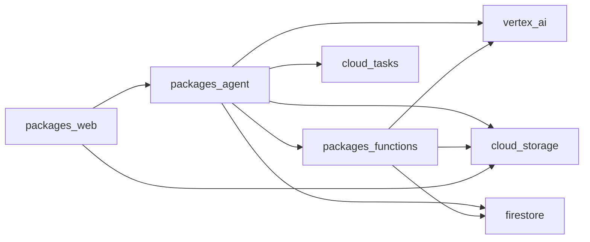

# Dependencies

## Internal Dependencies
### Mermaid Diagram


### Text Alternative
```
web は agent に依存し、agent は functions と各種GCPサービスに依存する。
functions は Vertex AI / Storage / Firestore を利用する。
```

### packages/web depends on packages/agent
- **Type**: Runtime
- **Reason**: 審査APIを呼び出すため

### packages/agent depends on packages/functions
- **Type**: Runtime
- **Reason**: 画像生成や完了処理を非同期で実行するため

## External Dependencies
### Next.js
- **Version**: 16.1.3
- **Purpose**: Webアプリフレームワーク
- **License**: See package metadata

### React
- **Version**: 19.2.3
- **Purpose**: UIライブラリ
- **License**: See package metadata

### Firebase SDK
- **Version**: ^12.8.0
- **Purpose**: 認証/Firestore/Storage連携
- **License**: See package metadata

### FastAPI
- **Version**: 0.115+
- **Purpose**: APIサーバー
- **License**: See package metadata

### Google Cloud Client Libraries
- **Version**: 各パッケージの最新
- **Purpose**: Firestore/Storage/Tasks連携
- **License**: See package metadata
