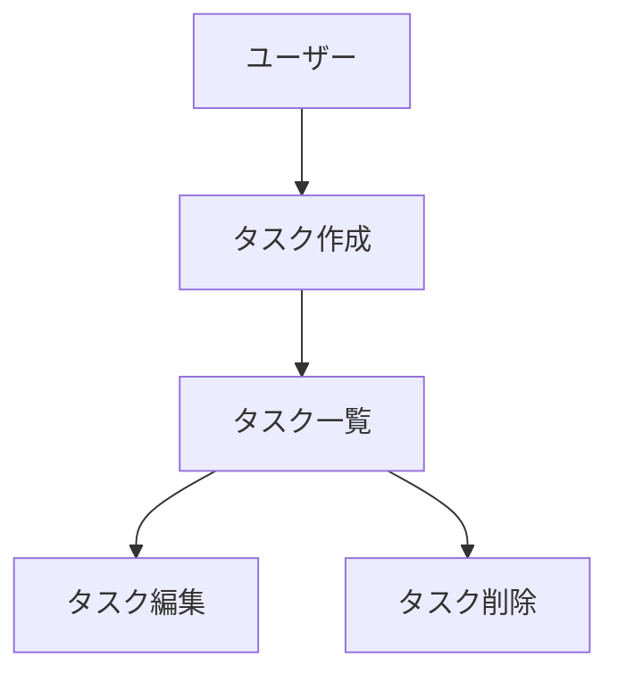

# GEMINI.md (プロジェクトメモリ)

## 概要
開発を進めるうえで遵守すべき標準ルールを定義します。

## プロジェクト構造

本リポジトリは、鉛筆デッサンコーチングエージェントアプリケーション専用のリポジトリです。

### モノレポ構成

`packages/`配下でエージェント・ウェブアプリ・インフラを統合管理します。

```
packages/
├── agent/    # エージェント・API実装（Python/ADK）
├── web/      # ウェブアプリ実装（React/Vite）
└── infra/    # インフラ定義（Terraform/gcloud）
```

### Coding Standards

コードを変更する際は、各パッケージのコーディング規約に従ってください：

| パッケージ | 規約ファイル | 内容 |
|-----------|-------------|------|
| **packages/agent** | [CODING_RULES.md](packages/agent/CODING_RULES.md) | Python/ADK、型定義、エラーハンドリング |
| **packages/web** | [CODING_RULES.md](packages/web/CODING_RULES.md) | React/TypeScript、Zustand、SWR、Tailwind CSS |
| **packages/infra** | [CODING_RULES.md](packages/infra/CODING_RULES.md) | Terraform、gcloudスクリプト |

---

## 開発手法の選択

### aidlcスキル利用時（推奨）

**大規模開発・新機能開発・リファクタリング**には `/aidlc [開発内容]` でaidlcワークフローを起動してください。

aidlcスキルを利用する場合、**aidlcのワークフローに完全に従う**こと：

1. **INCEPTION PHASE**: 要件分析、ユーザーストーリー、ワークフロー計画、アプリケーション設計
2. **CONSTRUCTION PHASE**: 機能設計、NFR要件/設計、インフラ設計、コード生成、ビルド&テスト
3. **OPERATIONS PHASE**: デプロイメント（プレースホルダー）

> **重要**: aidlc利用時は、本ドキュメントの「ドキュメント管理」セクションではなく、aidlcスキルが定義するワークフローとドキュメント構造（`aidlc-docs/`）に従うこと。

### 通常の開発（小規模変更・バグ修正）

シンプルなバグ修正や小規模変更は、aidlcを使わず直接対応可能：
1. 各パッケージのCODING_RULES.mdに従う
2. 必要に応じて`docs/`の永続的ドキュメントを更新

---

## ドキュメント管理

### ディレクトリ構成

| ディレクトリ | 用途 | 管理方針 |
|-------------|------|---------|
| `docs/` | 永続的ドキュメント | プロジェクトの基本設計・方針を定義。`/work-complete`時に必要に応じて更新 |
| `aidlc-docs/` | aidlc作業ドキュメント | aidlcワークフロー中に自動生成。作業完了後は`/work-complete`で整理 |
| `.gemini/steering/` | AIエージェント向けコンテキスト | `/work-complete`で過去の作業成果を蓄積 |

### ドキュメント更新フロー

```
aidlcワークフロー実行
        ↓
  aidlc-docs/ に作業ドキュメント生成
        ↓
  /work-complete 実行
        ↓
  ┌─────────────────────────────────────┐
  │ • aidlc-docs/ → .gemini/steering/ へ移動 │
  │ • docs/ の永続的ドキュメント更新（必要時）  │
  │ • walkthrough.md 作成              │
  └─────────────────────────────────────┘
```

### 永続的ドキュメント（`docs/`）

アプリケーション全体の「**何を作るか**」「**どう作るか**」を定義する恒久的なドキュメント。

- **product-requirements.md** - プロダクト要求定義書
  - プロダクトビジョンと目的
  - ターゲットユーザーと課題・ニーズ
  - 主要な機能一覧
  - 成功の定義
  - ビジネス要件
  - ユーザーストーリー
  - 受け入れ条件
  - 機能要件
  - 非機能要件

- **functional-design.md** - 機能設計書
  - 機能ごとのアーキテクチャ
  - システム構成図
  - データモデル定義（ER図含む）
  - コンポーネント設計
  - ユースケース図、画面遷移図、ワイヤフレーム
  - API設計（将来的にバックエンドと連携する場合）

- **architecture.md** - 技術仕様書
  - テクノロジースタック
  - 開発ツールと手法
  - 技術的制約と要件
  - パフォーマンス要件

- **repository-structure.md** - リポジトリ構造定義書
  - フォルダ・ファイル構成
  - ディレクトリの役割
  - ファイル配置ルール

- **development-guidelines.md** - 開発ガイドライン
  - コーディング規約
  - 命名規則
  - スタイリング規約
  - テスト規約
  - Git規約

- **glossary.md** - ユビキタス言語定義
  - ドメイン用語の定義
  - ビジネス用語の定義
  - UI/UX用語の定義
  - 英語・日本語対応表
  - コード上の命名規則
  - **参考文書（ADK, Gemini API, GCP等のドキュメントURL）**


#### 1. 影響分析

- 永続的ドキュメント（`docs/`）への影響を確認
- 変更が基本設計に影響する場合は `docs/` を更新


**重要：** 1ファイルごとに作成後、必ず確認・承認を得てから次のファイル作成を行う

#### 4. 永続的ドキュメント更新（必要な場合のみ）

変更が基本設計に影響する場合、該当する `docs/` 内のドキュメントを更新します。


## ドキュメント管理の原則

### 永続的ドキュメント（`docs/`）
- アプリケーションの基本設計を記述
- 頻繁に更新されない
- 大きな設計変更時のみ更新
- プロジェクト全体の「北極星」として機能


## 図表・ダイアグラムの記載ルール

### 記載場所
設計図やダイアグラムは、関連する永続的ドキュメント内に直接記載します。
独立したdiagramsフォルダは作成せず、手間を最小限に抑えます。

**配置例：**
- ER図、データモデル図 → `functional-design.md` 内に記載
- ユースケース図 → `functional-design.md` または `product-requirements.md` 内に記載
- 画面遷移図、ワイヤフレーム → `functional-design.md` 内に記載
- システム構成図 → `functional-design.md` または `architecture.md` 内に記載

### 記述形式
1. **Mermaid記法（推奨）**
   - Markdownに直接埋め込める
   - バージョン管理が容易
   - ツール不要で編集可能



2. **ASCII アート**
   - シンプルな図表に使用
   - テキストエディタで編集可能

```
┌─────────────┐
│   Header    │
└─────────────┘
       │
       ↓
┌─────────────┐
│  Task List  │
└─────────────┘
```

3. **画像ファイル（必要な場合のみ）**
   - 複雑なワイヤフレームやモックアップ
   - `docs/images/` フォルダに配置
   - PNG または SVG 形式を推奨

### 図表の更新
- 設計変更時は対応する図表も同時に更新
- 図表とコードの乖離を防ぐ

## Issue Management

- **GitHub Project Linking**: https://github.com/users/nuance-sudo/projects/3

---

## Agent Skills

本プロジェクトでは`.agent/skills/`配下にAgent Skillsを定義しています。

### 利用可能なスキル

| スキル名 | 説明 | 呼び出し方 |
|----------|------|-----------|
| `aidlc` | AI-DLC（AI-Driven Development Life Cycle）ワークフロー起動。大規模開発・リファクタリング・新規プロジェクト時に使用 | `/aidlc [開発内容]` |
| `work-complete` | 作業完了後にaidlc-docsをsteeringに移動し、walkthroughを作成 | `/work-complete [作業タイトル]` |
| `git-commit` | コミット・プッシュ・ブランチ作成・PR作成 | `/git-commit` |

### スキルの配置場所

```
.agent/skills/
├── aidlc/
│   └── SKILL.md
├── work-complete/
│   └── SKILL.md
└── git-commit/
    └── SKILL.md
```