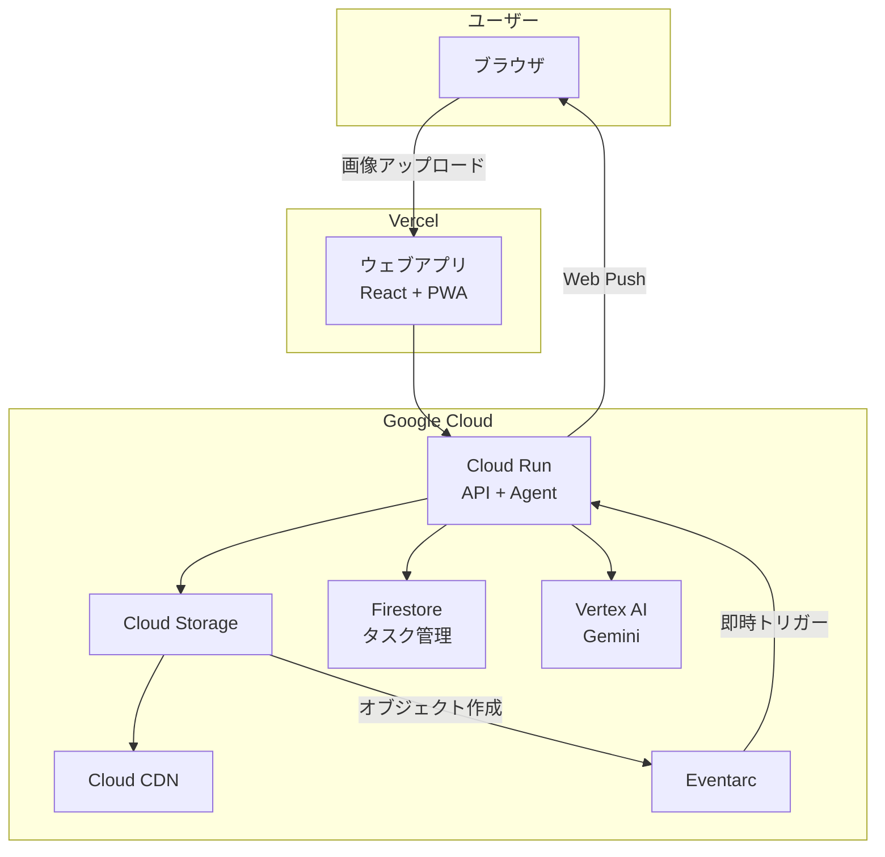

# 鉛筆デッサンコーチングエージェント

**第4回 Agentic AI Hackathon with Google Cloud** 参加プロジェクト

Google Cloud の最新AI技術（Gemini, ADK, Vertex AI）を駆使した、美術学習者のためのインテリジェントなデッサンコーチングエージェントです。

## 🎨 プロジェクト概要

「独学でデッサンを練習しているが、客観的なフィードバックが得られない」という悩みを解決するために開発されました。

**ウェブアプリから**デッサン画像をアップロードすると、AIエージェントが**プロの美術講師のような視点**で分析し、具体的な改善点をフィードバック。さらに「お手本画像（修正後のイメージ）」を生成して視覚的な学習をサポートします。

### ターゲットユーザー
- 美術初心者〜中級者
- 美大受験生
- イラストレーター志望者
- 趣味で絵を描くすべての人

## 🚀 主な機能

1. **高度なデッサン分析** (Gemini 3.0 Flash Preview)
   - プロポーション、陰影、線の質、質感表現を多角的に評価
   - 技術的な改善提案を提供

2. **お手本画像の生成** (Gemini 2.5 Flash Image)
   - 改善点を反映した「修正後のイメージ」を生成
   - 視覚的に理解できるフィードバック

3. **ランク制度**
   - 80点以上でランクアップ（10級〜師範）
   - ランクに応じた評価基準の調整

4. **Web Push通知**
   - 審査完了時にブラウザ通知

## 🏗️ アーキテクチャ



## 📦 プロジェクト構成

```
packages/
├── agent/    # エージェント・API実装（Python/ADK）
├── web/      # ウェブアプリ実装（React/Vite）
└── infra/    # インフラ定義（Terraform/gcloud）
```

### 技術スタック

| カテゴリ | 技術 |
|---------|------|
| **Frontend** | React 19, Vite 7, Tailwind CSS 4, Zustand 5, SWR |
| **Backend** | Python 3.12+, FastAPI, Google ADK |
| **AI Models** | gemini-3-flash-preview, gemini-2.5-flash-image |
| **Infrastructure** | Cloud Run, Cloud Storage, Cloud CDN, Eventarc, Firestore |
| **Hosting** | Vercel (Web), Cloud Run (API/Agent) |

## 📂 ドキュメント

| ドキュメント | 内容 |
|-------------|------|
| [product-requirements.md](docs/product-requirements.md) | プロダクト要求定義 |
| [functional-design.md](docs/functional-design.md) | 機能設計書 |
| [architecture.md](docs/architecture.md) | 技術仕様書 |
| [repository-structure.md](docs/repository-structure.md) | リポジトリ構造 |

## 🏁 始め方

### 前提条件
- Node.js 20+, pnpm
- Python 3.12+, uv
- Google Cloud アカウント
- gcloud CLI

### セットアップ

```bash
# リポジトリをクローン
git clone https://github.com/nuance-sudo/drawing-practice-agent-gch4.git
cd drawing-practice-agent-gch4

# 依存関係インストール
cd packages/agent && uv sync
cd ../web && pnpm install
```

### 開発サーバー起動

```bash
# ルートから
make dev
```

### デプロイ

```bash
# 全体デプロイ
make deploy-all

# 個別デプロイ
make deploy-agent
make deploy-web
```

## 🛠️ 開発ガイド

コーディング規約は各パッケージの `CODING_RULES.md` を参照：

- [packages/agent/CODING_RULES.md](packages/agent/CODING_RULES.md) - Python/ADK
- [packages/web/CODING_RULES.md](packages/web/CODING_RULES.md) - React/TypeScript
- [packages/infra/CODING_RULES.md](packages/infra/CODING_RULES.md) - Terraform

---

*Developed by nuance-sudo for Agentic AI Hackathon with Google Cloud*
