# Art coachIng

> 鉛筆デッサンコーチングエージェント

**第4回 Agentic AI Hackathon with Google Cloud** 参加プロジェクト

Google Cloud の最新AI技術（Gemini, ADK, Vertex AI）を駆使した、美術学習者のためのインテリジェントなデッサンコーチングエージェントです。

## 🎨 プロジェクト概要

「独学でデッサンを練習しているが、客観的なフィードバックが得られない」という悩みを解決するために開発されました。

**ウェブアプリから**デッサン画像をアップロードすると、AIエージェントが**プロの美術講師のような視点**で分析し、具体的な改善点をフィードバック。さらに「お手本画像（修正後のイメージ）」を生成して視覚的な学習をサポートします。

### ターゲットユーザー
- 趣味で絵を描くすべての人

## 🚀 主な機能

1. **アプリから審査依頼**
   - 画像をアップロードするだけで審査が開始

2. **AIによるデッサン分析とフィードバック**
   - 形・陰影・線の質などをわかりやすく解説

3. **改善ポイントの可視化**
   - どこを直すと良いかを画像で示す

4. **お手本画像の生成**
   - 修正後のイメージを提示して理解をサポート

5. **成長の可視化とランク**
   - 過去の提出と比較して上達を実感

## 📷 アプリケーション画面


## 🧭 体験フロー

1. ウェブアプリでデッサン画像をアップロード
2. アプリケーションで審査を実行し、フィードバック詳細に結果を表示
3. Geminiでデッサン分析 → フィードバック生成
4. Agentic Visionでアノテーション画像を生成
5. お手本画像を生成して改善点を視覚化

## 🧪 サンプル

以下のサンプル画像で試せます。

- `docs/samples/sample1.jpg`
- `docs/samples/sample2.jpg`
- `docs/samples/sample3.png`

## 🏗️ アーキテクチャ

```mermaid
flowchart TB
    subgraph User["ユーザー"]
        A[ブラウザ]
    end

    subgraph Firebase["Firebase"]
        B[ウェブアプリ<br/>Next.js + PWA]
    end

    subgraph GCP["Google Cloud"]
        C[Cloud Storage] --> D[Cloud CDN]
        F[Cloud Run<br/>API + Agent] --> G[Firestore<br/>タスク管理]
        F --> H[Vertex AI<br/>Gemini分析]
        F -->|HTTP Request| I[Cloud Functions<br/>画像生成 + 完了処理]
        I --> G
        I --> C
    end

    A -->|画像アップロード| B
    B --> F
    F --> C
    F -->|Web Push| A
```



## 📦 プロジェクト構成

```
packages/
├── agent/    # エージェント・API実装（Python/ADK）
├── web/      # ウェブアプリ実装（Next.js）
├── functions/# Cloud Run Functions実装（Python）
└── infra/    # インフラ定義（gcloud/補助スクリプト）
```

### 技術スタック

| カテゴリ | 技術 |
|---------|------|
| **Frontend** | Next.js 16, React 19, Tailwind CSS 4, Zustand 5, SWR |
| **Backend** | Python 3.12+, FastAPI, Google ADK |
| **AI Models** | gemini-3-flash-preview, gemini-3-pro-image-preview |
| **Infrastructure** | Cloud Run, Cloud Run Functions, Cloud Tasks, Cloud Storage, Cloud CDN, Firestore, Agent Engine, Memory Bank |
| **Hosting** | Firebase Hosting (Web), Cloud Run (API/Agent) |

## 📂 ドキュメント

| ドキュメント | 内容 |
|-------------|------|
| [product-requirements.md](docs/product-requirements.md) | プロダクト要求定義 |
| [functional-design.md](docs/functional-design.md) | 機能設計書 |
| [architecture.md](docs/architecture.md) | 技術仕様書 |
| [repository-structure.md](docs/repository-structure.md) | リポジトリ構造 |
| [agent-flow.md](docs/agent-flow.md) | エージェント処理フロー |
| [development-guidelines.md](docs/development-guidelines.md) | 開発ガイドライン |
| [glossary.md](docs/glossary.md) | 用語集 |

## 🏁 始め方

### 前提条件
- Node.js 20+, npm
- Python 3.12+, uv
- Google Cloud アカウント
- gcloud CLI

### セットアップ

```bash
# リポジトリをクローン
git clone https://github.com/nuance-sudo/drawing-practice-agent-gch4.git
cd drawing-practice-agent-gch4

# 依存関係インストール
cd packages/agent && uv sync
cd ../web && npm install
```

### 開発サーバー起動

```bash
# Backend
cd packages/agent
uv run adk api_server

# Frontend
cd ../web
npm run dev
```

### デプロイ

```bash
# デプロイ手順
cat packages/infra/DEPLOY_GUIDE.md
```

## 🛠️ 開発ガイド

コーディング規約は各パッケージの `CODING_RULES.md` を参照：

- [packages/agent/CODING_RULES.md](packages/agent/CODING_RULES.md) - Python/ADK
- [packages/web/CODING_RULES.md](packages/web/CODING_RULES.md) - React/TypeScript
- [packages/infra/CODING_RULES.md](packages/infra/CODING_RULES.md) - Terraform

---

## 💡 名前の由来

**Art coachIng** ― 鉛筆デッサンを添削し、上達をサポートする「Art Coaching（アートコーチング）」であると同時に、アルファベット1番目の「**A**」と9番目の「**I**」を大文字にして「**AI**」を表現したダブルミーニング。

---

*Developed by nuance-sudo for Agentic AI Hackathon with Google Cloud*
