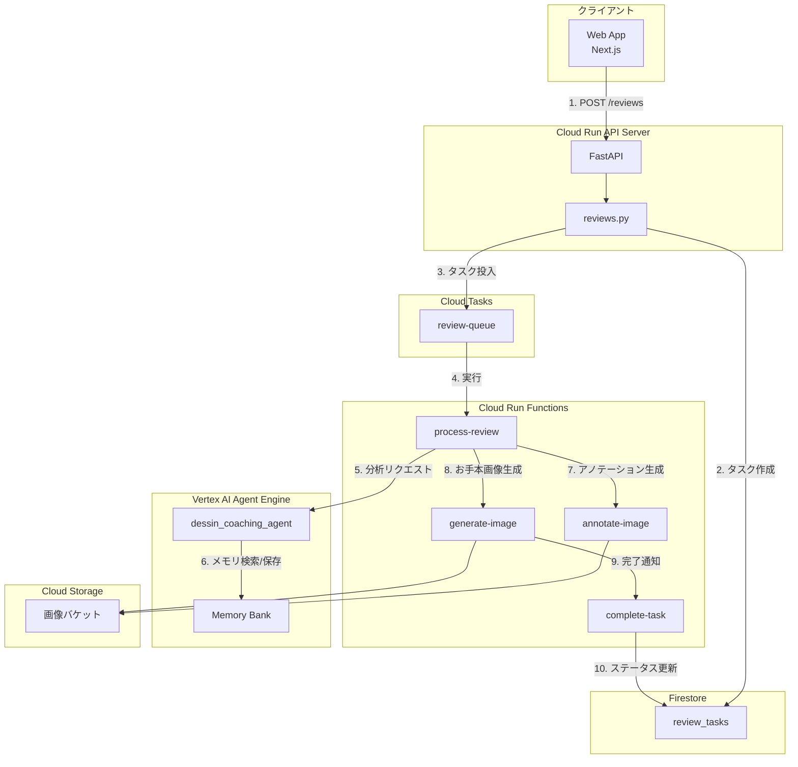
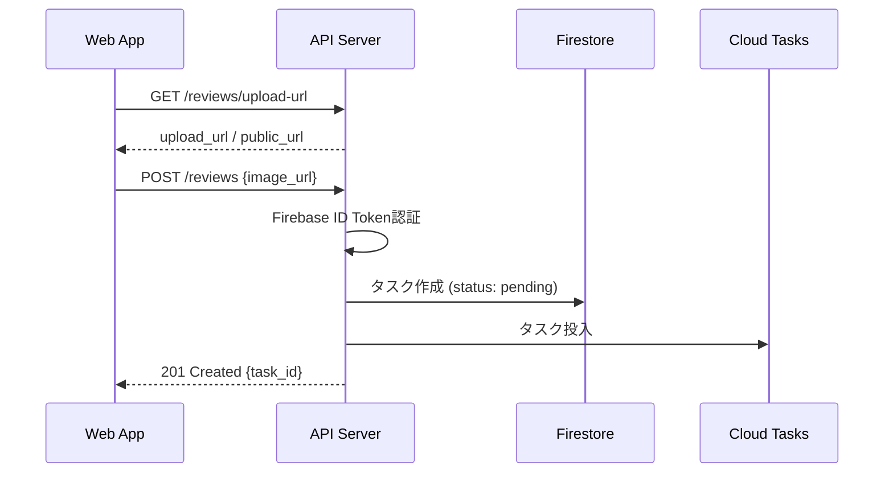
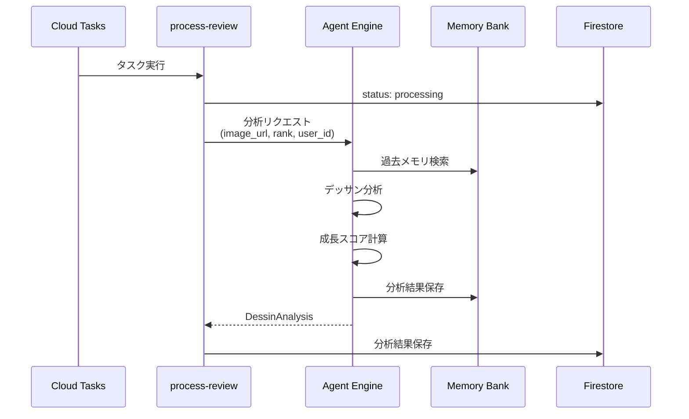
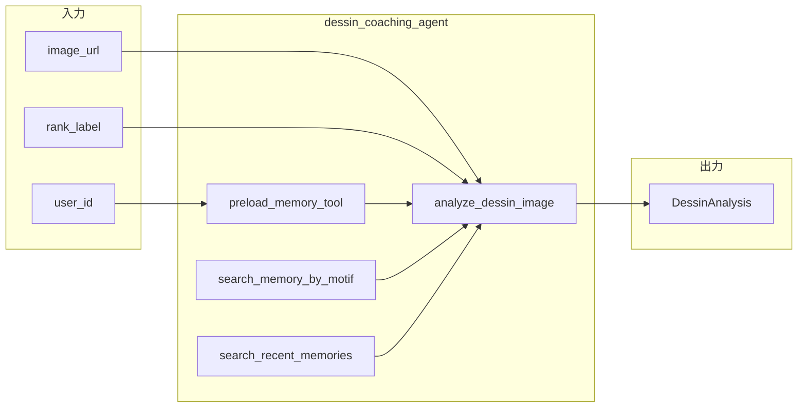
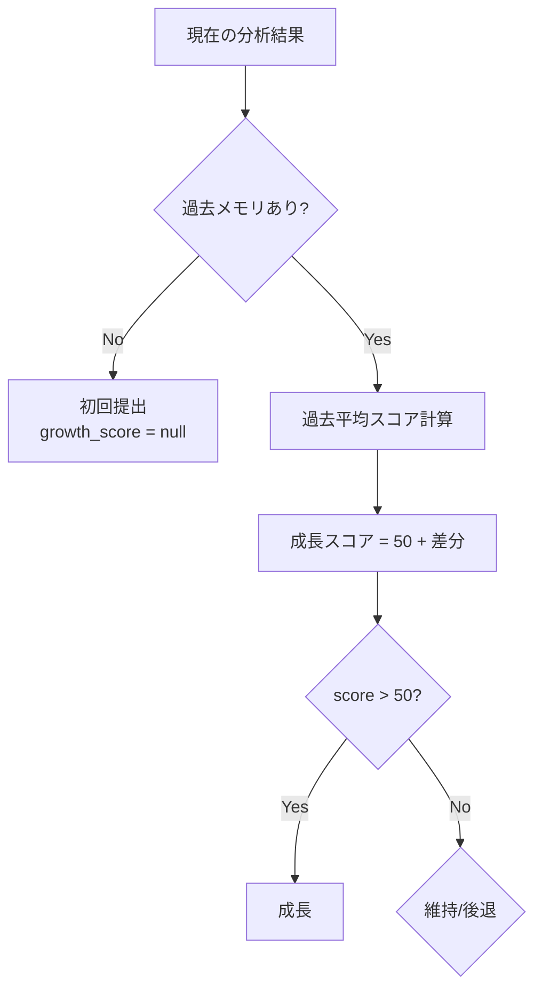
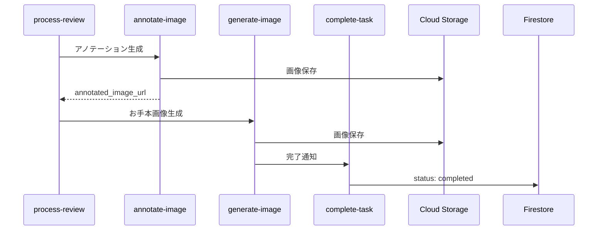
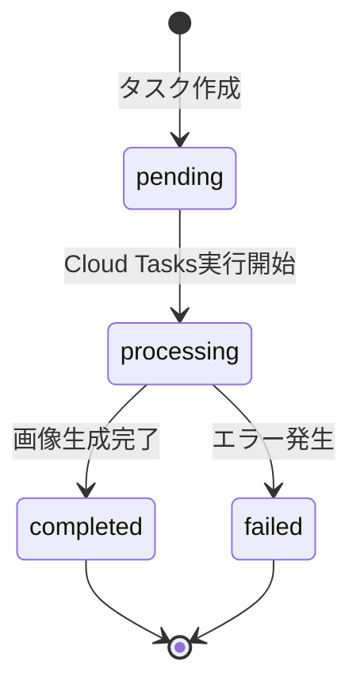

# エージェントフロー設計書

## 概要

本ドキュメントは、鉛筆デッサンコーチングエージェントの処理フローを詳細に説明します。

---

## 全体アーキテクチャ



---

## 処理フロー詳細

### 1. レビューリクエスト受付



| ステップ | 処理 | コンポーネント |
|------|------|----------------|
| 1 | Firebase ID Token認証 | `src/auth/dependencies.py` |
| 2 | タスク作成 | `TaskService.create_task()` |
| 3 | Cloud Tasks投入 | `CloudTasksService.create_review_task()` |

### 2. バックグラウンド処理



### 3. エージェント内部フロー



| ツール | 役割 |
|--------|------|
| `preload_memory_tool` | セッション開始時に過去メモリをプリロード |
| `search_memory_by_motif` | 同じモチーフの過去提出を検索 |
| `search_recent_memories` | ユーザーの直近提出を取得 |
| `analyze_dessin_image` | Gemini APIでデッサンを分析 |

### 4. 成長トラッキングフロー



**計算式:**
```
growth_score = 50 + (current_score - past_average_score)
```

- **50以上**: 成長
- **50**: 維持
- **50未満**: 後退

### 5. 画像生成フロー



---

## データフロー

### Memory Bankへの保存データ

| フィールド | 内容 |
|------------|------|
| `motif` | モチーフ名 (タグから抽出) |
| `overall_score` | 総合スコア |
| `proportion_score` | プロポーションスコア |
| `tone_score` | トーンスコア |
| `texture_score` | 質感スコア |
| `line_quality_score` | 線の質スコア |
| `growth_score` | 成長スコア |
| `submitted_at` | 提出日時 |

### Firestoreタスクステータス遷移



---

## エラーハンドリング

| フェーズ | 失敗時の動作 |
|----------|--------------|
| Cloud Tasks投入 | 同期処理にフォールバック |
| Agent Engine分析 | status: failed、エラーメッセージ保存 |
| アノテーション生成 | スキップしてお手本生成に進む |
| お手本画像生成 | 画像なしで完了 |
| ランク更新 | スキップ（分析結果は保存） |

---

## 関連ファイル

| コンポーネント | ファイル |
|----------------|--------|
| APIエンドポイント | `packages/agent/src/api/reviews.py` |
| Agent定義 | `packages/agent/dessin_coaching_agent/agent.py` |
| 分析ツール | `packages/agent/dessin_coaching_agent/tools.py` |
| メモリツール | `packages/agent/dessin_coaching_agent/memory_tools.py` |
| メモリ保存 | `packages/agent/dessin_coaching_agent/callbacks.py` |
| プロンプト | `packages/agent/dessin_coaching_agent/prompts.py` |
| モデル | `packages/agent/dessin_coaching_agent/models.py` |
