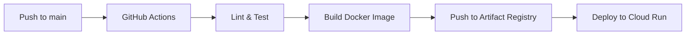
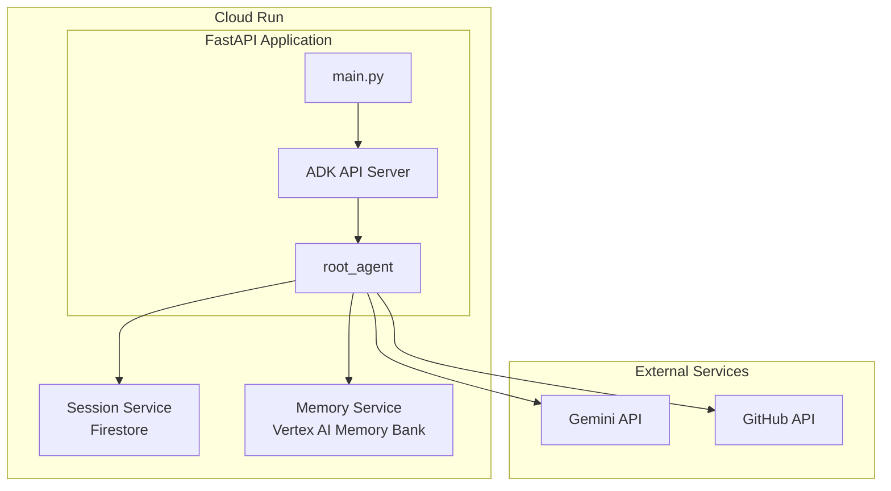
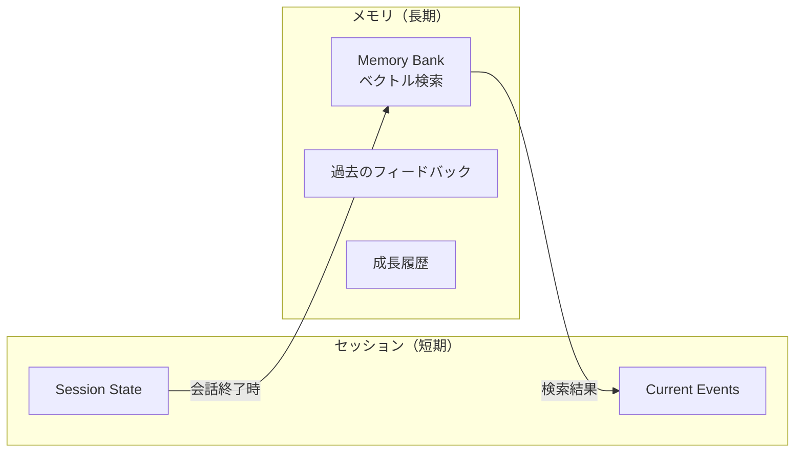
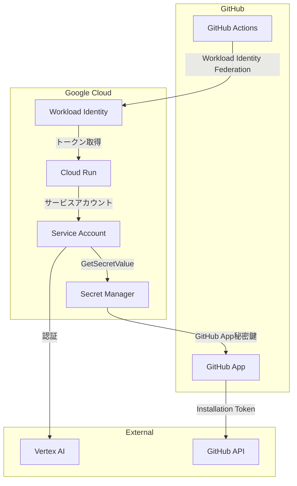

# 鉛筆デッサンコーチングエージェント 技術仕様書

## テクノロジースタック

### エージェント（バックエンド）

| カテゴリ | 技術 | バージョン | 用途 |
|----------|------|------------|------|
| 言語 | Python | 3.12+ | エージェント実装 |
| AIフレームワーク | Google ADK | latest | エージェント構築 |
| ホスティング | Cloud Run | - | サーバーレスエージェント実行 |
| コンテナ | Docker | 24+ | エージェントパッケージング |

### AI/ML サービス

| サービス | モデル | 用途 |
|----------|--------|------|
| Vertex AI | `gemini-3-flash-preview` | マルチモーダル画像分析 |
| Vertex AI | `gemini-2.5-flash-image` | お手本画像生成 |

### インフラストラクチャ

| サービス | 用途 |
|----------|------|
| Cloud Run | エージェントホスティング（サーバーレス） |
| Firestore | セッション管理、ユーザーランクデータの永続化 |
| Vertex AI Memory Bank | 長期メモリ（ベクトル検索による過去のフィードバック検索） |
| Secret Manager | GitHub App秘密鍵管理 |
| Cloud Tasks | 非同期処理キュー（オプション） |
| Artifact Registry | コンテナイメージレジストリ |
| Cloud Logging | ログ出力 |
| Cloud Monitoring | メトリクス・アラート |

### 外部連携

| サービス | 用途 |
|----------|------|
| GitHub API | PR情報取得、コメント投稿 |
| GitHub Actions | エージェントトリガー |
| GitHub App | 認証（秘密鍵ベース） |

---

## 開発ツールと手法

### 開発環境

| ツール | 用途 |
|--------|------|
| VS Code / Cursor | IDE |
| uv | Pythonパッケージ管理 |
| Docker | ローカル開発・テスト |
| gcloud CLI | GCPリソース操作 |

### CI/CD



| ステージ | ツール | 内容 |
|----------|--------|------|
| Lint | ruff | コードスタイルチェック |
| Type Check | mypy | 静的型チェック |
| Test | pytest | ユニットテスト |
| Build | Docker | コンテナイメージビルド |
| Deploy | gcloud | Cloud Runデプロイ |

### コード品質

```bash
# Linting
uv run ruff check .
uv run ruff format .

# Type checking
uv run mypy .

# Testing
uv run pytest tests/ -v
```

---

## 技術的制約（PoC）

> **Note**: 本プロジェクトはPoCのため、非機能要件は厳密に定義しません。

### 画像処理

| 項目 | 制約 |
|------|------|
| 入力画像形式 | JPEG, PNG, WebP |
| 入力画像サイズ | 10MB程度まで（目安） |

---

## パフォーマンス目安（PoC）

| フェーズ | 目安時間 | 備考 |
|----------|----------|------|
| フェーズ1 | 1分程度 | テキストフィードバック |
| フェーズ2 | 数分程度 | 画像生成・投稿 |

> PoCのため、レイテンシやスループットの厳密な目標は設定しません。動作することを優先します。

---

## Thinking機能（推論プロセス可視化）

オーケストレーターエージェントでGeminiのThinking機能を使用し、デッサン評価の推論プロセスを透明化します。

### 利点

| 項目 | 説明 |
|------|------|
| **評価根拠の明確化** | なぜその評価になったかの推論過程を記録 |
| **デバッグ容易性** | エージェントの判断ミスを追跡可能 |
| **フィードバック品質向上** | 深い分析に基づく具体的なアドバイス |

### モデルパラメータ設定

#### オーケストレーター

| パラメータ | 値 | 説明 |
|-----------|-----|------|
| model | `gemini-3-flash-preview` | マルチモーダル対応 |
| max_output_tokens | 32000 | 出力トークン上限 |
| temperature | 1.0 | 創造性バランス |
| thinking_budget_tokens | 8192 | 思考プロセス用トークン |

```python
generate_content_config={
    "max_output_tokens": 32000,
    "temperature": 1.0,
    "thinking_config": {
        "thinking_budget_tokens": 8192
    }
    # その他のパラメータはデフォルト値を使用
}
```

#### サブエージェント（将来拡張時）

| パラメータ | 値 | 説明 |
|-----------|-----|------|
| model | `gemini-3-flash-preview` | オーケストレーターと同一 |
| max_output_tokens | 32000 | 出力トークン上限 |
| temperature | 1.0 | 創造性バランス |
| thinking | なし | サブエージェントでは不使用 |

```python
generate_content_config={
    "max_output_tokens": 32000,
    "temperature": 1.0,
    # thinking_configなし（サブエージェントは単一観点に特化）
}
```

### 使用シーン

- プロポーション分析時の形状比較推論
- 陰影評価時の光源方向判定
- ランク昇格判定の根拠説明

---

## ADKランタイム構成

### Cloud Runデプロイ構成

ADKを使用してCloud Runにエージェントをデプロイする構成：



### セッション管理

| サービス | 用途 | 永続性 |
|----------|------|--------|
| Firestore Session Service | 会話セッションの状態管理 | ✅ 永続 |
| SQLite (ローカル開発用) | ローカル開発時のセッション保存 | 一時的 |

**設定例**:
```python
# session_service_uri の設定
SESSION_SERVICE_URI = "firestore://PROJECT_ID/sessions"  # 本番
SESSION_SERVICE_URI = "sqlite+aiosqlite:///./sessions.db"  # ローカル
```

### 長期メモリ（Memory Bank）

Vertex AI Memory Bankを使用したセマンティック検索によるメモリ機能：



| 項目 | 内容 |
|------|------|
| サービス | Vertex AI Memory Bank |
| 検索タイプ | セマンティック検索（ベクトル類似度） |
| 用途 | 過去のフィードバック検索、成長追跡 |
| 構成URI | `agentengine://<agent_engine_id>` |

**設定例**:
```python
from google.adk.memory import VertexAiMemoryBankService

memory_service = VertexAiMemoryBankService(
    project="PROJECT_ID",
    location="LOCATION",
    agent_engine_id="AGENT_ENGINE_ID"
)
```

**主要機能**:
- **add_session_to_memory**: 会話終了時にセッション内容をメモリに保存
- **search_memory**: 過去の会話からセマンティック検索でコンテキストを取得

---

## セキュリティ要件

### 認証・認可



| 項目 | 実装 |
|------|------|
| GitHub Actions → Cloud Run | Workload Identity Federation |
| Cloud Run認証 | IAM認証必須 |
| Vertex AI認証 | サービスアカウント（自動） |
| GitHub認証 | GitHub App（秘密鍵ベース） |

### データ保護

| データ | 保護方法 |
|--------|----------|
| 入力画像 | 処理後即時削除（メモリ上のみ） |
| 生成画像 | GitHubコメントに直接投稿（保存なし） |
| GitHub App秘密鍵 | Secret Manager（暗号化保存） |
| ログ | Cloud Logging（保持期間設定） |

### ネットワークセキュリティ

| 項目 | 設定 |
|------|------|
| Cloud Run | イングレス: すべて許可、認証: 必須 |
| Firestore | ファイアウォールルール設定 |
| Secret Manager | IAMポリシーで制限 |

---

## 可観測性

### ログ

```python
import structlog

logger = structlog.get_logger()

logger.info(
    "coaching_request_received",
    repo=request.repo,
    pr_number=request.pr_number,
    image_count=len(images),
)
```

| ログレベル | 用途 |
|------------|------|
| DEBUG | 詳細なデバッグ情報 |
| INFO | 正常処理のトラッキング |
| WARNING | 潜在的な問題 |
| ERROR | エラー発生 |

### メトリクス

| メトリクス | 説明 |
|------------|------|
| `coaching.requests.total` | 総リクエスト数 |
| `coaching.requests.success` | 成功リクエスト数 |
| `coaching.requests.error` | エラーリクエスト数 |
| `coaching.latency.analysis` | 分析処理時間 |
| `coaching.latency.generation` | 画像生成時間 |

### トレーシング

```python
from opentelemetry import trace

tracer = trace.get_tracer(__name__)

with tracer.start_as_current_span("analyze_dessin") as span:
    span.set_attribute("image.size", len(image_data))
    span.set_attribute("image.type", image_type)
    result = await analyze(image_data)
```

---

## エラーハンドリング

### エラー分類

| カテゴリ | 例 | 対応 |
|----------|----|------|
| 一時的エラー | API タイムアウト、レートリミット | リトライ（指数バックオフ） |
| 永続的エラー | 無効な画像形式、認証エラー | エラー通知、処理終了 |
| 部分的エラー | 画像生成のみ失敗 | フェーズ1は成功扱い、フェーズ2スキップ通知 |

### リトライ戦略

```python
from tenacity import retry, stop_after_attempt, wait_exponential

@retry(
    stop=stop_after_attempt(3),
    wait=wait_exponential(multiplier=1, min=2, max=30),
)
async def call_vertex_ai(prompt: str, image: bytes) -> str:
    ...
```

| パラメータ | 値 |
|------------|-----|
| 最大リトライ回数 | 3回 |
| 初回待機時間 | 2秒 |
| 最大待機時間 | 30秒 |
| バックオフ係数 | 2x（指数） |

---

## 依存関係

### Python パッケージ

```toml
# pyproject.toml
[project]
name = "dessin-coaching-agent"
version = "0.1.0"
requires-python = ">=3.12"
dependencies = [
    "google-adk>=0.1.0",
    "google-cloud-aiplatform>=1.0.0",
    "google-cloud-firestore>=2.0.0",
    "google-cloud-secret-manager>=2.0.0",
    "httpx>=0.27.0",
    "pydantic>=2.0.0",
    "structlog>=24.0.0",
    "tenacity>=9.0.0",
    "pillow>=11.0.0",
    "PyGithub>=2.0.0",
]

[project.optional-dependencies]
dev = [
    "pytest>=8.0.0",
    "pytest-asyncio>=0.24.0",
    "mypy>=1.0.0",
    "ruff>=0.8.0",
]
```

---

## 環境変数

| 変数名 | 説明 | 取得元 |
|--------|------|--------|
| `GCP_PROJECT_ID` | GCPプロジェクトID | 環境 |
| `GITHUB_APP_SECRET_ID` | GitHub App秘密鍵のSecret ID | 環境 |
| `GITHUB_APP_ID` | GitHub App ID | 環境 |
| `GITHUB_APP_INSTALLATION_ID` | Installation ID | 環境 |
| `FIRESTORE_COLLECTION` | ユーザーランクコレクション名 | 環境 |

---

## デプロイメント

### 環境構成

| 環境 | 用途 | 備考 |
|------|------|------|
| local | ローカル開発 | Docker Compose |
| dev | 開発環境 | 個人検証用 |
| prod | 本番環境 | ユーザー向け |

### デプロイコマンド

```bash
# Docker イメージビルド
docker build -t dessin-coaching-agent .

# Artifact Registry にプッシュ
docker tag dessin-coaching-agent \
  REGION-docker.pkg.dev/PROJECT_ID/REPO_NAME/dessin-coaching-agent:latest
docker push \
  REGION-docker.pkg.dev/PROJECT_ID/REPO_NAME/dessin-coaching-agent:latest

# Cloud Run デプロイ
gcloud run deploy dessin-coaching-agent \
  --image REGION-docker.pkg.dev/PROJECT_ID/REPO_NAME/dessin-coaching-agent:latest \
  --platform managed \
  --region REGION \
  --allow-unauthenticated=false \
  --memory 512Mi \
  --timeout 300 \
  --set-env-vars GCP_PROJECT_ID=PROJECT_ID
```

### Workload Identity Federation 設定

GitHub ActionsからCloud Runを呼び出すためのWorkload Identity Federation設定：

```bash
# Workload Identity Pool 作成
gcloud iam workload-identity-pools create github-pool \
  --location="global" \
  --display-name="GitHub Actions Pool"

# Provider 作成
gcloud iam workload-identity-pools providers create-oidc github-provider \
  --location="global" \
  --workload-identity-pool="github-pool" \
  --issuer-uri="https://token.actions.githubusercontent.com" \
  --attribute-mapping="google.subject=assertion.sub,attribute.actor=assertion.actor,attribute.repository=assertion.repository"

# サービスアカウントへのバインド
gcloud iam service-accounts add-iam-policy-binding SA_NAME@PROJECT_ID.iam.gserviceaccount.com \
  --role="roles/iam.workloadIdentityUser" \
  --member="principalSet://iam.googleapis.com/projects/PROJECT_NUMBER/locations/global/workloadIdentityPools/github-pool/attribute.repository/OWNER/REPO"
```

---

## ハッカソン対応：必須技術チェックリスト

### アプリケーション実行プロダクト（必須）
- [x] **Cloud Run** - エージェントホスティング

### AI技術（必須）
- [x] **Vertex AI** - AIモデル管理
- [x] **Gemini API（Vertex AI経由）** - gemini-3-flash-preview（分析）, gemini-2.5-flash-image（画像生成）
- [x] **ADK (Agents Development Kit)** - エージェント構築フレームワーク

### その他の技術（任意）
- [x] **Firestore** - セッション管理、ユーザーランク管理
- [x] **Vertex AI Memory Bank** - 長期メモリ（ベクトル検索）
- [x] **Secret Manager** - GitHub App秘密鍵
- [x] **Cloud Logging** - ログ出力
- [ ] Firebase - 未使用
- [ ] Flutter - 未使用
- [ ] Veo - 未使用
