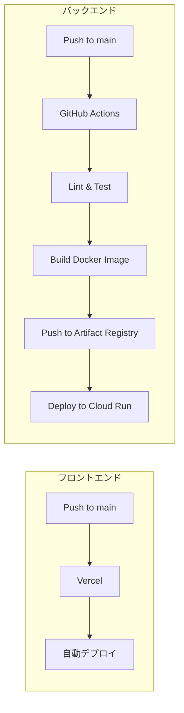
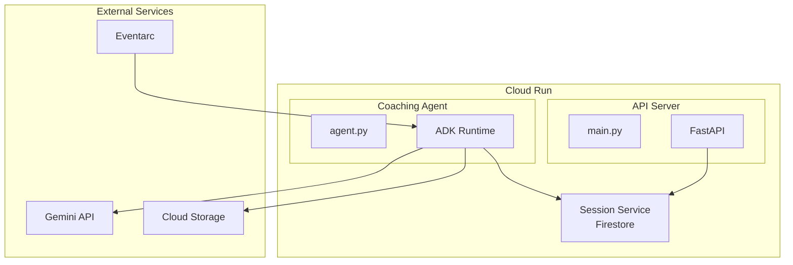

# 鉛筆デッサンコーチングエージェント 技術仕様書

## テクノロジースタック

### フロントエンド（ウェブアプリ）

| カテゴリ | 技術 | バージョン | 用途 |
|----------|------|------------|------|
| フレームワーク | React | 19.x | UIライブラリ |
| ビルドツール | Vite | 7.x | 開発サーバー・バンドラー |
| 言語 | TypeScript | 5.x | 型安全 |
| スタイリング | Tailwind CSS | 4.x | ユーティリティCSS |
| 状態管理 | Zustand | 5.x | グローバルステート |
| データフェッチ | SWR | 2.x | キャッシュ・ポーリング |
| PWA | vite-plugin-pwa | latest | Service Worker |
| ホスティング | Vercel | - | 自動デプロイ |

> **参考**: [aws-samples/generative-ai-use-cases](https://github.com/aws-samples/generative-ai-use-cases)

### エージェント（バックエンド）

| カテゴリ | 技術 | バージョン | 用途 |
|----------|------|------------|------|
| 言語 | Python | 3.12+ | エージェント・API実装 |
| Webフレームワーク | FastAPI | 0.128+ | REST API |
| AIフレームワーク | Google ADK | 1.18+ | エージェント構築 |
| AI Platform | google-cloud-aiplatform | 1.133+ | Vertex AI連携 |
| データベース | google-cloud-firestore | 2.23+ | Firestore連携 |
| ストレージ | google-cloud-storage | 3.8+ | Cloud Storage連携 |
| バリデーション | Pydantic | 2.12+ | データモデル・設定 |
| ログ | structlog | 25.5+ | 構造化ログ |
| リトライ | tenacity | 9.0+ | リトライ処理 |
| ホスティング | Cloud Run | - | サーバーレス実行 |
| コンテナ | Docker | 24+ | パッケージング |

> **Note**: バージョンは2026年1月時点の最新版です。`/check-package-versions` スキルで最新バージョンを確認できます。

### AI/ML サービス

| サービス | モデル | 用途 |
|----------|--------|------|
| Vertex AI | `gemini-3-flash-preview` | マルチモーダル画像分析 |
| Vertex AI | `gemini-2.5-flash-image` | お手本画像生成 |

### インフラストラクチャ

| サービス | 用途 |
|----------|------|
| Cloud Run | API Server + Agentホスティング |
| Cloud Storage | 画像ストレージ |
| Cloud CDN | 画像配信（高速・グローバル） |
| Eventarc | イベント駆動トリガー（即時実行） |
| Firestore | タスク管理、ユーザーランク管理 |
| Secret Manager | 秘密鍵管理 |
| Artifact Registry | コンテナイメージレジストリ |
| Cloud Logging | ログ出力 |
| Cloud Monitoring | メトリクス・アラート |

### 外部連携

| サービス | 用途 |
|----------|------|
| Vercel | ウェブアプリホスティング |
| GitHub API | PR連携（オプション） |
| GitHub Actions | PRトリガー（オプション） |
| GitHub App | 認証（オプション） |

---

## 開発ツールと手法

### 開発環境

| ツール | 用途 |
|--------|------|
| VS Code / Cursor | IDE |
| uv | Pythonパッケージ管理 |
| pnpm | Node.jsパッケージ管理 |
| Docker | ローカル開発・テスト |
| gcloud CLI | GCPリソース操作 |

### CI/CD



| ステージ | ツール | 内容 |
|----------|--------|------|
| Lint (Python) | ruff | コードスタイルチェック |
| Lint (TypeScript) | ESLint | コードスタイルチェック |
| Type Check (Python) | mypy | 静的型チェック |
| Test (Python) | pytest | ユニットテスト |
| Test (TypeScript) | vitest | ユニットテスト |
| Build | Docker / Vite | イメージ・バンドルビルド |
| Deploy | gcloud / Vercel | デプロイ |

### コード品質

```bash
# Backend - Python
uv run ruff check .
uv run ruff format .
uv run mypy .
uv run pytest tests/ -v

# Frontend - TypeScript
pnpm lint
pnpm build
pnpm test
```

---

## 技術的制約（PoC）

> **Note**: 本プロジェクトはPoCのため、非機能要件は厳密に定義しません。

### 画像処理

| 項目 | 制約 |
|------|------|
| 入力画像形式 | JPEG, PNG, WebP |
| 入力画像サイズ | 10MB程度まで（目安） |

---

## パフォーマンス目安（PoC）

| フェーズ | 目安時間 | 備考 |
|----------|----------|------|
| エージェント起動 | 5秒以内 | Eventarcトリガー |
| フェーズ1（分析） | 1分程度 | テキストフィードバック |
| フェーズ2（生成） | 3分程度 | 画像生成・保存 |

---

## Thinking機能（推論プロセス可視化）

オーケストレーターエージェントでGeminiのThinking機能を使用。

### モデルパラメータ設定

| パラメータ | 値 | 説明 |
|-----------|-----|------|
| model | `gemini-3-flash-preview` | マルチモーダル対応 |
| max_output_tokens | 32000 | 出力トークン上限 |
| temperature | 1.0 | 創造性バランス |
| thinking_budget_tokens | 8192 | 思考プロセス用トークン |

```python
generate_content_config={
    "max_output_tokens": 32000,
    "temperature": 1.0,
    "thinking_config": {
        "thinking_budget_tokens": 8192
    }
}
```

---

## ADKランタイム構成

### Cloud Runデプロイ構成



### セッション管理

| サービス | 用途 | 永続性 |
|----------|------|--------|
| Firestore Session Service | 会話セッションの状態管理 | ✅ 永続 |
| SQLite (ローカル開発用) | ローカル開発時のセッション保存 | 一時的 |

---

## セキュリティ要件

### 認証・認可

```mermaid
flowchart TB
    subgraph User["ユーザー"]
        A[ブラウザ]
    end

    subgraph Vercel["Vercel"]
        B[ウェブアプリ]
    end

    subgraph GCP["Google Cloud"]
        C[Cloud Run API]
        D[Secret Manager]
        E[Service Account]
        F[Eventarc]
        G[Cloud Run Agent]
    end

    A -->|認証(将来)| B
    B -->|API Call| C
    C -->|サービスアカウント| E
    E -->|GetSecretValue| D
    F -->|トリガー| G
    G -->|サービスアカウント| E
```

| 項目 | 実装 |
|------|------|
| ユーザー認証 | 将来実装（Firebase Auth等） |
| API認証 | APIキー or JWT（将来） |
| Eventarc → Cloud Run | サービスアカウント |
| Vertex AI認証 | サービスアカウント（自動） |
| GitHub認証 | GitHub App（オプション） |

### データ保護

| データ | 保護方法 |
|--------|----------|
| 入力画像 | Cloud Storage（一定期間後削除） |
| 生成画像 | Cloud Storage（一定期間後削除） |
| 秘密鍵 | Secret Manager（暗号化保存） |
| ログ | Cloud Logging（保持期間設定） |

---

## 可観測性

### ログ

```python
import structlog

logger = structlog.get_logger()

logger.info(
    "review_task_created",
    task_id=task.task_id,
    user_id=task.user_id,
    image_size=len(image_data),
)
```

### メトリクス

| メトリクス | 説明 |
|------------|------|
| `review.tasks.total` | 総タスク数 |
| `review.tasks.completed` | 完了タスク数 |
| `review.tasks.failed` | 失敗タスク数 |
| `review.latency.analysis` | 分析処理時間 |
| `review.latency.generation` | 画像生成時間 |

---

## エラーハンドリング

### エラー分類

| カテゴリ | 例 | 対応 |
|----------|----|------|
| 一時的エラー | API タイムアウト、レートリミット | リトライ（指数バックオフ） |
| 永続的エラー | 無効な画像形式、認証エラー | エラー通知、処理終了 |
| 部分的エラー | 画像生成のみ失敗 | フェーズ1は成功扱い、フェーズ2スキップ |

### リトライ戦略

```python
from tenacity import retry, stop_after_attempt, wait_exponential

@retry(
    stop=stop_after_attempt(3),
    wait=wait_exponential(multiplier=1, min=2, max=30),
)
async def call_vertex_ai(prompt: str, image: bytes) -> str:
    ...
```

---

## 依存関係

### Python パッケージ (agent/)

```toml
[project]
name = "dessin-coaching-agent"
version = "0.1.0"
requires-python = ">=3.12"
dependencies = [
    "google-adk>=0.1.0",
    "google-cloud-aiplatform>=1.0.0",
    "google-cloud-firestore>=2.0.0",
    "google-cloud-storage>=2.0.0",
    "google-cloud-secret-manager>=2.0.0",
    "fastapi>=0.115.0",
    "uvicorn>=0.32.0",
    "httpx>=0.27.0",
    "pydantic>=2.0.0",
    "structlog>=24.0.0",
    "tenacity>=9.0.0",
    "pillow>=11.0.0",
    "pywebpush>=2.0.0",
]

[project.optional-dependencies]
dev = [
    "pytest>=8.0.0",
    "pytest-asyncio>=0.24.0",
    "mypy>=1.0.0",
    "ruff>=0.8.0",
]
```

### Node.js パッケージ (webapp/)

```json
{
  "dependencies": {
    "react": "^18.2.0",
    "react-dom": "^18.2.0",
    "zustand": "^4.5.2",
    "swr": "^2.3.0",
    "tailwind-merge": "^2.4.0"
  },
  "devDependencies": {
    "vite": "^6.4.1",
    "typescript": "^5.4.5",
    "tailwindcss": "^3.4.3",
    "@vitejs/plugin-react": "^4.2.0",
    "vite-plugin-pwa": "^0.21.1",
    "vitest": "^3.0.7",
    "eslint": "^8.57.0"
  }
}
```

---

## 環境変数

### バックエンド

| 変数名 | 説明 | 取得元 |
|--------|------|--------|
| `GCP_PROJECT_ID` | GCPプロジェクトID | 環境 |
| `STORAGE_BUCKET` | Cloud Storageバケット名 | 環境 |
| `CDN_BASE_URL` | Cloud CDNのベースURL | 環境 |
| `FIRESTORE_DATABASE` | Firestoreデータベース名 | 環境 |
| `VAPID_PUBLIC_KEY` | Web Push用公開鍵 | 環境 |
| `VAPID_PRIVATE_KEY_SECRET_ID` | 秘密鍵のSecret ID | 環境 |
| `GITHUB_APP_SECRET_ID` | GitHub App秘密鍵（オプション） | 環境 |

### フロントエンド

| 変数名 | 説明 |
|--------|------|
| `VITE_API_BASE_URL` | APIサーバーのURL |
| `VITE_VAPID_PUBLIC_KEY` | Web Push用公開鍵 |

---

## デプロイメント

### 環境構成

| 環境 | 用途 | 備考 |
|------|------|------|
| local | ローカル開発 | Docker Compose |
| dev | 開発環境 | 個人検証用 |
| prod | 本番環境 | ユーザー向け |

### デプロイコマンド

```bash
# Docker イメージビルド
docker build -t dessin-coaching-agent .

# Artifact Registry にプッシュ
docker tag dessin-coaching-agent \
  REGION-docker.pkg.dev/PROJECT_ID/REPO_NAME/dessin-coaching-agent:latest
docker push \
  REGION-docker.pkg.dev/PROJECT_ID/REPO_NAME/dessin-coaching-agent:latest

# Cloud Run デプロイ
gcloud run deploy dessin-coaching-agent \
  --image REGION-docker.pkg.dev/PROJECT_ID/REPO_NAME/dessin-coaching-agent:latest \
  --platform managed \
  --region REGION \
  --allow-unauthenticated=false \
  --memory 512Mi \
  --timeout 300
```

---

## ハッカソン対応：必須技術チェックリスト

### アプリケーション実行プロダクト（必須）
- [x] **Cloud Run** - API + Agentホスティング

### AI技術（必須）
- [x] **Vertex AI** - AIモデル管理
- [x] **Gemini API（Vertex AI経由）** - gemini-3-flash-preview, gemini-2.5-flash-image
- [x] **ADK (Agents Development Kit)** - エージェント構築フレームワーク

### その他の技術（任意）
- [x] **Cloud Storage** - 画像ストレージ
- [x] **Cloud CDN** - 画像配信
- [x] **Eventarc** - イベント駆動トリガー
- [x] **Firestore** - タスク・ランク管理
- [x] **Secret Manager** - 秘密鍵管理
- [x] **Cloud Logging** - ログ出力
- [ ] Firebase Auth - 将来実装
- [ ] Flutter - モバイルアプリ（将来）
- [ ] Veo - 未使用
