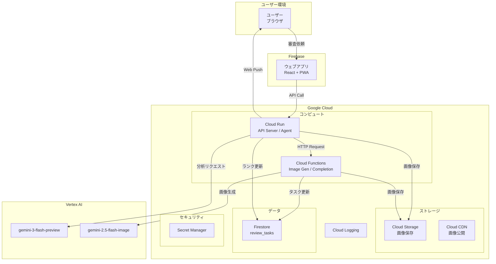
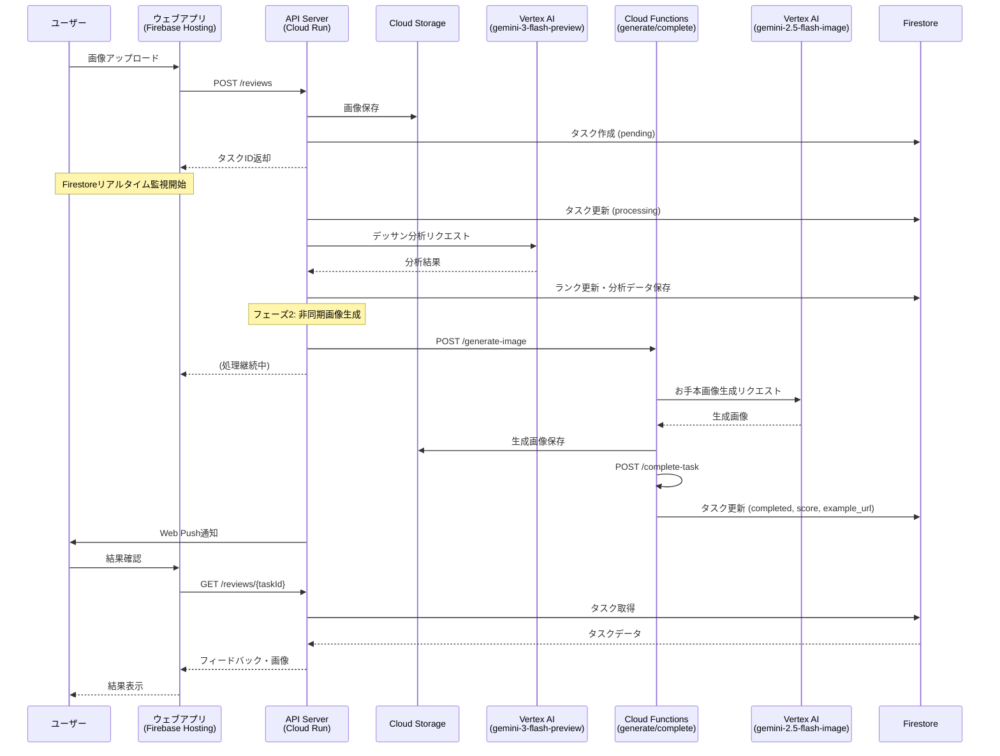
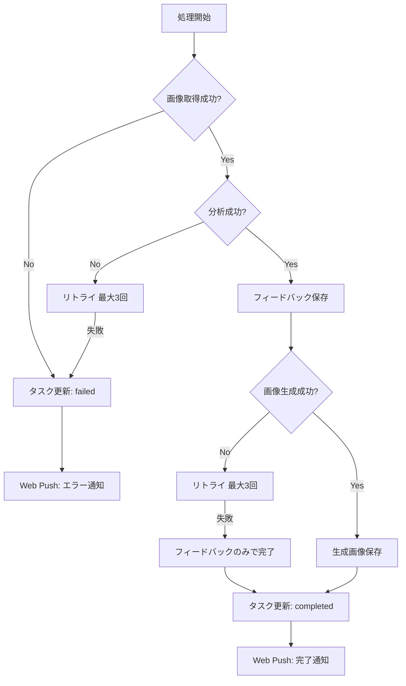
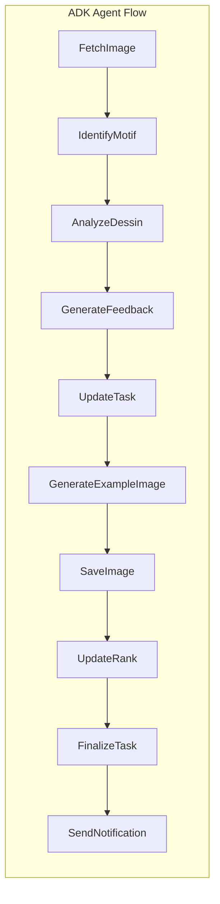
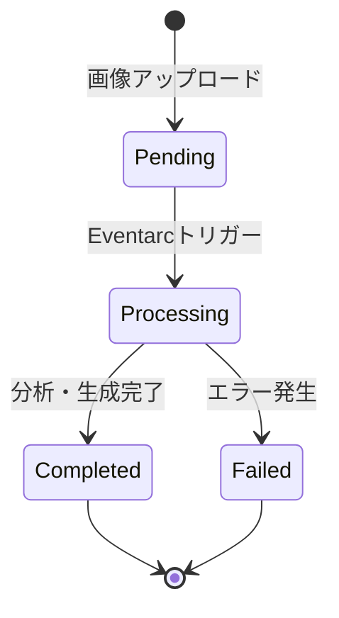
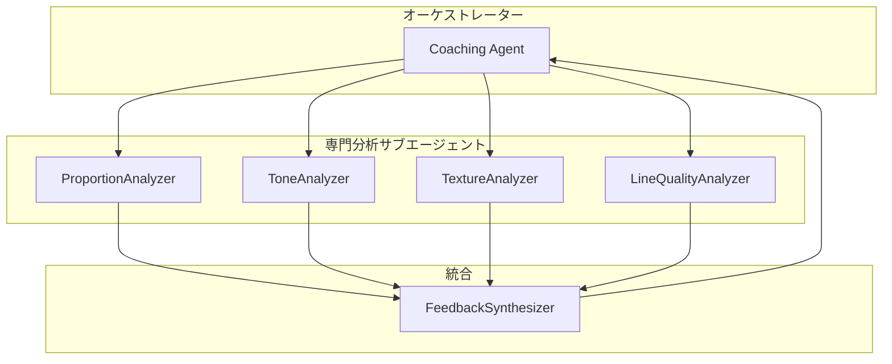

# 鉛筆デッサンコーチングエージェント 機能設計書

## システム概要

ウェブアプリからの審査依頼をトリガーに鉛筆デッサン画像を分析し、コーチングフィードバックとお手本画像を生成するサーバーレスエージェントシステム。Google Cloud上で稼働し、ADK（Agents Development Kit）を活用したエージェンティックAIアーキテクチャを採用。

---

## システム構成図

### Google Cloud構成図



---

## 処理フロー

### メインフロー



### エラーハンドリングフロー



---

## コンポーネント設計

### 1. ウェブアプリ（Firebase Hosting）

**責務**: ユーザーインターフェース、画像アップロード、結果表示、プッシュ通知

**技術スタック**:
- React 19.x
- Next.js 16.x (App Router)
- TypeScript 5.x
- Tailwind CSS 4.x
- Firebase Authentication (GitHub)
- Zustand 5.x（状態管理）
- SWR 2.x（データフェッチ・ポーリング）

```
packages/web/
├── app/
│   ├── api/
│   │   └── auth/
│   │       └── [...nextauth]/
│   │           └── route.ts    # API Routes
│   ├── (authenticated)/        # 認証必須ページ
│   │   ├── review/
│   │   │   └── page.tsx
│   │   ├── history/
│   │   │   └── page.tsx
│   │   └── layout.tsx
│   ├── page.tsx                # ホーム（ログイン）
│   └── layout.tsx              # ルートレイアウト
├── components/                 # UIコンポーネント
│   ├── ImageUpload.tsx
│   ├── FeedbackDisplay.tsx
│   ├── TaskList.tsx
│   └── RankBadge.tsx
├── stores/                     # Zustandストア
│   └── taskStore.ts
├── hooks/                      # カスタムフック
│   ├── useTaskRealtime.ts      # Firestoreリアルタイム監視
│   └── usePushNotification.ts
├── lib/
│   ├── firebase.ts             # Firebase初期化
│   └── api.ts                  # API呼び出し
├── public/
│   └── sw.js                   # Service Worker
├── package.json
├── next.config.ts
└── tailwind.config.ts
```

### 2. API Server（Cloud Run）

**責務**: RESTful API提供、画像アップロード処理、タスク管理

```
agent/
├── src/
│   ├── main.py           # FastAPIエントリーポイント
│   ├── api/
│   │   ├── reviews.py    # 審査API
│   │   ├── tasks.py      # タスクAPI
│   │   └── users.py      # ユーザーAPI
│   └── ...
```

### 3. Coaching Agent（Cloud Run）

**責務**: 画像分析、フィードバック生成、画像生成のオーケストレーション

```
agent/
├── src/
│   ├── agent.py          # ADK Agent定義
│   ├── tools/
│   │   ├── storage_tool.py   # Cloud Storage操作
│   │   └── image_tool.py     # 画像処理
│   ├── prompts/
│   │   └── coaching.py   # コーチング用プロンプト
│   ├── services/
│   │   ├── gemini_service.py # Vertex AI連携
│   │   ├── rank_service.py   # ランク管理
│   │   ├── task_service.py   # タスク管理
│   │   ├── push_service.py   # Web Push通知
│   │   └── feedback_service.py
│   └── models/
│       ├── task.py       # タスクモデル
│       ├── feedback.py   # フィードバックモデル
│       └── rank.py       # ランクモデル
```

### 4. ADK Agent構成

```python
# agent.py
from google.adk import Agent, Tool

class DessinCoachingAgent(Agent):
    """鉛筆デッサンコーチングエージェント
    
    Thinking機能を使用して、デッサン分析の推論プロセスを透明化。
    """
    
    def __init__(self):
        super().__init__(
            name="dessin-coaching-agent",
            model="gemini-3-flash-preview",
            description="鉛筆デッサンを分析し、改善フィードバックを提供するエージェント",
            generate_content_config={
                "max_output_tokens": 32000,
                "temperature": 1.0,
                "thinking_config": {
                    "thinking_budget_tokens": 8192
                }
            },
            tools=[
                self.fetch_image,
                self.analyze_dessin,
                self.generate_feedback,
                self.generate_example_image,
                self.update_task,
                self.send_push_notification,
            ]
        )
    
    @Tool
    def fetch_image(self, image_url: str) -> bytes:
        """Cloud CDNから画像を取得"""
        ...
    
    @Tool
    def analyze_dessin(self, image_data: bytes) -> dict:
        """デッサン画像を分析"""
        ...
    
    @Tool
    def generate_feedback(self, analysis: dict, rank: str) -> str:
        """フィードバックを生成"""
        ...
    
    @Tool
    def generate_example_image(self, image_data: bytes, improvements: list) -> str:
        """お手本画像を生成"""
        ...
    
    @Tool
    def update_task(self, task_id: str, status: str, data: dict) -> bool:
        """Firestoreのタスクを更新"""
        ...
    
    @Tool
    def send_push_notification(self, user_id: str, message: str) -> bool:
        """Web Push通知を送信"""
        ...
```

### 5. 処理ノード構成



| ノード | 責務 | 主要コンポーネント |
|--------|------|-------------------|
| **FetchImage** | Cloud CDNから画像を取得 | `StorageTool` |
| **IdentifyMotif** | モチーフ識別・タグ付け | `GeminiService` |
| **AnalyzeDessin** | gemini-3-flash-previewでデッサンを分析 | `GeminiService` |
| **GenerateFeedback** | フィードバック生成 | `FeedbackService` |
| **UpdateTask** | タスクステータス更新 | `TaskService` |
| **GenerateExampleImage** | gemini-2.5-flash-imageでお手本画像生成 | `GeminiService` |
| **SaveImage** | 生成画像をCloud Storageに保存 | `StorageTool` |
| **UpdateRank** | ランク判定・更新 | `RankService` |
| **FinalizeTask** | タスク完了処理 | `TaskService` |
| **SendNotification** | Web Push通知送信 | `PushService` |

---

## データモデル定義

### タスクモデル

```python
from pydantic import BaseModel
from typing import Optional, List
from datetime import datetime
from enum import Enum

class TaskStatus(str, Enum):
    PENDING = "pending"
    PROCESSING = "processing"
    COMPLETED = "completed"
    FAILED = "failed"

class ReviewTask(BaseModel):
    """審査タスク"""
    task_id: str
    user_id: str
    status: TaskStatus
    image_url: str                    # 元画像のCDN URL
    example_image_url: Optional[str]  # 生成画像のCDN URL
    feedback: Optional[dict]          # フィードバックデータ
    score: Optional[float]            # 総合スコア
    tags: Optional[List[str]]         # モチーフタグ
    error_message: Optional[str]      # エラー時のメッセージ
    created_at: datetime
    updated_at: datetime
```

### デッサン分析モデル

```python
from pydantic import BaseModel
from typing import List

class ProportionAnalysis(BaseModel):
    """プロポーション分析"""
    shape_accuracy: str       # 形の正確さ
    ratio_balance: str        # 比率・バランス
    contour_quality: str      # 輪郭線の質
    score: float              # スコア (0-100)

class ToneAnalysis(BaseModel):
    """陰影（トーン）分析"""
    value_range: str          # 明暗の階調
    light_consistency: str    # 光源の一貫性
    three_dimensionality: str # 立体感
    score: float

class TextureAnalysis(BaseModel):
    """質感表現分析"""
    material_expression: str  # 素材感
    touch_variety: str        # タッチの使い分け
    score: float

class LineQualityAnalysis(BaseModel):
    """線の質分析"""
    stroke_quality: str       # 運筆
    pressure_control: str     # 筆圧コントロール
    hatching: str             # ハッチング技法
    score: float

class DessinAnalysis(BaseModel):
    """デッサン総合分析"""
    proportion: ProportionAnalysis
    tone: ToneAnalysis
    texture: TextureAnalysis
    line_quality: LineQualityAnalysis
    overall_score: float      # 総合スコア (0-100)
    strengths: List[str]      # 強み
    improvements: List[str]   # 改善点
    tags: List[str]           # モチーフタグ
```

### ランクモデル

```python
from pydantic import BaseModel
from typing import List
from datetime import datetime

class UserRank(BaseModel):
    """ユーザーランク"""
    user_id: str
    rank_level: int           # 1-15 (10級〜師範)
    total_submissions: int
    high_scores: List[float]  # 直近の高スコア
    created_at: datetime
    updated_at: datetime
    
    @property
    def display_name(self) -> str:
        """ランク表示名"""
        if self.rank_level <= 10:
            return f"{11 - self.rank_level}級"
        elif self.rank_level <= 13:
            return f"{self.rank_level - 10}段"
        elif self.rank_level == 14:
            return "師範代"
        else:
            return "師範"
```

### ランク制度

| レベル | 表示名 | 昇格条件 | 評価基準 |
|--------|--------|----------|----------|
| 1 | 10級 | 初期ランク | 優しめ（基礎重視） |
| 2 | 9級 | 80点以上を1回 | 優しめ |
| 3 | 8級 | 80点以上を2回 | 優しめ |
| 4 | 7級 | 80点以上を3回 | やや優しめ |
| 5 | 6級 | 80点以上を4回 | やや優しめ |
| 6 | 5級 | 80点以上を5回 | 標準 |
| 7 | 4級 | 80点以上を6回 | 標準 |
| 8 | 3級 | 80点以上を7回 | やや厳しめ |
| 9 | 2級 | 80点以上を8回 | やや厳しめ |
| 10 | 1級 | 80点以上を10回 | 厳しめ |
| 11 | 初段 | 80点以上を12回 | 厳しめ |
| 12 | 2段 | 80点以上を15回 | かなり厳しめ |
| 13 | 3段 | 80点以上を20回 | かなり厳しめ |
| 14 | 師範代 | 80点以上を25回 | プロ基準 |
| 15 | 師範 | 80点以上を30回 | プロ基準 |

> **Note**: ランクが上がるにつれて評価基準が厳しくなります。初心者は基礎的な要素（形・バランス）を重視し、上級者になるほど質感・空気感・芸術性など高度な要素も評価対象となります。

---

## UI表示例

### フィードバック表示

```markdown
## 🎨 デッサンコーチング フィードバック

**現在のランク**: 7級 ⬆️

### 総合評価: ⭐ 78/100

---

### 🌟 良い点

- **陰影表現**: 明暗の階調が丁寧に描かれており、立体感が出ています
- **構図**: モチーフの配置が画面内でバランスよく収まっています
- **線の質**: ハッチングの方向が一定で、安定した運筆です

---

### 📈 改善ポイント

#### プロポーション
- モチーフの右側がやや歪んでいます。補助線を引いて形を確認しましょう
- 楕円の軸を意識すると、より正確な形が取れます

#### 陰影（トーン）
- 最も暗い部分の描き込みが浅いです。10段階の明暗をすべて使いましょう
- 反射光の表現を加えると、より立体感が増します

---

### 🖼️ 改善例（お手本画像）


_この画像はAI（gemini-2.5-flash-image）によって生成されました_
```

---

## 外部サービス連携

### 1. Firebase Hosting

| 操作 | 用途 |
|------|------|
| ホスティング | Next.jsアプリ (SSR/Static) の配信 |
| CDN | 静的アセットのグローバル配信 |

### 2. Cloud Storage / CDN

| 操作 | 用途 |
|------|------|
| オブジェクト作成 | 画像アップロード |
| 公開URL生成 | CDN経由での画像配信 |
| 署名付きURL | セキュアなアップロード |

### 3. Eventarc

| 操作 | 用途 |
|------|------|
| Cloud Storageトリガー | オブジェクト作成時にCloud Runを起動 |

### 4. Vertex AI (Gemini)

| 操作 | モデル | 用途 |
|------|--------|------|
| デッサン分析 | `gemini-3-flash-preview` | マルチモーダル分析 |
| 画像生成 | `gemini-2.5-flash-image` | お手本画像生成 |

### 5. Google Cloud Services

| サービス | 用途 |
|----------|------|
| Cloud Run | API Server + Agent ホスティング |
| Cloud Storage | 画像ストレージ |
| Cloud CDN | 画像配信 |
| Eventarc | イベント駆動トリガー |
| Firestore | タスク・ランク管理 |
| Secret Manager | 秘密鍵管理 |
| Cloud Logging | ログ出力 |
| Artifact Registry | コンテナイメージ |

---

## Firestore データ構造

### コレクション: `review_tasks`

```
tasks/
└── {task_id}/
    ├── task_id: string
    ├── user_id: string
    ├── status: string (pending|processing|completed|failed)
    ├── image_url: string
    ├── example_image_url: string (optional)
    ├── feedback: map (optional)
    ├── score: number (optional)
    ├── tags: array<string> (optional)
    ├── error_message: string (optional)
    ├── created_at: timestamp
    └── updated_at: timestamp
```

### コレクション: `user_ranks`

```
user_ranks/
└── {user_id}/
    ├── user_id: string
    ├── rank_level: number
    ├── total_submissions: number
    ├── high_scores: array<number>
    ├── created_at: timestamp
    └── updated_at: timestamp
```

### コレクション: `push_subscriptions`

```
push_subscriptions/
└── {user_id}/
    ├── endpoint: string
    ├── keys: map
    │   ├── p256dh: string
    │   └── auth: string
    └── created_at: timestamp
```

### インデックス

| コレクション | フィールド | タイプ |
|--------------|------------|--------|
| review_tasks | user_id, created_at | 複合（昇順、降順） |
| review_tasks | status | 単一 |
| user_ranks | rank_level | 降順 |

### リアルタイム監視（onSnapshot）

ウェブアプリからFirestoreの`tasks`コレクションをリアルタイム監視し、エージェントがタスクステータスを更新した瞬間にUIに反映します。

```typescript
// useTaskRealtime.ts
import { collection, onSnapshot, query, where, orderBy } from 'firebase/firestore';
import { db } from '@/lib/firebase';

export const useTaskRealtime = (userId: string) => {
  const [tasks, setTasks] = useState<ReviewTask[]>([]);

  useEffect(() => {
    const q = query(
      collection(db, 'review_tasks'),
      where('user_id', '==', userId),
      orderBy('created_at', 'desc')
    );

    // リアルタイムリスナー設定
    const unsubscribe = onSnapshot(q, (snapshot) => {
      const newTasks = snapshot.docs.map(doc => ({
        taskId: doc.id,
        ...doc.data()
      }));
      setTasks(newTasks);
    });

    return () => unsubscribe();
  }, [userId]);

  return { tasks };
};
```

> **Note**: ポーリング不要で、エージェントがFirestoreを更新した瞬間に自動的にフロントエンドに反映されます。

---

## Cloud Run設定

### API Server

| 項目 | 値 |
|------|-----|
| メモリ | 256Mi |
| CPU | 1 |
| 最大インスタンス | 10 |
| 最小インスタンス | 0 |
| タイムアウト | 60秒 |
| 同時実行数 | 80 |
| イングレス | すべて許可 |
| 認証 | 不要（API認証で制御） |

### Coaching Agent

| 項目 | 値 |
|------|-----|
| メモリ | 512Mi |
| CPU | 1 |
| 最大インスタンス | 10 |
| 最小インスタンス | 0 |
| タイムアウト | 300秒 |
| 同時実行数 | 1 |
| イングレス | 内部のみ |
| 認証 | Eventarcトリガー |

### 環境変数

| 変数名 | 説明 |
|--------|------|
| `GCP_PROJECT_ID` | GCPプロジェクトID |
| `STORAGE_BUCKET` | Cloud Storageバケット名 |
| `CDN_BASE_URL` | Cloud CDNのベースURL |
| `FIRESTORE_DATABASE` | Firestoreデータベース名 |
| `VAPID_PUBLIC_KEY` | Web Push用公開鍵 |
| `VAPID_PRIVATE_KEY_SECRET_ID` | Web Push用秘密鍵のSecret ID |

---

## 状態遷移図（タスク）



---

## オプション機能: GitHub PR連携

> [!NOTE]
> この機能はオプションです。ウェブアプリをメインとしつつ、エンジニア向けにPR連携も提供します。

### GitHub Actions Workflow

```yaml
# .github/workflows/dessin-coaching.yml
name: Dessin Coaching Trigger
on:
  pull_request:
    types: [opened, synchronize]
    paths:
      - '**.png'
      - '**.jpg'
      - '**.jpeg'

jobs:
  trigger-coaching:
    runs-on: ubuntu-latest
    permissions:
      id-token: write
      contents: read
    steps:
      - name: Authenticate to Google Cloud
        uses: google-github-actions/auth@v2
        with:
          workload_identity_provider: ${{ secrets.GCP_WORKLOAD_IDENTITY_PROVIDER }}
          service_account: ${{ secrets.GCP_SERVICE_ACCOUNT }}

      - name: Trigger Coaching Agent
        run: |
          TOKEN=$(gcloud auth print-identity-token)
          curl -X POST ${{ secrets.AGENT_ENDPOINT }} \
            -H "Content-Type: application/json" \
            -H "Authorization: Bearer $TOKEN" \
            -d '{
              "repo": "${{ github.repository }}",
              "pr_number": ${{ github.event.pull_request.number }},
              "head_sha": "${{ github.event.pull_request.head.sha }}"
            }'
```

### PRコメント投稿

フィードバックをPRコメントとして投稿する機能を提供。

---

## 将来の拡張機能

### 拡張1: マルチエージェントによる協調分析

**概要**: 複数のサブエージェントが協調してデッサンを分析するSwarmパターンへ拡張



### 拡張2: メモリ機能による成長トラッキング

**概要**: ADKのセッション/メモリ機能を活用し、ユーザーの成長を時系列で追跡

### 拡張3: マルチモーダルエンベディング

**概要**: Vertex AIのマルチモーダルエンベディングを使用して、過去に似たスケッチを検索

---

## 初期実装 vs 将来拡張

| 機能 | 初期実装 | 将来拡張 |
|------|----------|----------|
| エージェント構成 | 単一エージェント | マルチエージェント |
| メモリ | Firestoreのみ | Memory Bank統合 |
| 類似検索 | なし | マルチモーダルエンベディング |
| UI | ウェブアプリ | モバイルアプリ |
| 通知 | Web Push | Email/LINE連携 |
