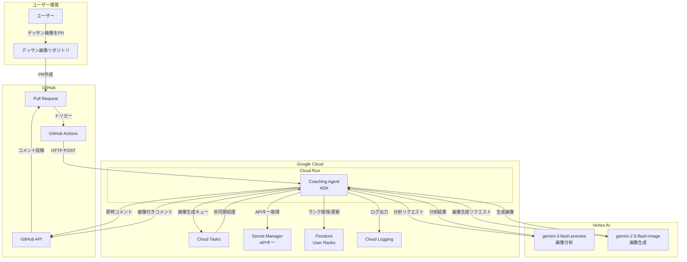
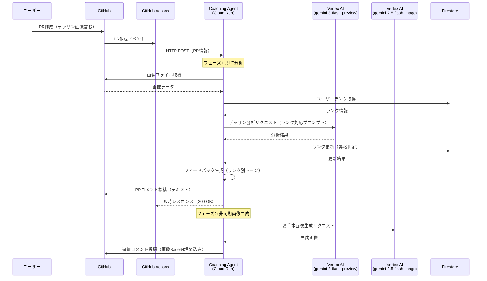
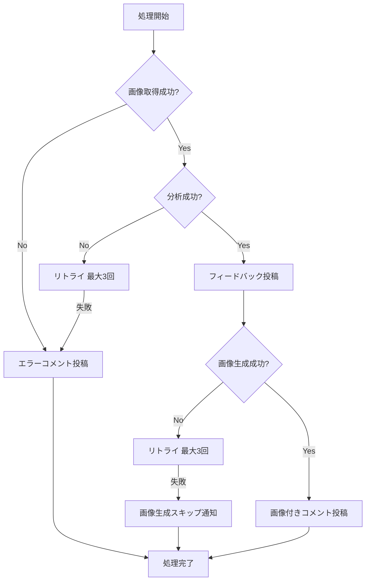
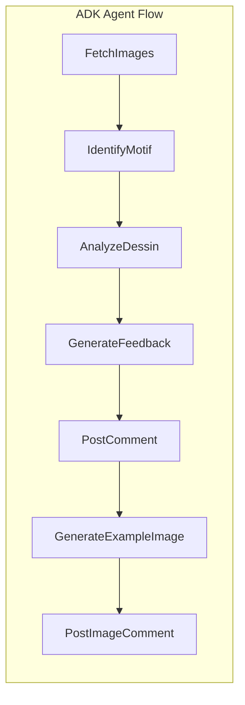
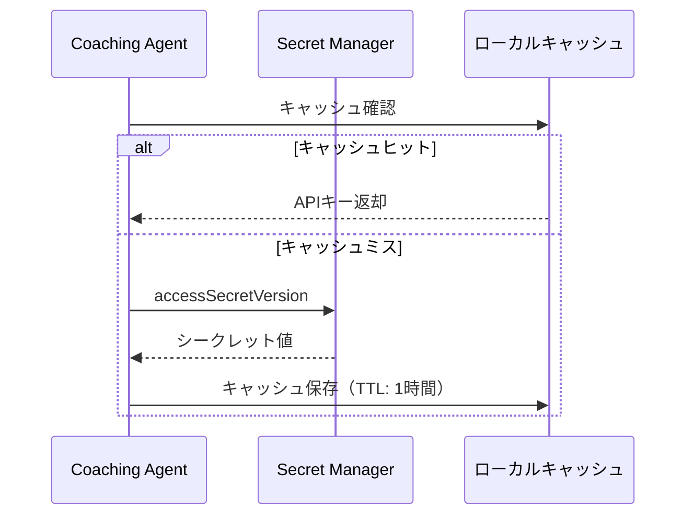
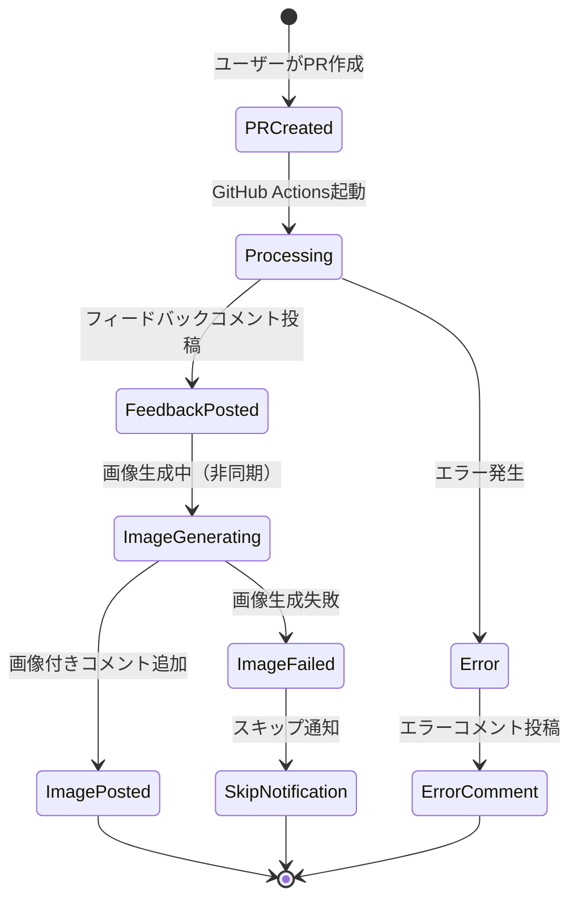
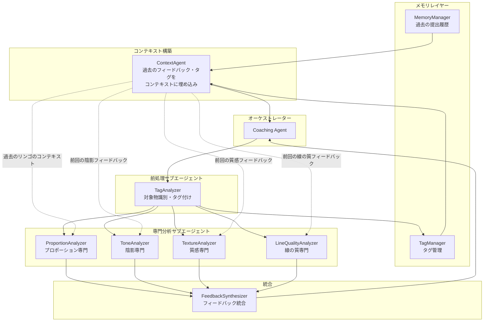

# 鉛筆デッサンコーチングエージェント 機能設計書

## システム概要

GitHub PRをトリガーに鉛筆デッサン画像を分析し、コーチングフィードバックとお手本画像を生成するサーバーレスエージェントシステム。Google Cloud上で稼働し、ADK（Agents Development Kit）を活用したエージェンティックAIアーキテクチャを採用。

---

## システム構成図

### Google Cloud構成図



---

## 処理フロー

### メインフロー



### エラーハンドリングフロー



---

## コンポーネント設計

### 1. GitHub Actions Workflow

**責務**: PR作成イベントを検知し、エージェントにHTTPリクエストを送信

```yaml
# .github/workflows/dessin-coaching.yml
name: Dessin Coaching Trigger
on:
  pull_request:
    types: [opened, synchronize]
    paths:
      - '**.png'
      - '**.jpg'
      - '**.jpeg'

jobs:
  trigger-coaching:
    runs-on: ubuntu-latest
    permissions:
      id-token: write
      contents: read
    steps:
      - name: Authenticate to Google Cloud
        uses: google-github-actions/auth@v2
        with:
          workload_identity_provider: ${{ secrets.GCP_WORKLOAD_IDENTITY_PROVIDER }}
          service_account: ${{ secrets.GCP_SERVICE_ACCOUNT }}

      - name: Trigger Coaching Agent
        run: |
          TOKEN=$(gcloud auth print-identity-token)
          curl -X POST ${{ secrets.AGENT_ENDPOINT }} \
            -H "Content-Type: application/json" \
            -H "Authorization: Bearer $TOKEN" \
            -d '{
              "repo": "${{ github.repository }}",
              "pr_number": ${{ github.event.pull_request.number }},
              "head_sha": "${{ github.event.pull_request.head.sha }}"
            }'
```

### 2. Coaching Agent（メインエージェント）

**責務**: 画像分析、フィードバック生成、GitHub連携のオーケストレーション

```
agent/
├── main.py              # エントリーポイント（Cloud Run対応）
├── agent.py             # ADK Agentの定義
├── tools/
│   ├── github_tool.py   # GitHub API操作
│   └── image_tool.py    # 画像取得・処理
├── prompts/
│   └── coaching.py      # コーチング用プロンプト
├── services/
│   ├── vertex_ai_service.py # Vertex AI連携
│   ├── rank_service.py      # ランク管理
│   └── feedback_service.py  # フィードバック生成
└── models/
    ├── request.py       # リクエストモデル
    ├── feedback.py      # フィードバックモデル
    └── rank.py          # ランクモデル
```

### 3. ADK Agent構成

Google ADK（Agents Development Kit）を使用したエージェント構成

```python
# agent.py
from google.adk import Agent, Tool

class DessinCoachingAgent(Agent):
    """鉛筆デッサンコーチングエージェント（オーケストレーター）
    
    Thinking機能を使用して、デッサン分析の推論プロセスを透明化。
    複雑な評価判断の根拠を明確にし、より質の高いフィードバックを生成。
    """
    
    def __init__(self):
        super().__init__(
            name="dessin-coaching-agent",
            model="gemini-3-flash-preview",
            description="鉛筆デッサンを分析し、改善フィードバックを提供するエージェント",
            # モデル実行パラメータ
            generate_content_config={
                "max_output_tokens": 32000,
                "temperature": 1.0,
                "thinking_config": {
                    "thinking_budget_tokens": 8192  # 思考プロセスに割り当てるトークン数
                }
            },
            tools=[
                self.analyze_dessin,
                self.generate_feedback,
                self.generate_example_image,
                self.post_github_comment,
            ]
        )
    
    @Tool
    def analyze_dessin(self, image_data: bytes) -> dict:
        """デッサン画像を分析"""
        ...
    
    @Tool
    def generate_feedback(self, analysis: dict, rank: str) -> str:
        """フィードバックを生成"""
        ...
    
    @Tool
    def generate_example_image(self, image_data: bytes, improvements: list) -> str:
        """お手本画像を生成"""
        ...
    
    @Tool
    def post_github_comment(self, repo: str, pr_number: int, comment: str) -> bool:
        """GitHubにコメントを投稿"""
        ...
```

### 4. 処理ノード構成



| ノード | 責務 | 主要コンポーネント |
|--------|------|-------------------|
| **FetchImages** | PRから画像を取得 | `GitHubTool` |
| **IdentifyMotif** | モチーフ識別・タグ付け | `GeminiService` |
| **AnalyzeDessin** | gemini-3-flash-previewでデッサンを分析 | `GeminiService` |
| **GenerateFeedback** | フィードバック生成 | `FeedbackService` |
| **PostComment** | PRにコメント投稿 | `GitHubTool` |
| **GenerateExampleImage** | gemini-2.5-flash-imageでお手本画像生成 | `GeminiService` |
| **PostImageComment** | 画像付きコメント投稿 | `GitHubTool` |

---

## データモデル定義

### リクエストモデル

```python
from pydantic import BaseModel

class CoachingRequest(BaseModel):
    repo: str               # リポジトリ名（owner/repo形式）
    pr_number: int          # PR番号
    head_sha: str           # コミットSHA
```

### デッサン分析モデル

```python
from pydantic import BaseModel
from typing import List

class ProportionAnalysis(BaseModel):
    """プロポーション分析"""
    shape_accuracy: str       # 形の正確さ
    ratio_balance: str        # 比率・バランス
    contour_quality: str      # 輪郭線の質
    score: float              # スコア (0-100)

class ToneAnalysis(BaseModel):
    """陰影（トーン）分析"""
    value_range: str          # 明暗の階調
    light_consistency: str    # 光源の一貫性
    three_dimensionality: str # 立体感
    score: float

class TextureAnalysis(BaseModel):
    """質感表現分析"""
    material_expression: str  # 素材感
    touch_variety: str        # タッチの使い分け
    score: float

class LineQualityAnalysis(BaseModel):
    """線の質分析"""
    stroke_quality: str       # 運筆
    pressure_control: str     # 筆圧コントロール
    hatching: str             # ハッチング技法
    score: float

class DessinAnalysis(BaseModel):
    """デッサン総合分析"""
    proportion: ProportionAnalysis
    tone: ToneAnalysis
    texture: TextureAnalysis
    line_quality: LineQualityAnalysis
    overall_score: float      # 総合スコア (0-100)
    strengths: List[str]      # 強み
    improvements: List[str]   # 改善点
    tags: List[str]           # モチーフタグ（リンゴ、球体、静物など）
```


### モチーフタグモデル

```python
from pydantic import BaseModel
from typing import List

class MotifTag(BaseModel):
    """モチーフタグ"""
    primary: str              # 主要モチーフ（例: リンゴ）
    category: str             # カテゴリ（静物、人物、風景など）
    attributes: List[str]     # 属性（明暗練習、質感練習など）
```


### ランクモデル

```python
from pydantic import BaseModel
from typing import List
from datetime import datetime

class UserRank(BaseModel):
    """ユーザーランク"""
    github_username: str
    rank_level: int           # 1-15 (10級〜師範)
    total_submissions: int
    high_scores: List[float]  # 直近の高スコア
    created_at: datetime
    updated_at: datetime
    
    @property
    def display_name(self) -> str:
        """ランク表示名"""
        if self.rank_level <= 10:
            return f"{11 - self.rank_level}級"
        elif self.rank_level <= 13:
            return f"{self.rank_level - 10}段"
        elif self.rank_level == 14:
            return "師範代"
        else:
            return "師範"
```

### ランク制度

| レベル | 表示名 | 昇格条件 |
|--------|--------|----------|
| 1 | 10級 | 初期ランク |
| 2 | 9級 | 70点以上を2回 |
| 3 | 8級 | 75点以上を2回 |
| 4 | 7級 | 75点以上を3回 |
| 5 | 6級 | 80点以上を2回 |
| 6 | 5級 | 80点以上を3回 |
| 7 | 4級 | 85点以上を2回 |
| 8 | 3級 | 85点以上を3回 |
| 9 | 2級 | 90点以上を2回 |
| 10 | 1級 | 90点以上を3回 |
| 11 | 初段 | 95点以上を2回 |
| 12 | 2段 | 95点以上を3回 |
| 13 | 3段 | 95点以上を5回 |
| 14 | 師範代 | 98点以上を3回 |
| 15 | 師範 | 98点以上を5回 |

---

## コメント表示例

### フェーズ1: 即時フィードバック（テキスト）

```markdown
## 🎨 デッサンコーチング フィードバック

**現在のランク**: 7級 ⬆️

### 総合評価: ⭐ 78/100

---

### 🌟 良い点

- **陰影表現**: 明暗の階調が丁寧に描かれており、立体感が出ています
- **構図**: モチーフの配置が画面内でバランスよく収まっています
- **線の質**: ハッチングの方向が一定で、安定した運筆です

---

### 📈 改善ポイント

#### プロポーション
- モチーフの右側がやや歪んでいます。補助線を引いて形を確認しましょう
- 楕円の軸を意識すると、より正確な形が取れます

#### 陰影（トーン）
- 最も暗い部分の描き込みが浅いです。10段階の明暗をすべて使いましょう
- 反射光の表現を加えると、より立体感が増します

#### 質感表現
- 素材感の違いをタッチで表現してみましょう
- 金属はシャープに、布は柔らかいタッチで

---

_🖼️ お手本画像を生成中です。しばらくお待ちください..._
```

### フェーズ2: 画像付き追加コメント

```markdown
## 🖼️ 改善例（お手本画像）

以下は上記の改善ポイントを反映した参考デッサンです：


### 適用した改善点
- プロポーションの修正（右側の歪み補正）
- 明暗の階調を広げた陰影表現
- 反射光の追加

---

_この画像はAI（gemini-2.5-flash-image）によって生成されました_
```

> **Note**: 生成画像はBase64エンコードしてGitHubコメントに直接埋め込みます。外部ストレージは使用しません。

---

## 外部サービス連携

### 1. GitHub API

| 操作 | API | 用途 |
|------|-----|------|
| PR情報取得 | `GET /repos/{owner}/{repo}/pulls/{pull_number}` | PR詳細取得 |
| ファイル一覧 | `GET /repos/{owner}/{repo}/pulls/{pull_number}/files` | 変更ファイル取得 |
| ファイル内容 | `GET /repos/{owner}/{repo}/contents/{path}` | 画像取得 |
| コメント投稿 | `POST /repos/{owner}/{repo}/issues/{issue_number}/comments` | フィードバック投稿 |

### 2. Vertex AI (Gemini)

| 操作 | モデル | 用途 |
|------|--------|------|
| デッサン分析 | `gemini-3-flash-preview` | マルチモーダル分析 |
| 画像生成 | `gemini-2.5-flash-image` | お手本画像生成 |

### 3. Google Cloud Services

| サービス | 用途 |
|----------|------|
| Cloud Run | エージェントホスティング |
| Cloud Tasks | 非同期処理キュー（オプション） |
| Secret Manager | GitHub App秘密鍵保存 |
| Cloud Logging | ログ出力 |
| Firestore | ユーザーランク管理 |
| Artifact Registry | エージェントコンテナイメージ |

> **Note**: 生成画像はGitHubコメントに直接Base64埋め込みするため、Cloud StorageやCloud CDNは使用しません。

---

## シークレット管理

### 管理するシークレット

| シークレット名 | 用途 | 保存先 |
|----------------|------|--------|
| `GITHUB_APP_PRIVATE_KEY` | GitHub App認証用秘密鍵 | Secret Manager |
| `GITHUB_APP_ID` | GitHub App ID | Secret Manager |
| `GITHUB_APP_INSTALLATION_ID` | GitHub App Installation ID | Secret Manager |

> **Note**: Vertex AIはサービスアカウント認証を使用するため、APIキーのSecret Manager管理は不要です。

### シークレット取得フロー



---

## Firestore データ構造

### コレクション: `user_ranks`

```
user_ranks/
└── {github_username}/
    ├── github_username: string
    ├── rank_level: number
    ├── total_submissions: number
    ├── high_scores: array<number>
    ├── created_at: timestamp
    └── updated_at: timestamp
```

### インデックス

| コレクション | フィールド | タイプ |
|--------------|------------|--------|
| user_ranks | rank_level | 降順 |
| user_ranks | updated_at | 降順 |

---

## Cloud Run設定

### サービス設定

| 項目 | 値 |
|------|-----|
| メモリ | 512Mi |
| CPU | 1 |
| 最大インスタンス | 10 |
| 最小インスタンス | 0 |
| タイムアウト | 300秒 |
| 同時実行数 | 80 |
| イングレス | すべて許可 |
| 認証 | IAM認証必須 |

### 環境変数

| 変数名 | 説明 |
|--------|------|
| `GCP_PROJECT_ID` | GCPプロジェクトID |
| `GITHUB_APP_SECRET_ID` | GitHub App秘密鍵のSecret ID |
| `FIRESTORE_COLLECTION` | ユーザーランクコレクション名 |

---

## 状態遷移図（GitHub PR上のUX）



---

## 将来の拡張機能

### 拡張1: マルチエージェントによる協調分析

**概要**: 現在の単一エージェント構成から、複数のサブエージェントが協調してデッサンを分析するSwarmパターンへ拡張。メモリレイヤーを上位に配置し、過去のコンテキストを各サブエージェントに注入する。

**参考**:
- [Google ADK Multi-Agents (Iterative Refinement Pattern)](https://google.github.io/adk-docs/agents/multi-agents/#iterative-refinement-pattern)
- [Strands Agents Swarm Pattern](https://strandsagents.com/1.1.x/documentation/docs/user-guide/concepts/multi-agent/swarm/)

**アーキテクチャ構想**:



**処理フロー**:

1. **メモリ取得**: `MemoryManager`がユーザーの過去の提出履歴を取得
2. **コンテキスト構築**: `ContextAgent`が過去のフィードバックやタグをコンテキストに埋め込み
3. **タグ付け**: `TagAnalyzer`がデッサンの対象物を識別（例: リンゴ、球体、静物）
4. **専門分析**: 各サブエージェントが過去のコンテキストを参照しながら分析
   - 例: 「前回のリンゴでは右側が歪んでいた。今回はどうか？」
5. **フィードバック統合**: `FeedbackSynthesizer`が全分析を統合し、成長フィードバックを生成

**コンテキスト注入例**:

```python
context = {
    "user_history": {
        "last_apple_dessin": {
            "date": "2024-01-15",
            "score": 72,
            "issues": ["右側のプロポーションが歪み", "陰影の階調が5段階程度"]
        },
        "frequent_issues": ["プロポーションの歪み"],
        "improving_areas": ["陰影表現", "ハッチング"]
    },
    "current_tags": ["リンゴ", "静物", "明暗練習"],
    "same_motif_history": [...]  # 同じタグの過去提出
}

# 各サブエージェントへのプロンプト例
tone_analyzer_prompt = f"""
あなたは陰影（トーン）の専門分析エージェントです。

## 過去のフィードバック
前回のリンゴのデッサン（1/15）では、陰影の階調が5段階程度でした。
今回のデッサンでは改善されているか確認してください。

[画像を分析してください]
"""
```

**期待される効果**:
- 各分析観点の専門性向上
- 分析の深さと精度向上
- 新しい分析観点の追加が容易
- **過去との比較による成長フィードバック**
- **同じモチーフの継続的な改善追跡**

**サブエージェント一覧**:

| エージェント | 責務 | メモリ利用 |
|--------------|------|------------|
| `TagAnalyzer` | 対象物識別・タグ付け | タグ履歴参照、新規タグ登録 |
| `ProportionAnalyzer` | プロポーション分析 | 同モチーフの過去プロポーション問題参照 |
| `ToneAnalyzer` | 陰影分析 | 過去の陰影スコア・フィードバック参照 |
| `TextureAnalyzer` | 質感分析 | 過去の質感フィードバック参照 |
| `LineQualityAnalyzer` | 線の質分析 | 過去のハッチング・運筆フィードバック参照 |
| `FeedbackSynthesizer` | 統合・成長レポート生成 | 全履歴参照、成長トレンド生成 |

**実装ステップ**:
1. メモリレイヤーの設計（Firestore連携）
2. `TagAnalyzer`の実装（対象物識別プロンプト設計）
3. `ContextAgent`の実装（コンテキスト構築ロジック）
4. 各専門サブエージェントのプロンプト設計（過去コンテキスト注入）
5. オーケストレーターの実装
6. フィードバック統合ロジックの実装（成長レポート含む）
7. 評価・チューニング

---

### 拡張2: メモリ機能による成長トラッキング

**概要**: ADKのセッション/メモリ機能を活用し、ユーザーの成長を時系列で追跡。過去の提出作品と比較した成長フィードバックを提供

**参考**:
- [Google ADK Sessions](https://google.github.io/adk-docs/sessions/)

**機能イメージ**:

```markdown
## 🎨 デッサンコーチング フィードバック

### 📈 成長レポート

前回（1/15）と比較して：
- ✅ **陰影表現が向上**: 明暗の階調が5段階→8段階に改善しました！
- ✅ **立体感UP**: 反射光の表現が追加され、より立体的になりました
- 🔄 **プロポーション**: 前回同様、右側がやや歪む傾向があります。継続して意識しましょう

### タグ: #リンゴ #静物 #明暗練習
```

**データモデル拡張**:

```python
from pydantic import BaseModel
from typing import List, Optional
from datetime import datetime

class DessinSubmission(BaseModel):
    """デッサン提出履歴"""
    submission_id: str
    github_username: str
    pr_number: int
    submitted_at: datetime
    analysis: DessinAnalysis
    tags: List[str]           # モチーフタグ（リンゴ、静物、人物など）
    image_hash: str           # 画像のハッシュ（重複検出用）

class UserMemory(BaseModel):
    """ユーザーメモリ"""
    github_username: str
    submissions: List[DessinSubmission]
    skill_progression: dict   # スキル別の成長履歴
    frequent_issues: List[str] # よく指摘される改善点
    last_feedback_at: datetime
```

**Firestoreコレクション拡張**:

```
user_memories/
└── {github_username}/
    ├── submissions/
    │   └── {submission_id}/
    │       ├── pr_number: number
    │       ├── submitted_at: timestamp
    │       ├── analysis: map
    │       ├── tags: array<string>
    │       └── image_hash: string
    ├── skill_progression: map
    ├── frequent_issues: array<string>
    └── last_feedback_at: timestamp
```

**期待される効果**:
- ユーザーの成長を可視化
- パーソナライズされたフィードバック
- モチベーション向上
- 弱点の継続的な改善サポート

**実装ステップ**:
1. Firestoreコレクション設計
2. 提出履歴の保存ロジック実装
3. 成長比較アルゴリズムの実装
4. タグ付け機能の実装（自動/手動）
5. 成長レポート生成ロジックの実装

---

## 初期実装 vs 将来拡張

| 機能 | 初期実装 (MVP) | 将来拡張 |
|------|----------------|----------|
| エージェント構成 | 単一エージェント | マルチエージェント（Swarm） |
| 分析観点 | プロポーション、陰影、質感、線の質 | +構図、+モチーフ別専門分析 |
| モチーフ識別・タグ付け | ✅ 対象物識別、タグ付け | +同一モチーフの履歴比較 |
| フィードバック | 単発評価 | 成長トラッキング付き |
| メモリ | ランク情報 + タグ情報 | 提出履歴、成長履歴 |
| 対象モチーフ | シンプル（リンゴ等） | 静物、人物、風景など |
