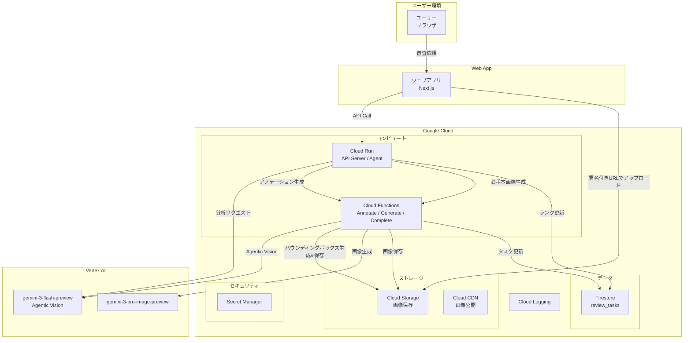
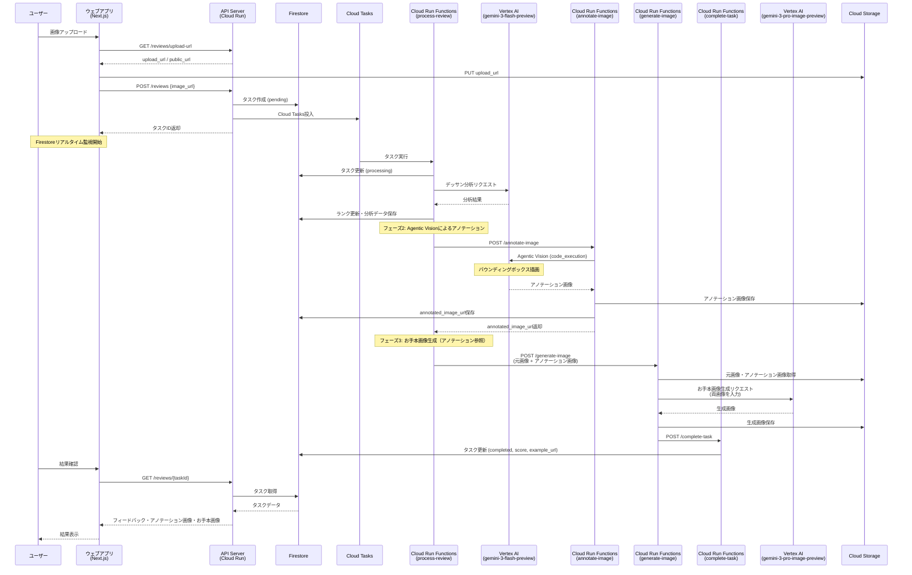
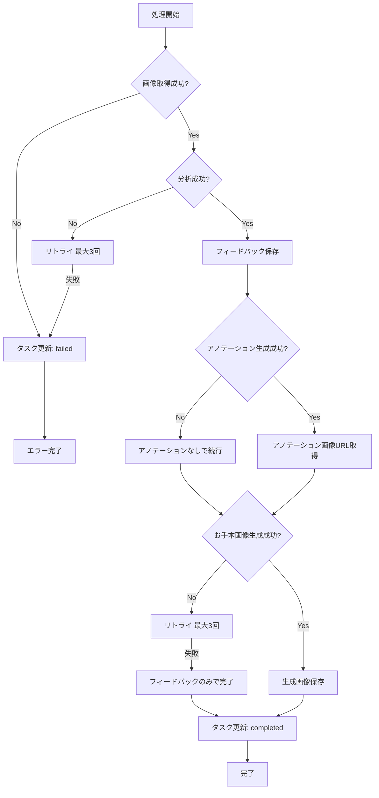
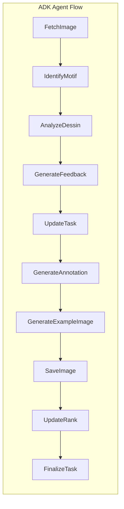
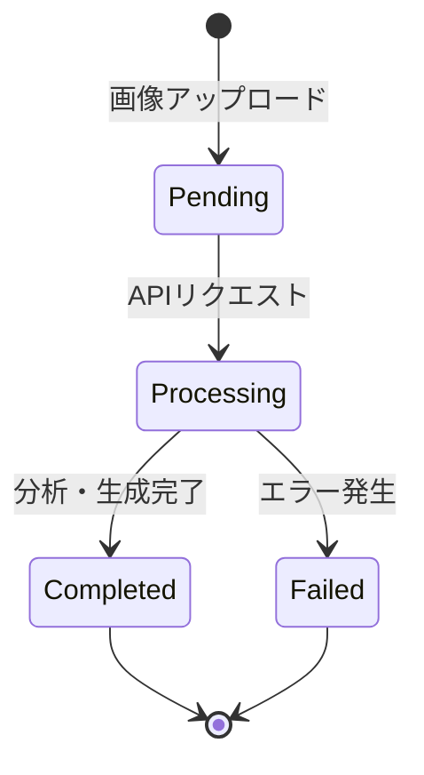
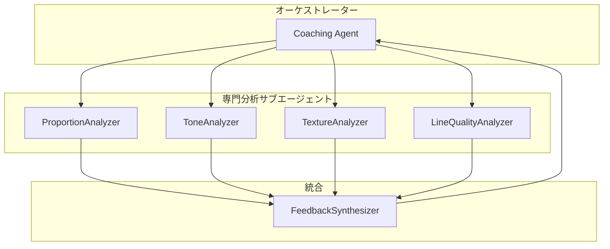

# 鉛筆デッサンコーチングエージェント 機能設計書

## システム概要

ウェブアプリからの審査依頼をトリガーに鉛筆デッサン画像を分析し、コーチングフィードバックとお手本画像を生成するサーバーレスエージェントシステム。Google Cloud上で稼働し、ADK（Agents Development Kit）を活用したエージェンティックAIアーキテクチャを採用。

---

## システム構成図

### Google Cloud構成図



---

## 処理フロー

### メインフロー




### エラーハンドリングフロー




---

## コンポーネント設計

### 1. ウェブアプリ（Next.js）

**責務**: ユーザーインターフェース、画像アップロード、結果表示

**技術スタック**:
- React 19.x
- Next.js 16.x (App Router)
- TypeScript 5.x
- Tailwind CSS 4.x
- Firebase Authentication (GitHub Provider)
- Zustand 5.x（状態管理）
- SWR 2.x（API呼び出し補助）

```
packages/web/
├── app/
│   ├── (authenticated)/        # 認証必須ページ
│   │   └── review/
│   │       └── page.tsx
│   ├── favicon.ico
│   ├── globals.css
│   ├── layout.tsx              # ルートレイアウト
│   └── page.tsx                # ホーム（ログイン）
├── components/                 # UIコンポーネント
│   ├── auth-provider.tsx
│   ├── login-button.tsx
│   ├── common/
│   │   ├── Button.tsx
│   │   └── UserProfileMenu.tsx
│   └── features/
│       ├── dashboard/
│       │   ├── CalendarFilter.tsx
│       │   ├── TagSidebar.tsx
│       │   ├── TaskGrid.tsx
│       │   └── UploadSection.tsx
│       ├── review/
│       │   ├── ExampleImageDisplay.tsx
│       │   └── FeedbackDisplay.tsx
│       └── upload/
│           └── ImageUpload.tsx
├── stores/                     # Zustandストア
│   ├── auth-store.ts
│   └── taskStore.ts
├── hooks/                      # カスタムフック
│   ├── useRank.ts
│   └── useTasks.ts             # Firestoreリアルタイム監視
├── lib/
│   ├── firebase.ts             # Firebase初期化
│   └── api.ts                  # API呼び出し
├── public/
│   └── ...
├── package.json
├── next.config.ts
└── tailwind.config.ts
```

### 2. API Server（Cloud Run）

**責務**: RESTful API提供、画像アップロード処理、タスク管理

```
agent/
├── src/
│   ├── main.py           # FastAPIエントリーポイント
│   ├── api/
│   │   └── reviews.py    # 審査API
│   └── ...
```

### 3. Coaching Agent（Vertex AI Agent Engine）

**責務**: 画像分析、フィードバック生成、画像生成のオーケストレーション

```
agent/
├── dessin_coaching_agent/
│   ├── agent.py          # root_agent定義
│   ├── tools.py          # analyze_dessin_image
│   ├── memory_tools.py   # Memory Bank検索
│   ├── callbacks.py      # Memory Bank保存
│   ├── prompts.py        # コーチング用プロンプト
│   └── models.py         # DessinAnalysis 等
```

### 4. ADK Agent構成（現在の実装）

ADKのAgent関数ベースで実装されています。Vertex AI Agent Engineにデプロイし、Memory Bank統合と成長トラッキングを実現しています。

```python
# dessin_coaching_agent/agent.py
from google.adk.agents import Agent
from google.adk.tools.preload_memory_tool import PreloadMemoryTool

from .config import settings
from .custom_gemini import GlobalGemini
from .memory_tools import search_memory_by_motif, search_recent_memories
from .prompts import get_dessin_analysis_system_prompt
from .tools import analyze_dessin_image

# globalリージョン用Geminiモデル
gemini_model = GlobalGemini(model=settings.gemini_model)

# Memory Bankからユーザーの過去メモリを自動プリロードするツール
preload_memory_tool = PreloadMemoryTool()

# ルートエージェント定義（ADK規約）
root_agent = Agent(
    name="dessin_coaching_agent",
    model=gemini_model,
    description="鉛筆デッサンを分析し、改善フィードバックを提供するコーチングエージェント",
    instruction=get_dessin_analysis_system_prompt(),
    tools=[
        analyze_dessin_image,
        preload_memory_tool,
        search_memory_by_motif,
        search_recent_memories,
    ],
)
```

#### エージェントツール一覧

| ツール名 | 責務 | 説明 |
|----------|------|------|
| `analyze_dessin_image` | デッサン分析 | 画像URLを受け取り、Gemini APIで分析後、成長スコア補正して結果を返す |
| `preload_memory_tool` | メモリプリロード | セッション開始時に過去メモリをプリロード |
| `search_memory_by_motif` | モチーフ別検索 | 同じモチーフの過去提出を検索 |
| `search_recent_memories` | 直近メモリ検索 | ユーザーの直近の提出履歴を取得 |

#### Memory Bank統合

Vertex AI Memory Bankを使用して、ユーザーの過去の提出履歴を長期記憶として保存・検索します。

```python
# dessin_coaching_agent/callbacks.py
def save_analysis_to_memory(
    analysis: DessinAnalysis,
    user_id: str,
    session_id: str = "",
) -> bool:
    """分析結果をメタデータ付きでMemory Bankに保存
    
    保存されるメタデータ:
    - motif: モチーフ名
    - overall_score: 総合スコア
    - proportion_score, tone_score, texture_score, line_quality_score
    - growth_score: 成長スコア
    - submitted_at: 提出日時
    """
    ...
```

```python
# dessin_coaching_agent/memory_tools.py
def search_memory_by_motif(motif: str, user_id: str) -> list[MemoryEntry]:
    """モチーフでフィルタしたメモリを取得"""
    ...

def search_recent_memories(user_id: str, limit: int = 5) -> list[MemoryEntry]:
    """直近のメモリを取得（新しい順）"""
    ...
```

#### 成長トラッキング機能

過去の提出と比較して成長を評価する5つ目の採点項目として実装されています。

```python
# dessin_coaching_agent/tools.py
def _calculate_growth_from_memories(
    analysis: DessinAnalysis,
    past_memories: list[MemoryEntry],
) -> DessinAnalysis:
    """過去メモリと比較して成長スコアを計算
    
    計算ロジック:
    - 成長スコア = 50 + (現在スコア - 過去平均スコア)
    - 50点 = 維持、50以上 = 成長、50未満 = 後退
    """
    ...
```

### 5. 処理ノード構成



| ノード | 責務 | 主要コンポーネント |
|--------|------|-------------------|
| **FetchImage** | Cloud CDNから画像を取得 | `StorageTool` |
| **IdentifyMotif** | モチーフ識別・タグ付け | `GeminiService` |
| **AnalyzeDessin** | gemini-3-flash-previewでデッサンを分析 | `GeminiService` |
| **GenerateFeedback** | フィードバック生成 | `FeedbackService` |
| **UpdateTask** | タスクステータス更新 | `TaskService` |
| **GenerateAnnotation** | Agentic Visionで改善ポイントにバウンディングボックス描画 | `AnnotationService` |
| **GenerateExampleImage** | 元画像+アノテーション画像を参照し、gemini-3-pro-image-previewでお手本画像生成 | `ImageGenerationService` |
| **SaveImage** | 生成画像をCloud Storageに保存 | `StorageTool` |
| **UpdateRank** | ランク判定・更新 | `RankService` |
| **FinalizeTask** | タスク完了処理 | `TaskService` |

---

## データモデル定義

### タスクモデル

```python
from pydantic import BaseModel
from typing import Optional, List
from datetime import datetime
from enum import Enum

class TaskStatus(str, Enum):
    PENDING = "pending"
    PROCESSING = "processing"
    COMPLETED = "completed"
    FAILED = "failed"

class ReviewTask(BaseModel):
    """審査タスク"""
    task_id: str
    user_id: str
    status: TaskStatus
    image_url: str                      # 元画像のCDN URL
    annotated_image_url: Optional[str]  # アノテーション画像のCDN URL（バウンディングボックス付き）
    example_image_url: Optional[str]    # 生成画像のCDN URL
    feedback: Optional[dict]            # フィードバックデータ
    score: Optional[float]              # 総合スコア
    tags: Optional[List[str]]           # モチーフタグ
    error_message: Optional[str]        # エラー時のメッセージ
    created_at: datetime
    updated_at: datetime
```

### デッサン分析モデル

```python
from pydantic import BaseModel
from typing import List

class ProportionAnalysis(BaseModel):
    """プロポーション分析"""
    shape_accuracy: str       # 形の正確さ
    ratio_balance: str        # 比率・バランス
    contour_quality: str      # 輪郭線の質
    score: float              # スコア (0-100)

class ToneAnalysis(BaseModel):
    """陰影（トーン）分析"""
    value_range: str          # 明暗の階調
    light_consistency: str    # 光源の一貫性
    three_dimensionality: str # 立体感
    score: float

class TextureAnalysis(BaseModel):
    """質感表現分析"""
    material_expression: str  # 素材感
    touch_variety: str        # タッチの使い分け
    score: float

class LineQualityAnalysis(BaseModel):
    """線の質分析"""
    stroke_quality: str       # 運筆
    pressure_control: str     # 筆圧コントロール
    hatching: str             # ハッチング技法
    score: float

class GrowthAnalysis(BaseModel):
    """成長トラッキング分析（5つ目の採点項目）
    
    過去の提出と比較した成長度を評価。
    初回提出時は全フィールドがデフォルト値となる。
    """
    comparison_summary: str = "初回提出のため比較データなし"
    improved_areas: List[str] = []      # 前回から改善した項目
    consistent_strengths: List[str] = []  # 一貫して維持している強み
    ongoing_challenges: List[str] = []    # 継続的に取り組むべき課題
    score: Optional[float] = None   # 成長スコア (0-100)。初回提出時はnull

class DessinAnalysis(BaseModel):
    """デッサン総合分析"""
    proportion: ProportionAnalysis
    tone: ToneAnalysis
    texture: TextureAnalysis
    line_quality: LineQualityAnalysis
    growth: GrowthAnalysis = GrowthAnalysis()  # 成長トラッキング
    overall_score: float      # 総合スコア (0-100)
    strengths: List[str]      # 強み
    improvements: List[str]   # 改善点
    tags: List[str]           # モチーフタグ
```

### ランクモデル

```python
from pydantic import BaseModel
from typing import List
from datetime import datetime

class UserRank(BaseModel):
    """ユーザーランク"""
    user_id: str
    rank_level: int           # 1-15 (10級〜師範)
    total_submissions: int
    high_scores: List[float]  # 直近の高スコア
    created_at: datetime
    updated_at: datetime
    
    @property
    def display_name(self) -> str:
        """ランク表示名"""
        if self.rank_level <= 10:
            return f"{11 - self.rank_level}級"
        elif self.rank_level <= 13:
            return f"{self.rank_level - 10}段"
        elif self.rank_level == 14:
            return "師範代"
        else:
            return "師範"
```

### ランク制度

| レベル | 表示名 | 昇格条件 | 評価基準 |
|--------|--------|----------|----------|
| 1 | 10級 | 初期ランク | 優しめ（基礎重視） |
| 2 | 9級 | 80点以上を1回 | 優しめ |
| 3 | 8級 | 80点以上を2回 | 優しめ |
| 4 | 7級 | 80点以上を3回 | やや優しめ |
| 5 | 6級 | 80点以上を4回 | やや優しめ |
| 6 | 5級 | 80点以上を5回 | 標準 |
| 7 | 4級 | 80点以上を6回 | 標準 |
| 8 | 3級 | 80点以上を7回 | やや厳しめ |
| 9 | 2級 | 80点以上を8回 | やや厳しめ |
| 10 | 1級 | 80点以上を10回 | 厳しめ |
| 11 | 初段 | 80点以上を12回 | 厳しめ |
| 12 | 2段 | 80点以上を15回 | かなり厳しめ |
| 13 | 3段 | 80点以上を20回 | かなり厳しめ |
| 14 | 師範代 | 80点以上を25回 | プロ基準 |
| 15 | 師範 | 80点以上を30回 | プロ基準 |

> **Note**: ランクが上がるにつれて評価基準が厳しくなります。初心者は基礎的な要素（形・バランス）を重視し、上級者になるほど質感・空気感・芸術性など高度な要素も評価対象となります。

---

## UI表示例

### フィードバック表示

```markdown
## 🎨 デッサンコーチング フィードバック

**現在のランク**: 7級 ⬆️

### 総合評価: ⭐ 78/100

---

### 🌟 良い点

- **陰影表現**: 明暗の階調が丁寧に描かれており、立体感が出ています
- **構図**: モチーフの配置が画面内でバランスよく収まっています
- **線の質**: ハッチングの方向が一定で、安定した運筆です

---

### 📈 改善ポイント

#### プロポーション
- モチーフの右側がやや歪んでいます。補助線を引いて形を確認しましょう
- 楕円の軸を意識すると、より正確な形が取れます

#### 陰影（トーン）
- 最も暗い部分の描き込みが浅いです。10段階の明暗をすべて使いましょう
- 反射光の表現を加えると、より立体感が増します

---

### 🖼️ 改善例（お手本画像）


_この画像はAI（gemini-3-pro-image-preview）によって生成されました_
```

---

## 外部サービス連携

### 1. Web Hosting（任意）

| 操作 | 用途 |
|------|------|
| ホスティング | Next.jsアプリ (SSR/Static) の配信 |
| CDN | 静的アセットの配信 |

### 2. Cloud Storage / CDN

| 操作 | 用途 |
|------|------|
| オブジェクト作成 | 画像アップロード |
| 公開URL生成 | CDN経由での画像配信 |
| 署名付きURL | セキュアなアップロード |


### 4. Vertex AI (Gemini)

| 操作 | モデル | 用途 |
|------|--------|------|
| デッサン分析 | `gemini-3-flash-preview` | マルチモーダル分析 |
| アノテーション生成 | `gemini-3-flash-preview` + Agentic Vision | 改善ポイントへのバウンディングボックス描画（code_execution） |
| 画像生成 | `gemini-3-pro-image-preview` | 元画像+アノテーション画像を参照したお手本画像生成 |

### 5. Google Cloud Services

| サービス | 用途 |
|----------|------|
| Cloud Run | API Server + Agent ホスティング |
| Cloud Storage | 画像ストレージ |
| Cloud CDN | 画像配信 |
| Firestore | タスク・ランク管理 |
| Secret Manager | 秘密鍵管理 |
| Cloud Logging | ログ出力 |
| Artifact Registry | コンテナイメージ |

---

## Firestore データ構造

### コレクション: `review_tasks`

```
tasks/
└── {task_id}/
    ├── task_id: string
    ├── user_id: string
    ├── status: string (pending|processing|completed|failed)
    ├── image_url: string
    ├── annotated_image_url: string (optional)  # バウンディングボックス付き画像
    ├── example_image_url: string (optional)
    ├── feedback: map (optional)
    ├── score: number (optional)
    ├── tags: array<string> (optional)
    ├── rank_at_review: string (optional)  # 審査時ランク
    ├── rank_changed: boolean (optional)   # 昇格有無
    ├── error_message: string (optional)
    ├── created_at: timestamp
    └── updated_at: timestamp
```

### コレクション: `user_ranks`

```
user_ranks/
└── {user_id}/
    ├── user_id: string
    ├── rank_level: number
    ├── total_submissions: number
    ├── high_scores: array<number>
    ├── created_at: timestamp
    └── updated_at: timestamp
```

### インデックス

| コレクション | フィールド | タイプ |
|--------------|------------|--------|
| review_tasks | user_id, created_at | 複合（昇順、降順） |
| review_tasks | status | 単一 |
| user_ranks | rank_level | 降順 |

### リアルタイム監視（onSnapshot）

ウェブアプリからFirestoreの`tasks`コレクションをリアルタイム監視し、エージェントがタスクステータスを更新した瞬間にUIに反映します。

```typescript
// useTasks.ts
import { collection, onSnapshot, query, where, orderBy } from 'firebase/firestore';
import { db } from '@/lib/firebase';

export const useTasks = (userId: string) => {
  const [tasks, setTasks] = useState<ReviewTask[]>([]);

  useEffect(() => {
    const q = query(
      collection(db, 'review_tasks'),
      where('user_id', '==', userId),
      orderBy('created_at', 'desc')
    );

    // リアルタイムリスナー設定
    const unsubscribe = onSnapshot(q, (snapshot) => {
      const newTasks = snapshot.docs.map(doc => ({
        taskId: doc.id,
        ...doc.data()
      }));
      setTasks(newTasks);
    });

    return () => unsubscribe();
  }, [userId]);

  return { tasks };
};
```

> **Note**: ポーリング不要で、エージェントがFirestoreを更新した瞬間に自動的にフロントエンドに反映されます。

---

## Cloud Run設定

### API Server

| 項目 | 値 |
|------|-----|
| メモリ | 256Mi |
| CPU | 1 |
| 最大インスタンス | 10 |
| 最小インスタンス | 0 |
| タイムアウト | 60秒 |
| 同時実行数 | 80 |
| イングレス | すべて許可 |
| 認証 | 不要（API認証で制御） |

### Coaching Agent

| 項目 | 値 |
|------|-----|
| メモリ | 512Mi |
| CPU | 1 |
| 最大インスタンス | 10 |
| 最小インスタンス | 0 |
| タイムアウト | 300秒 |
| 同時実行数 | 1 |
| イングレス | 内部のみ |
| 認証 | 不要（API認証で制御） |

### 環境変数

| 変数名 | 説明 |
|--------|------|
| `GCP_PROJECT_ID` | GCPプロジェクトID |
| `GCS_BUCKET_NAME` | Cloud Storageバケット名 |
| `CDN_BASE_URL` | Cloud CDNのベースURL |
| `FIRESTORE_DATABASE` | Firestoreデータベース名 |
| `PROCESS_REVIEW_FUNCTION_URL` | process-review関数URL |
| `ANNOTATION_FUNCTION_URL` | annotate-image関数URL |
| `IMAGE_GENERATION_FUNCTION_URL` | generate-image関数URL |
| `AGENT_ENGINE_ID` | Agent EngineリソースID |
| `AGENT_ENGINE_LOCATION` | Agent Engineリージョン |
| `CLOUD_TASKS_LOCATION` | Cloud Tasksリージョン |
| `CLOUD_TASKS_QUEUE_NAME` | Cloud Tasksキュー名 |
| `GEMINI_MODEL` | Geminiモデル名 |
| `AUTH_ENABLED` | Firebase認証有効化 |
| `CORS_ORIGINS` | CORS許可オリジン |

---

## 状態遷移図（タスク）



---

## オプション機能: GitHub PR連携

> [!NOTE]
> この機能はオプションです。ウェブアプリをメインとしつつ、エンジニア向けにPR連携も提供します。

### GitHub Actions Workflow

```yaml
# .github/workflows/dessin-coaching.yml
name: Dessin Coaching Trigger
on:
  pull_request:
    types: [opened, synchronize]
    paths:
      - '**.png'
      - '**.jpg'
      - '**.jpeg'

jobs:
  trigger-coaching:
    runs-on: ubuntu-latest
    permissions:
      id-token: write
      contents: read
    steps:
      - name: Authenticate to Google Cloud
        uses: google-github-actions/auth@v2
        with:
          workload_identity_provider: ${{ secrets.GCP_WORKLOAD_IDENTITY_PROVIDER }}
          service_account: ${{ secrets.GCP_SERVICE_ACCOUNT }}

      - name: Trigger Coaching Agent
        run: |
          TOKEN=$(gcloud auth print-identity-token)
          curl -X POST ${{ secrets.AGENT_ENDPOINT }} \
            -H "Content-Type: application/json" \
            -H "Authorization: Bearer $TOKEN" \
            -d '{
              "repo": "${{ github.repository }}",
              "pr_number": ${{ github.event.pull_request.number }},
              "head_sha": "${{ github.event.pull_request.head.sha }}"
            }'
```

### PRコメント投稿

フィードバックをPRコメントとして投稿する機能を提供。

---

## 将来の拡張機能

### 拡張1: マルチエージェントによる協調分析

**概要**: 複数のサブエージェントが協調してデッサンを分析するSwarmパターンへ拡張



### 拡張2: マルチモーダルエンベディング

**概要**: Vertex AIのマルチモーダルエンベディングを使用して、過去に似たスケッチを検索

---

## 実装状況

| 機能 | 状況 | 備考 |
|------|--------|------|
| 単一エージェント | ✅ 実装済 | Vertex AI Agent Engineにデプロイ |
| Memory Bank統合 | ✅ 実装済 | 成長トラッキングに使用 |
| 成長トラッキング | ✅ 実装済 | 5つ目の採点項目として追加 |
| Cloud Tasks非同期処理 | ✅ 実装済 | レビュータスクのバックグラウンド処理 |
| マルチエージェント | 🚧 将来拡張 | Swarmパターンへの拡張 |
| マルチモーダルエンベディング | 🚧 将来拡張 | 類似スケッチ検索 |
| モバイルアプリ | 🚧 将来拡張 | iOS/Android対応 |
| Email/LINE連携 | 🚧 将来拡張 | 通知チャネル拡張 |

