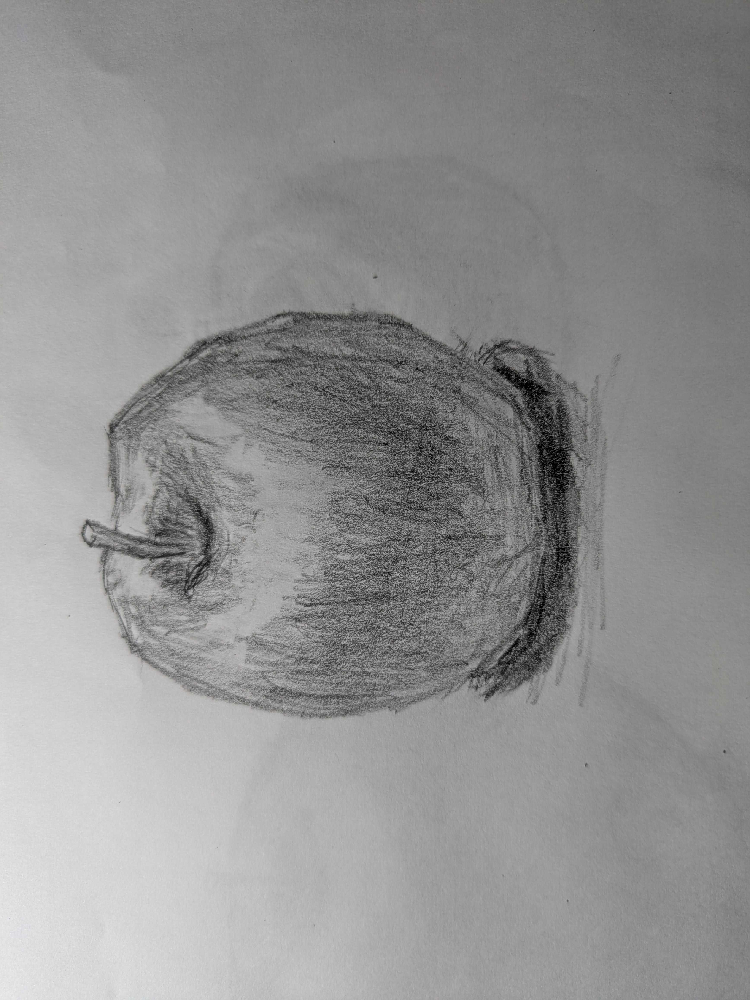
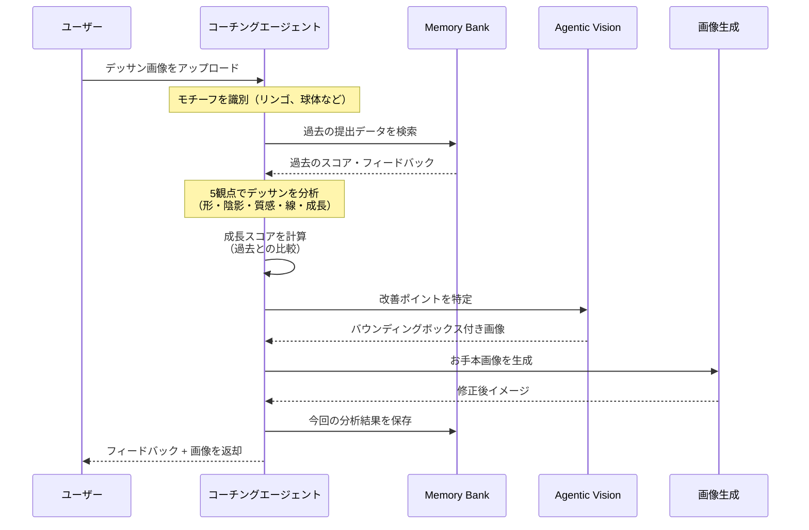
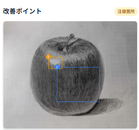
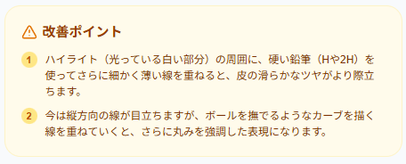
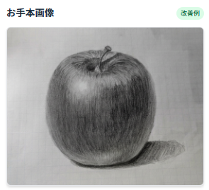
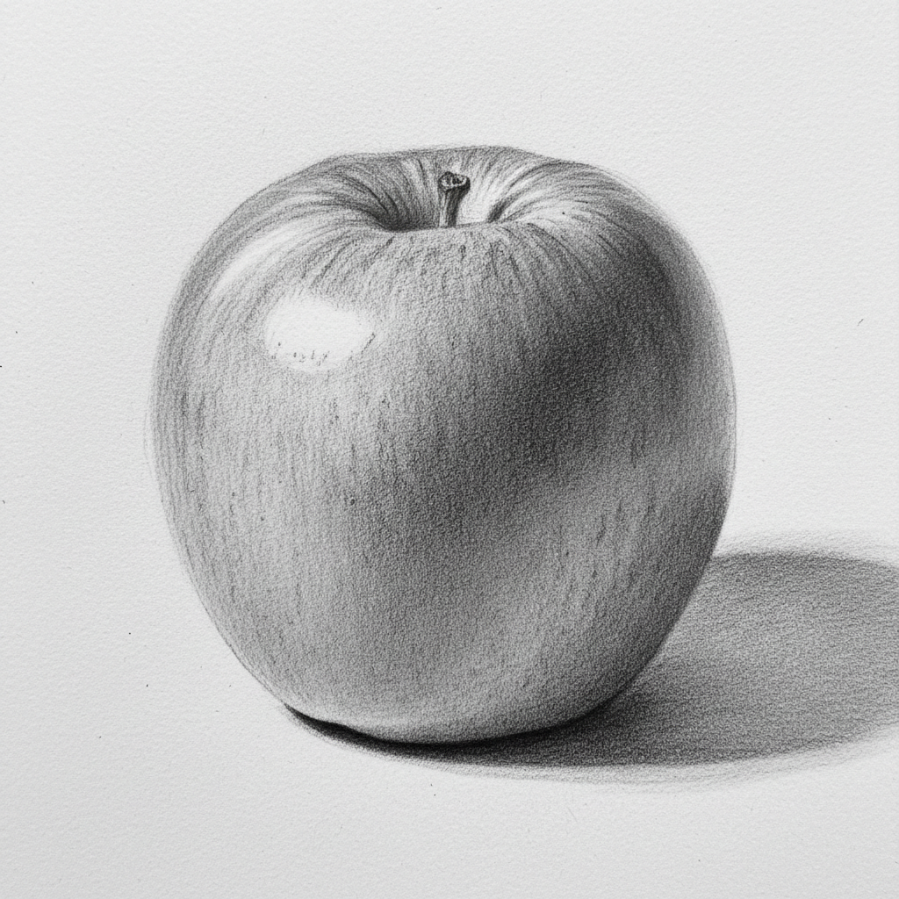

## 記事の作成ルール
Zennで記事を作成する際は、以下の設定と内容を含めてください。

#### 記事の設定

**カテゴリ**：「Idea」を選択
**トピック**：gch4 を追加
#### 記事に含める内容

**プロジェクト概要**：対象ユーザー、解決する課題、ソリューションの特徴
**システムアーキテクチャ図**：画像形式でも可
**デモ動画**（3分程度）：YouTubeに公開し、記事に埋め込んでください

:::message
この記事は**第4回 Agentic AI Hackathon with Google Cloud** 参加プロジェクトの紹介記事です
:::

## はじめに

はじめまして。ハッカソン参加に伴い、zennに初めて投稿します。
本記事では、このハッカソンに向けて構築したエージェントプロジェクトである**Art coachIng** を紹介します。

### なぜ作ったのか

私は普段、生成AI推進の仕事をしているのですが、ある課題を感じていました。
**「使う人はどんどん使う、使わない人は全く使わない」という二極化**が進んでいることです。

そんな中、普段ITに縁がない母から相談を受けました。
「ちぎり絵の参考に、写真を絵に変換したいけどうまくいかない」

驚きました。生成AIという言葉が母の口から出てくるとは。

このことから
**「創作」という楽しさを入り口にすれば、AIに縁遠い人でも自然と使い始める**
ということに気づきました。

そこで今回のハッカソンでは、**絵を描く楽しさを支援するエージェント**を作ることにしました。

はたして、生成AIで絵の先生を作ったら、美術の成績2だった自分でも上達できるのか！？

はじめて書いたリンゴのデッサン

---

## プロジェクト概要

ウェブアプリからデッサン画像をアップロードすると、AIエージェントが**プロの美術講師のような視点**で分析し、具体的な改善点をフィードバック。さらに「お手本画像（修正後のイメージ）」を生成して視覚的な学習をサポートします。

### ターゲットユーザー

趣味で絵を描くすべての人

### 解決したい課題

#### 1. 生成AIに興味がない層へのアプローチ

普段生成AIに触れる機会が少ない人でも絵を描くという趣味を通じて、生成AIの便利さを体験してもらえるアプリにしました。

#### 2. 絵のフィードバックを受けるハードルを下げる

趣味で絵を描いている人が、誰かにフィードバックをもらいたいと思ったとき、いくつかのハードルがあります。

- **人に見せること自体が恥ずかしい**という心理的なハードル
- **厳しい批評をされたらどうしよう**という不安
- 「ここがダメ」と言われても**具体的にどう直せばいいかわからない**という問題

AIエージェントは、これらの課題を解決します。

機械相手なら気軽に何度でも相談できます。どんな絵を見せても、否定せず建設的なフィードバックを返してくれます。そして、高い言語処理能力で「なぜ」「どうすれば」を具体的・論理的に説明してくれます。24時間いつでも、何度でも、気兼ねなく相談できます。

### ソリューションの特徴

1. **プロの採点基準でデッサンを評価**
   - 複数の視点からデッサンを専門分析

2. **Memory Bank による成長記録**
   - 過去の提出と比較して成長を可視化

3. **Agentic Vision によるアノテーション**
   - 改善ポイントに自動でバウンディングボックスを描画

4. **お手本画像の自動生成**
   - 修正後のイメージをAIが生成

5. **段位制度でモチベーション維持**
   - 10級 → 師範 まで段階的にレベルアップ

## システムアーキテクチャ

### 全体構成

ユーザーがウェブアプリからデッサン画像をアップロードすると、Cloud Run API 経由で Vertex AI Agent Engine にリクエストが送られます。

### 使用技術

| カテゴリ | 技術 |
|----------|------|
| フロントエンド | Next.js / TypeScript / Tailwind CSS |
| バックエンド | FastAPI / Python |
| エージェント | ADK (Agents Development Kit) |
| AI分析 | Gemini 3 Flash |
| アノテーション | Agentic Vision + code_execution |
| お手本生成 | Gemini 3 Pro Image |
| インフラ | Cloud Run / Cloud Run Functions / Cloud Tasks |
| データ | Firestore / Cloud Storage / Memory Bank |
| 認証 | Firebase Authentication |

## エージェントの仕組み

### エージェントのワークフロー

### モチーフ識別

エージェントはデッサン画像を受け取ると、まず画像を分析してモチーフを識別します。「これはリンゴのデッサンだ」という判断は、次のステップで Memory Bank から「同じモチーフの過去作品」を探すための重要な手がかりになります。

### Memory Bank で過去を思い出す

モチーフがわかったら、エージェントは Memory Bank に問い合わせ、同じモチーフ（リンゴ）の過去データを検索します。

すると、過去のスコア（総合76点、プロポーション78点...）、前回指摘された強み・改善点、成長サマリーなどが「記憶」として蘇ります。エージェントはこれを文脈として保持し、今回の分析結果と比較します。初回提出の場合は「過去データなし」としてゼロからの評価を行います。

### デッサン分析 & 成長スコア計算

過去データを取得したら、エージェントはデッサン分析ツールを起動し、画像を詳細に分析します。

評価は5つの観点で行われます：

1. **プロポーション** - 形の正確さ、比率・バランス
2. **陰影（トーン）** - 明暗の階調、光源の一貫性
3. **質感** - 素材感の表現
4. **線の質** - 運筆、ハッチング技法
5. **成長** - 過去との比較による成長度

評価基準はユーザーのランクに応じて調整されます。初級者（10級〜6級）には基礎技術を重視し、上級者には高度な表現力を求めます。

分析が完了すると、総合スコア76.25点、各観点のスコアと詳細コメント、成長サマリー（「前回より陰影が改善...」）などを含む構造化されたデータが生成されます。

### Agentic Vision で改善ポイントを可視化

分析結果をもとに、エージェントは Gemini の Agentic Vision 機能（code_execution）を起動します。元のデッサン画像と改善点リストを参照しながら、Python コードを生成・実行し、画像上に直接バウンディングボックスを描画します。

「ここを直せばいい」が一目でわかるので、テキストだけのフィードバックよりも直感的に改善ポイントを理解できます。

### お手本画像を自動生成

最後に、エージェントは Gemini 3 Pro Image を使って「お手本画像」を生成します。元のデッサン画像、アノテーション画像、改善点リストを参照しながら、「こう描くともっと良くなる」という修正後のイメージを出力します。

ユーザーの絵のスタイルを活かしつつ、改善ポイントを反映した画像が生成されるため、具体的な改善の方向性を視覚的に確認できます。

#### 改善点を意識せずに作っていたころの画像

---

## デモ動画

（TODO: YouTube動画を埋め込み）

## 成果

### 実際にやってみた結果

（TODO: ビフォーアフターの画像と説明）

## 苦労した点・学び

（TODO: 開発中の苦労話、技術的な学び）
agenticに開発した。
gcpがはじめてだった

## 今後の展望

（TODO: 今後追加したい機能、改善点）
https://github.com/nuance-sudo/drawing-practice-agent-gch4/issues/33

## おわりに

（TODO: まとめ、ハッカソン参加の感想）