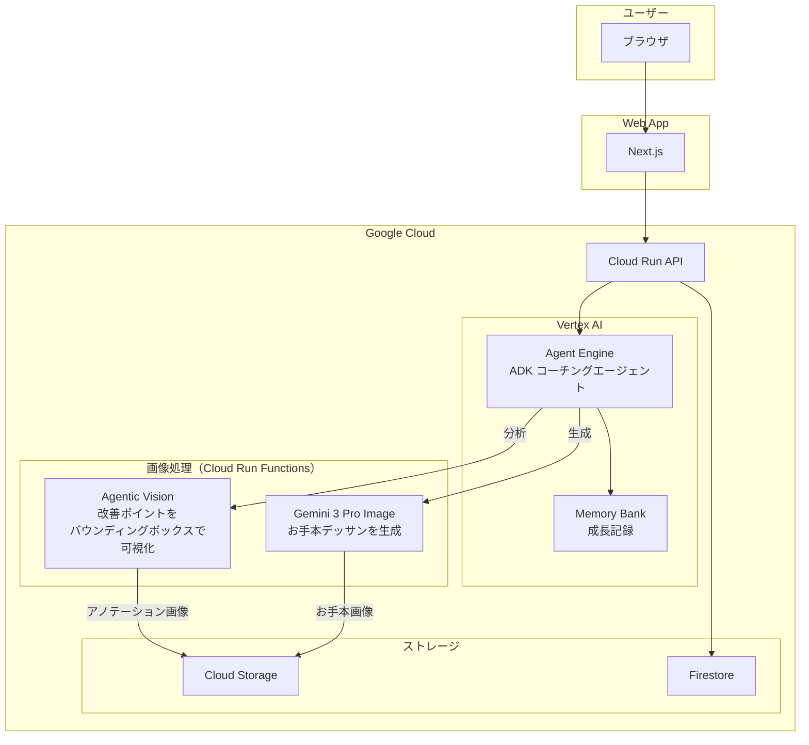
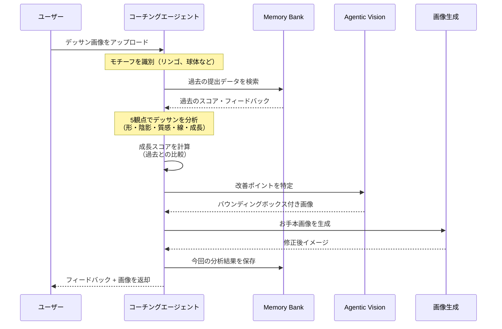

:::message
この記事は**第4回 Agentic AI Hackathon with Google Cloud** 参加プロジェクトの紹介記事です
:::
https://zenn.dev/hackathons/google-cloud-japan-ai-hackathon-vol4?tab=overview

## はじめに

はじめまして。今回のハッカソンをきっかけに Zenn デビューします。
本記事では、このハッカソンに向けて構築したエージェントプロジェクトである**Art coachIng** を紹介します。

## デモ動画

https://www.youtube.com/watch?v=KFUuolX9VuA

## 背景

私は普段、生成AI推進の仕事をしているのですが、ある課題を感じていました。
**「使う人はどんどん使う、使わない人は全く使わない」という二極化**が進んでいることです。

そんな中、普段ITに縁がないスマホ教室帰りの母から相談を受けました。
「チャッピーを使って写真を絵に変換したいけど、うまくいかない」

驚きました。まさか母の口から AI の話が出てくるとは。。。

このことから
**「創作」という楽しさを入り口にすれば、AIに縁遠い人でも自然と使い始める**
ということに気づきました。

そこで今回のハッカソンでは、**絵を描く楽しさを支援するエージェント**を作ることにしました。

はたして、生成AIで絵の先生を作ったら、美術の成績2だった自分でも上達できるのか！？

*はじめて書いたリンゴのデッサン*

## プロジェクト概要

ウェブアプリからデッサン画像をアップロードすると、AIエージェントが**プロの美術講師のような視点**で分析し、具体的な改善点をフィードバック。さらに「お手本画像（次に書くべき一枚）」を生成して視覚的な学習をサポートします。

### ターゲットユーザー

趣味で絵を描くすべての人

### 解決したい課題

#### 1. 生成AIに興味がない層へのアプローチ

普段生成AIに触れる機会が少ない人でも絵を描くという趣味を通じて、生成AIの便利さを体験してもらえるアプリにしました。

#### 2. 絵のフィードバックを受けるハードルを下げる

趣味で絵を描いている人が、誰かにフィードバックをもらいたいと思ったとき、いくつかのハードルがあります。

- **人に見せること自体が恥ずかしい**という心理的なハードル
- **厳しい批評をされたらどうしよう**という不安
- 「ここがダメ」と言われても**具体的にどう直せばいいかわからない**という問題

AIエージェントは、これらの課題を解決します。

AI相手なら気軽に何度でも相談できます。どんな絵を見せても、否定せず建設的なフィードバックを返してくれます。そして、高い言語処理能力で「なぜ」「どうすれば」を具体的・論理的に説明してくれます。24時間いつでも、何度でも、気兼ねなく相談できます。

### ソリューションの特徴

1. **プロの採点基準でデッサンを評価**
   - 複数の視点からデッサンを専門分析

2. **Memory Bank による成長記録**
   - 過去の提出と比較して成長を可視化

3. **Agentic Vision によるアノテーション**
   - 改善ポイントに自動でバウンディングボックスを描画

4. **お手本画像の自動生成**
   - 修正後のイメージをAIが生成

5. **段位制度でモチベーション維持**
   - 10級 → 師範 まで段階的にレベルアップ

## システムアーキテクチャ

### 全体構成

### 使用技術

| カテゴリ | 技術 |
|----------|------|
| フロントエンド | Next.js / TypeScript / Tailwind CSS |
| バックエンド | FastAPI / Python |
| エージェント | ADK (Agents Development Kit) |
| AI分析 | Gemini 3 Flash |
| アノテーション | Agentic Vision + code_execution |
| お手本生成 | Gemini 3 Pro Image |
| インフラ | Cloud Run / Cloud Run Functions / Cloud Tasks |
| データ | Firestore / Cloud Storage / Memory Bank |
| 認証 | Firebase Authentication |

### エージェントワークフロー

ユーザーがウェブアプリからデッサン画像をアップロードすると、Cloud Run API 経由で Vertex AI Agent Engine にリクエストが送られ、デッサンの分析とお手本画像の生成が行われます。

ユーザーのランクと過去の投稿履歴は Firestore で管理されています。分析時にランクを参照し、レベルに応じた評価を行います。総合スコア80点以上で昇格できますが、ランクが上がるにつれ評価も厳しくなるため、「今の自分に合った課題」に挑戦し続けられます。

## エージェントの仕組み

### モチーフ識別

エージェントはまず「何を描いたデッサンか」を判断します。ここで付けたモチーフタグをもとに、次のフェーズで Memory Bank をフィルター検索し、同じモチーフの過去作品を取得します。

### メモリ取得

エージェントはユーザーIDとモチーフタグをキーにして Memory Bank を検索し、該当ユーザーの同じモチーフ（存在しない場合はユーザーのみ）に関する過去データを取得します。

取得されるのは、過去のスコア（総合76点、プロポーション78点...）、前回の強み・改善点、成長サマリーなどです。エージェントはこれを文脈として保持し、今回の分析と比較します。

今回 Vertex AI Agent Engine を採用した決め手は、この Memory Bank 機能でした。
Memory Bank を使うことで、ライブラリ化されたメモリ生成・取得関数を使用でき、簡単にメモリ管理することができました。

### デッサン分析 & 成長スコア計算

過去データを取得したら、エージェントはデッサン分析ツールを起動し、画像を詳細に分析します。

評価は5つの観点で行われます：

1. **プロポーション** - 形の正確さ、比率・バランス
2. **陰影（トーン）** - 明暗の階調、光源の一貫性
3. **質感** - 素材感の表現
4. **線の質** - 運筆、ハッチング技法
5. **成長** - 過去との比較による成長度

評価基準はユーザーのランクに応じて調整されます。初級者（10級〜6級）には基礎技術を重視し、上級者には高度な表現力を求めます。

分析が完了すると、総合スコア76.25点、各観点のスコアと詳細コメント、成長サマリー（「前回より陰影が改善...」）などを含む構造化されたデータが生成されます。

### Agentic Vision で改善ポイントを可視化

分析結果をもとに、エージェントは Gemini の Agentic Vision 機能（code_execution）を起動します。元のデッサン画像と改善点リストを参照しながら、Python コードを生成・実行し、画像上に直接バウンディングボックスを描画します。

「ここを直せばいい」が一目でわかるので、テキストだけのフィードバックよりも直感的に改善ポイントを理解できます。

さらに、このアノテーション画像は次のお手本画像生成フェーズにも入力されます。これにより、エージェントは改善ポイントにフォーカスしたお手本を生成できるようになります。

この Agentic Vision は2026年1月末に登場したばかりの新機能です。世間的にはまだあまり話題になっていませんが、個人的には Nano Banana の登場くらいのインパクトがありました。

従来のマルチモーダル AI は画像を「一度見て終わり」でしたが、Agentic Vision ではエージェントが Think → Act → Observe のループで自律的に画像を操作できます。ズームインなどの画像操作を自分で判断して実行してくれるのが強みです。

今回のプロジェクトでは、テキストで出力された分析情報（「陰影が弱い」「プロポーションがずれている」など）を、デッサン上の具体的な改善ポイントとしてアノテーションにつなげています。抽象的なフィードバックを視覚的に落とし込めるのが、この機能の魅力です。（もっと流行れ）

### お手本画像を生成

最後に、エージェントは Gemini 3 Pro Image (Nano Banana Pro) を使って「お手本画像」を生成します。

この画像生成モデルは、参照画像のスタイルや質感を維持しながら編集できる点が特徴です。ユーザーの絵のタッチを活かしつつ、改善ポイントを反映した画像を生成できます。

さらに、前フェーズで作成したアノテーション画像も入力として渡すことで、単に「上手いデッサン」を生成するのではなく、そのユーザーにとってのネクストステップとなるお手本を生成します。改善点にフォーカスした具体的な「次の一歩」が視覚的に示されるため、何を意識して練習すればいいかが明確になります

#### 改善点を意識せずに作っていたころの画像

## 成果

### やってみた感想

**メモリ機能**、**ランク制度**、**改善点アノテーション**、**一貫性を持ったお手本画像生成**、これらを組み合わせることで、ユーザーに寄り添ったエージェントを作ることができました。

絵は抽象的で評価が難しい領域ですが、エージェントを介することで改善点を論理的に解説してもらえます。「なんとなく違う」を言語化してくれるのは、独学で練習する人にとって大きな助けになります。

さらに、テキストのフィードバックだけでなく、アノテーションとお手本画像により「どう描き直せばいいか」が視覚的にわかります。文章＋画像のマルチモーダルな出力が、理解しやすさに直結しました。

技術面では、ADK と Vertex AI Agent Engine のおかげで、エージェントのイベントループやホスティングを意識せずに開発できました。メモリ管理もマネージドサービスとして提供されているため、管理に悩む必要がありませんでした。

フロントエンドで採用した Firebase も地味に便利でした。ログイン認証は Firebase Authentication のコンソールからボタン操作だけで設定完了できました。また、Firestore のリアルタイムリスナーを使えば、ステータス変更時にフロントエンドが自動更新されるため、ポーリング処理を書く必要がありませんでした。

普段は AWS を利用しているため GCP は初めてでしたが、今回のハッカソンを通じて Vertex AI、Cloud Run、Firebase など幅広いサービスに触れることができました。良い学びの機会になりました。

## 苦労した点・学び

今回は Antigravity と伴走しながら開発を進めました。最初は標準の Planning 機能で開発しており、ある程度のレベルのものは作れました。しかし、大規模な開発になるとエージェントが想定外の方向に暴走しがちでした。

例えば今回の開発では最初のころCloud Runでエージェントを構築していたのですが、Memory Bankを利用するためにVertex AI Agent Engineに移行する必要がありました。その際、AntigravityにPlanningを任せて構築していましたが、ただただクレジットが吹き飛んだ結果になりました（笑）。

この課題へのベストプラクティスはまだ模索中ですが、構築前の計画フェーズでルールを明文化しておくことが重要だと感じています。最終的には [AIDLC](https://github.com/awslabs/aidlc-workflows) をスキルとして組み込む形に落ち着きました。

また、今回の経験から「コーディングエージェントは、その人の能力以上のことはできない」と痛感しました。GCP が初めてだったため、エージェントが間違った方向に進んでいても気づけず、止めるべきところで止められませんでした。

知っている技術であれば「そこは違う」とすぐに軌道修正できますが、知らない技術だとエージェントにお任せで走らせてしまいます。コーディングエージェントは「自分ができる作業を高速化するツール」として使うべきで、未知の領域を丸投げするのは危険だと学びました。

ただ、ルールを事前に明文化できれば、この課題も改善できそうな予感はあります。

## 今後の展望

現在は描いた後のデッサンに対してフィードバックを受ける形式ですが、今後は Gemini の Live API を活用したリアルタイム・コーチング機能を実装したいと考えています。

ブラウザのカメラで手元を映しながら、「もう少し筆圧を下げて」「右側の輪郭線がずれています」といったアドバイスをリアルタイムで音声フィードバックする。そんなプロの美術講師が隣で見守ってくれるような体験を目指しています。

特に初学者は「どう描き進めればいいか」がわからないことが多いため、描くプロセス自体をサポートできるこの機能は有効だと考えています。

## おわりに

今回のハッカソンでは、「絵を描く楽しさを支援するエージェント」を作りました。

Memory Bank による成長記録、レベルに応じた評価、Agentic Vision によるアノテーション、Nano Banana Pro によるお手本画像生成、これらを組み合わせることで、ユーザーに寄り添うコーチングエージェントを実現できました。

普段 AI に縁遠い人でも、絵を描くという創作活動を通じて自然に AI を使い始めてもらえたら嬉しいです。

最後まで読んでいただき、ありがとうございました！

最後に、冒頭で紹介した美術の成績2だった私のリンゴデッサンの成長をお見せします。

*TODO: 練習中です！*

まだまだですが、このエージェントと一緒に練習を続けていきたいと思います。